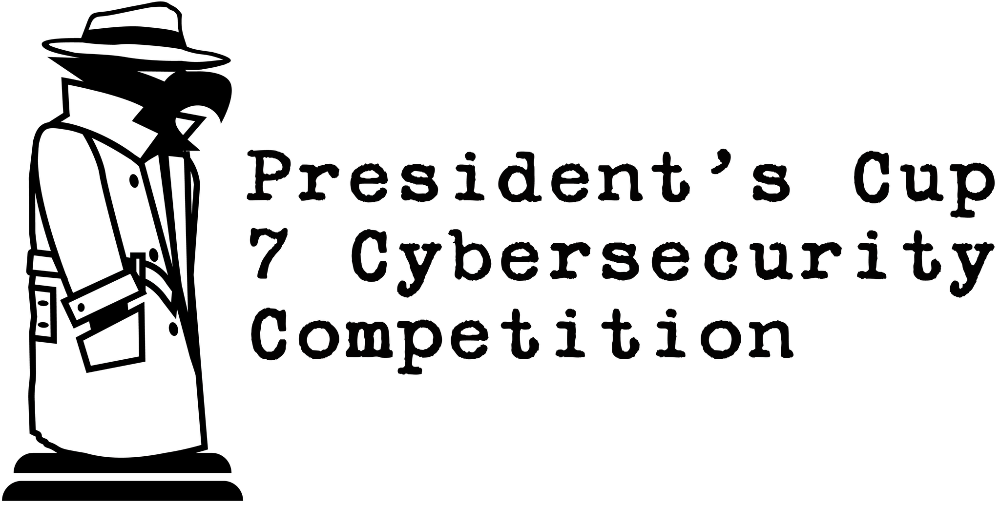

# President's Cup Cybersecurity Competition 2026 (Season 7)

## Summary

This directory contains challenge content developed for the 2026 President's Cup Cybersecurity Competition.

## Layout

### `/{track}`

Competition challenge content can be found in the [/individual-offense](./individual-offense/), [/individual-defense](./individual-defense/), and [/team](./team/) directories, each mapping to the respective track. Challenge sub-directories in each track follow this format:

```text
{round}-{challenge-name}
```

#### `challenge-name`

The challenge name in kebab-case is the directory name inside the track folders.

## Licensing

### Portions Developed by the United States Government
The portions of this package developed by the United States government are distributed under the Creative Commons 0 ("CC0") [license](LICENSE.md).

### Portions Developed by Government Contractors
Portions created by government contractors at the behest of CISA are provided with the explicit grant of right to use, modify, and redistribute the code subject to this statement and the existing license structure.

### New Submissions and Other Portions
All other portions, including new submissions from all others, are subject to the Apache License, Version 2.0.

### Third-Party Dependencies
This project uses third-party dependencies that are distributed under their respective licenses.
