# DEADDROP

This solution guide provides challengers with a walkthrough of a "dead drop" mission.

## Prerequisites & Preparation
This challenge only requires you to download a binary from a web page and use your preferred suite of forensics tools to complete all objectives.

## Overview
* Locate SPECTRE's Dead Drop hidden within a corrupted relay node disk image.
* Recover multiple layers of encryption — including password-protected containers, misleading decoy files, and obfuscated evidence.
* Forensically extract the four hidden access tokens from the disk image using advanced analysis techniques.
Decrypt the four embedded containers to retrieve key fragments, then assemble them to unlock the final payload revealing the mole’s identity.

Only precision forensic work will reveal the true sequence and path to success.

## Preparation

To place us in the best position for success, we must first download the DEADDROP `image` from `http://droppoint.pccc` and the `Mission Briefing`:


### Accessing the Dead Drop without the ability to use mount

Once we have `dead_drop.img` on disk, perform the following:

```bash
sudo mkdir -p /mnt/dead_drop 
sudo mcopy -i dead_drop.img ::* /mnt/dead_drop 
sudo mdir -i dead_drop.img ::
```

Image:

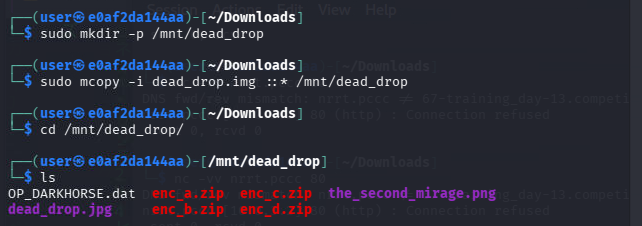


You should see the following output:

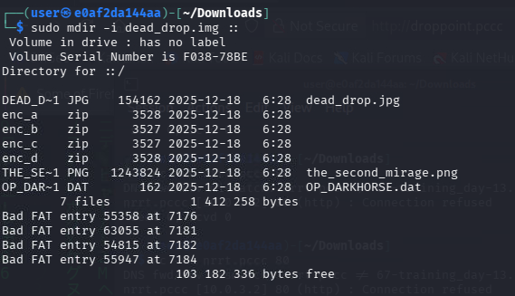

This will save us time for tokens 2-4.

## Question 1
Token 1: 🗿 Recover the deleted file - a historic token

1) We can use the tools `fls` and `icat` from [`sleuthkit`](https://wiki.sleuthkit.org/index.php?title=Fls) to check the volume for deleted files. 

2) Run fls to examine the disk image. 

```bash
fls -o 0 dead_drop.img
```

We can see that regular file `old_token.bin` has been deleted due to the `r/r *` annotation.

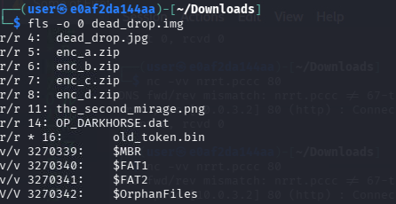

3) Next, run icat and look for a line with a `*` highlighted in it; this signifies deleted data. In our case, `inode 16` harbors what we need:

```bash
icat -i raw dead_drop.img 16 > recovered.bin
```

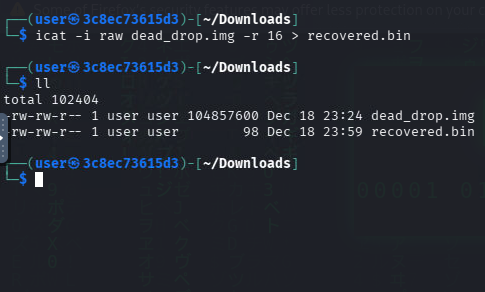

In the recovered binary, the magic key exists:

4) Carve the binary record by searching for the magic header:

```bash
xxd recovered.bin
```

You should receive this output:

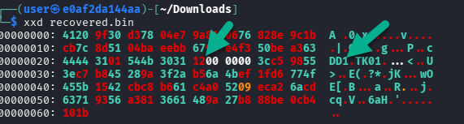


5) Let's analyze what we're looking at from a digital forensics perspective:

At offset 0x20 you have:
* 4444 3101 → magic DD1\x01
* 544b 3031 → tag TK01
* 1200 0000 → LEN = 0x12 = 18 bytes
* The next 18 bytes → obfuscated payload
* The following 4 bytes → CRC32 (of the obfuscated payload)

In your dump, this means the full payload is:

```text
Payload (18 bytes):
3c c5 98 55 3e c7 b8 45 28 9a 3f 2a b5 6a 4b ef 1f d6

CRC (4 bytes):
77 4f 45 5b
```

This is everything we need to input into a decrypter to get the token.

6) Let's cave out the disk at the offset that best suits our investigation (0x20):

```bash
dd if=recovered.bin bs=1 skip=$((0x20)) count=34 2>/dev/null > rec.bin
xxd rec.bin
```

Output:

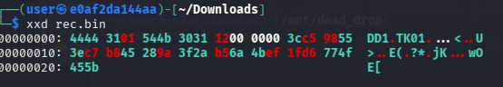

7) Now that we have the payload extracted, let's decode it.  Using the script below, replace the value of `SEED_STR` with your SEED value from the Mission Briefing we downloaded earlier.

```python
# filename:  decryptor.py
# usage: python3 decryptor.py 
import struct, zlib, hashlib

with open("rec.bin", "rb") as f:
    blob = f.read()

magic = blob[:4]
tag   = blob[4:8]
ln    = struct.unpack("<I", blob[8:12])[0]
obf   = blob[12:12+ln]
crc   = struct.unpack("<I", blob[12+ln:16+ln])[0]

assert magic == b"DD1\x01", f"Bad magic: {magic!r}"
assert zlib.crc32(obf) & 0xffffffff == crc, "CRC mismatch (wrong slice / corrupted data)"

# MUST match builder:
SEED_STR = "DARKHORSE_HORIZON_21pN" # replace with your seed
KEY_BYTES = hashlib.blake2s(SEED_STR.encode("utf-8"), digest_size=32).digest()

def keystream(key: bytes, n: int) -> bytes:
    out = bytearray()
    counter = 0
    while len(out) < n:
        h = hashlib.blake2s(key=key, digest_size=32)
        h.update(struct.pack("<I", counter))
        out.extend(h.digest())
        counter += 1
    return bytes(out[:n])

ks = keystream(KEY_BYTES, len(obf))
pt = bytes(a ^ b for a, b in zip(obf, ks))

print("tag:", tag.decode(errors="replace"))
print("len:", ln)
print("plaintext:", pt.decode(errors="replace"))
```

8) If executed correctly, we now have the answer to Question 1 (may vary in your instance):


### Answer

The answer is the value of token 1 (plaintext).

`PCCC{RECOVR-XXXXX}`


## Question 2
Token 2: 🌊 Look into the mirage and find the least significant bit

In this challenge, we’re given an image file named `the_second_mirage.png`, located in `/mnt/dead_drop`. This image contains hidden data embedded using Least Significant Bit (LSB) steganography.

We’ll use Python and the Pillow library (a fork of PIL) to extract this hidden information. Specifically, we’ll extract the least significant bit (LSB) of each color channel (red, green, and blue) from every pixel in the image to reconstruct the hidden message.

<details>
<summary>How do we know to look across all color channels?</summary>

*The challenge description hints at “least significant bit” — a classic form of steganography. Since the_second_mirage.png is a color image in PNG format, we can reasonably assume that the hidden data is embedded in the LSB of each color channel (red, green, blue) across the image. Extracting one bit from each channel per pixel gives us 3 bits per pixel — a subtle and efficient way to store hidden data without visibly altering the image.*
</details>
<br><br>

1) The following Python script opens the image, iterates through each pixel, and extracts the least significant bit from each RGB channel. These bits are grouped into bytes and decoded into readable text.

```python
# filename: mirage_decoder.py
# usage: python3 mirage_decoder.py
from PIL import Image

END = b"\x00\x00"  # your embed uses two null bytes as terminator

img = Image.open("the_second_mirage.png").convert("RGB")
bits = []

for y in range(img.height):
    for x in range(img.width):
        r, g, b = img.getpixel((x, y))
        bits.append(r & 1)
        bits.append(g & 1)
        bits.append(b & 1)

out = bytearray()
for i in range(0, len(bits), 8):
    byte_bits = bits[i:i+8]
    if len(byte_bits) < 8:
        break
    val = 0
    for bit in byte_bits:
        val = (val << 1) | bit
    out.append(val)
    if out[-2:] == END:
        out = out[:-2]
        break

print(out.decode("utf-8", errors="replace"))
```

2) Save the code above as `mirage_decoder.py` and run it using Python: 

```bash
python3 mirage_decoder.py
```

The output will contain the hidden message or **Token 2**

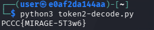

### Answer

The output from the script is your Token 2. Copy and submit it as your answer.

`PCCC{MIRAGE-XXXXX}`

## Question 3
Token 3: 💽 Scan the surface of the image to find this deeply seated token

In this challenge, we’re given a file named `dead_drop.img`, which is a disk image — a raw snapshot of a file system or storage device. The clue mentions "scanning the surface of the image", suggesting we’re dealing with low-level disk sectors rather than files in a file system.

We’ll need to manually scan portions of the disk image to find a hidden token, likely embedded directly in binary data. This approach mimics forensic analysis techniques.

1) Rather than examine the entire image, we can jump to different offsets to check for interesting content. We’ll start at a higher offset and narrow in from there. 

This can be done with the `dd` command:

```bash
dd if=dead_drop.img bs=1 skip=16384 count=128 2>/dev/null > sector.bin #<-- right offset - translates to (0x00004000)
```

2) Next, let's run `xxd` to inspect the bytes; we'll find a similar situation to that found in token 1:

```bash
xxd sector.bin
```

<details>
<summary>What this does</summary>

-  if=dead_drop.img: Read from the disk image file.
-  bs=1: Read in blocks of 1 byte.
-  skip=16384: Skip the first 16,384 bytes (which is 0x4000 in hexadecimal).
-  count=128: Copy 128 bytes starting at that offset.
-  2>/dev/null: Suppress the progress message.
-  \> sector.bin: Save the result to sector.bin.

Why offset 0x4000?

We’re assuming the token is deeply embedded in a sector farther into the image. Skipping 16KB moves us to a new region where interesting data may be stored — likely selected through trial and error or via a scanning script.

</details>


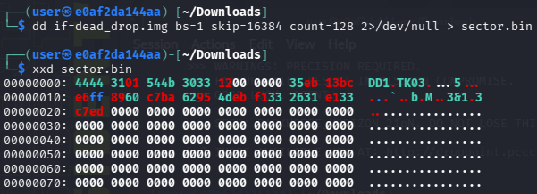


3) Let's now run the `decrypt script` from Question 1, using the same `seed key` but just _pointing it at the new sector.bin file_:

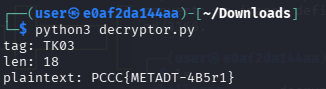

### Answer

The output from the decryption script is your Token 3. Submit that as your answer.

`PCCC{SPECTR-XXXXX}`

## Question 4
Token 4: 🔀 Investigate any .dat files and seek sectors to find and decrypt the next encrypted payload

`OP_DARKHORSE.dat` can be found in `/mnt/dead_drop/`.

1) Using `python` this can be resolved. We'll first use `xxd` again to find out where our ciphertext lies:

```bash
cp /mnt/dead_drop/OP_DARKHORSE.dat .
```

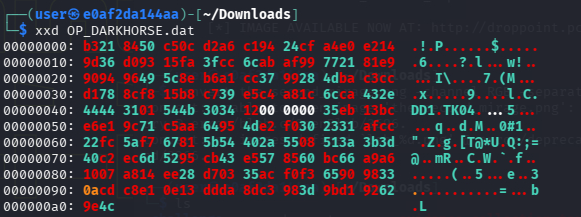

2) Since this is a different offset, we have to carve out a different part of the file to be successful:

```bash
dd if=OP_DARKHORSE.dat bs=1 skip=$((0x40)) count=34 2>/dev/null > rec4.bin
```

```bash
xxd rec4.bin
```

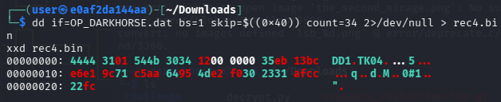


3) Let's now take the decryption script and use it to get the token (pointing it at rec4.bin)

Image:

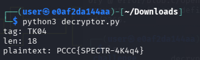

### Answer

The output from the decryption script is your Token 4. Submit that as your answer.

`PCCC{METADT-XXXXX}`

## Question 5
Token 5: 🚁 SPECTRE never leaves anything to chance: four fragments, four gates. Once aligned, the final truth will be revealed through the dead drop’s cover. Extract the last secret from `dead_drop.jpg`?

This cryptic clue tells us we’re dealing with a steganography challenge where hidden data has been embedded in an image file (dead_drop.jpg). The message references “four fragments”, which turn out to be keys—one from each of the four tokens you’ve already collected.

These fragments, when assembled in the correct order, form the passphrase needed to unlock the hidden data.

1) Inside `/mnt/dead_drop/`, you’ll find four encrypted ZIP files:

|token|zip|
|----|----|
| token1_value | enc_a.zip |
| token2_value | enc_b.zip |
| token3_value | enc_c.zip |
| token4_value | enc_d.zip |

Each ZIP file is encrypted with the corresponding full token value (i.e. `PCCC{ABCD_12_AB87}`).

Copy all of the zip files to the current working directory.

```bash
cp /mnt/dead_drop/enc_*.zip .
```

Then unzip

```bash
unzip enc_(FILE) # <-- where file is the letter associated with the target zip file (i.e. enc_a.zip)
```

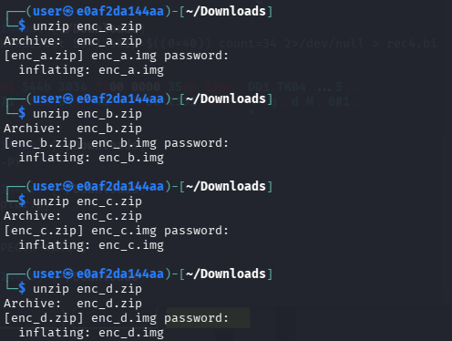

Each .img file is a small disk image. Rather than mount them, we can simply use `strings` to search for human-readable text within the raw binary.
Each output will contain a marker like FRAGMENTTXT, followed by a hex string. This hex string is the fragment.

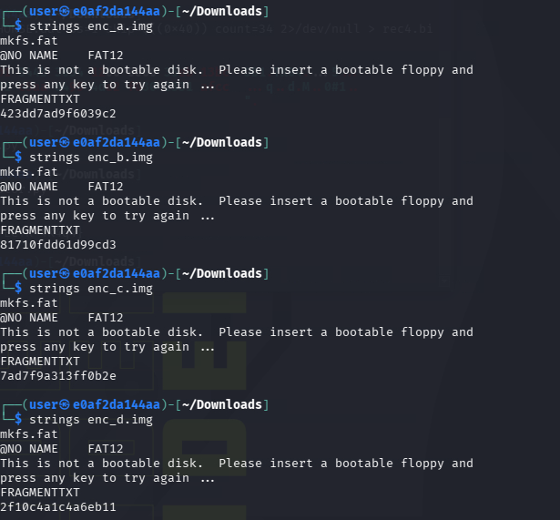

```text
└─$ strings enc_a.img 
mkfs.fat
@NO NAME    FAT12   
This is not a bootable disk.  Please insert a bootable floppy and
press any key to try again ... 
FRAGMENTTXT 
423dd7ad9f6039c2

┌──(user㉿e0af2da144aa)-[~/Downloads]
└─$ strings enc_b.img                                                        
mkfs.fat
@NO NAME    FAT12   
This is not a bootable disk.  Please insert a bootable floppy and
press any key to try again ... 
FRAGMENTTXT 
81710fdd61d99cd3

┌──(user㉿e0af2da144aa)-[~/Downloads]
└─$ strings enc_c.img                                                        
mkfs.fat
@NO NAME    FAT12   
This is not a bootable disk.  Please insert a bootable floppy and
press any key to try again ... 
FRAGMENTTXT 
7ad7f9a313ff0b2e

┌──(user㉿e0af2da144aa)-[~/Downloads]
└─$ strings enc_d.img                                                        
mkfs.fat
@NO NAME    FAT12   
This is not a bootable disk.  Please insert a bootable floppy and
press any key to try again ... 
FRAGMENTTXT 
2f10c4a1c4a6eb11
```

3) When combined, we get: `423dd7ad9f6039c281710fdd61d99cd37ad7f9a313ff0b2e2f10c4a1c4a6eb11`. We'll now use `steghide` to pull out the hidden artifact from `dead_drop.jpg` (image of the mole). From the `/mnt/dead_drop/` directory, run the following command:

```bash
sudo steghide extract -sf dead_drop.jpg
# Enter passphrase: 423dd7ad9f6039c281710fdd61d99cd37ad7f9a313ff0b2e2f10c4a1c4a6eb11
```

The following text is revealed:

```text
wrote extracted data to "finalflag.txt".
```

Open the file to view the final token:

```bash
cat finalflag.txt
```

Image (putting it all together):

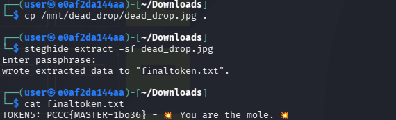

### Answer

The contents of `finalflag.txt` is Token 5 — enter that value as your answer.

`PCCC{MASTER-XXXXX}`

**This completes the Solution Guide for this challenge.**