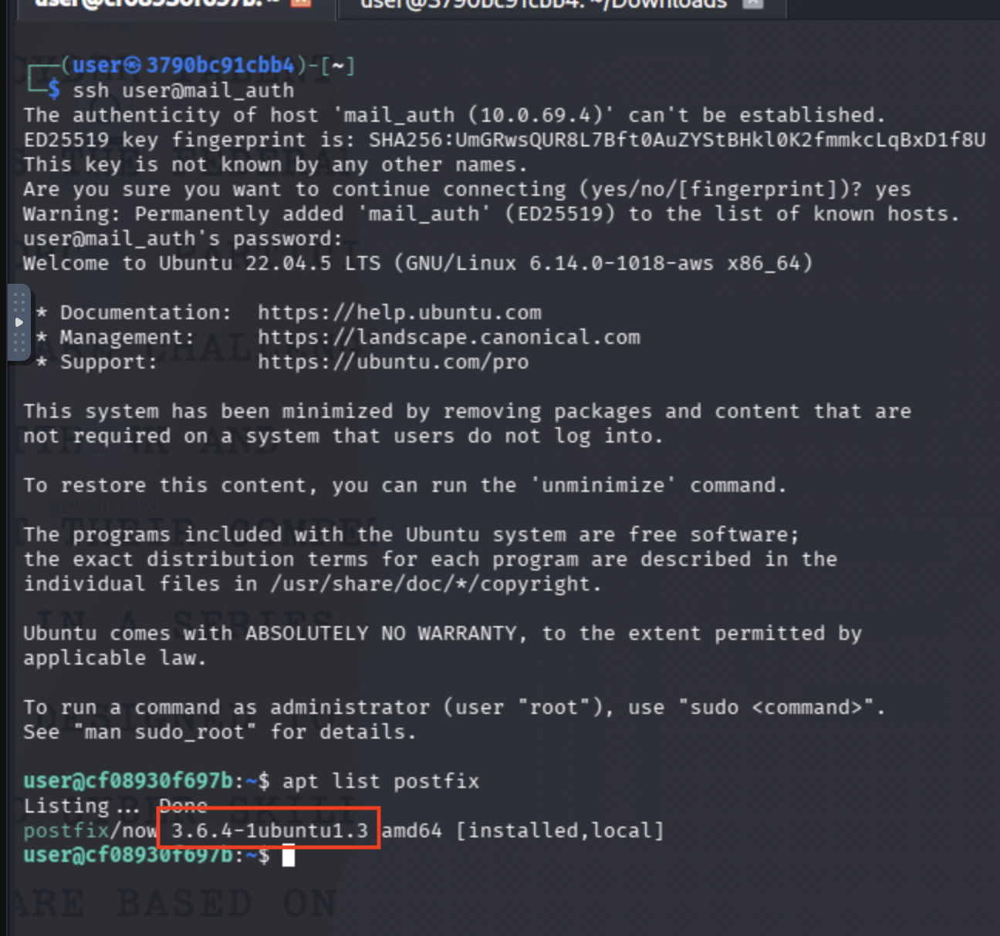
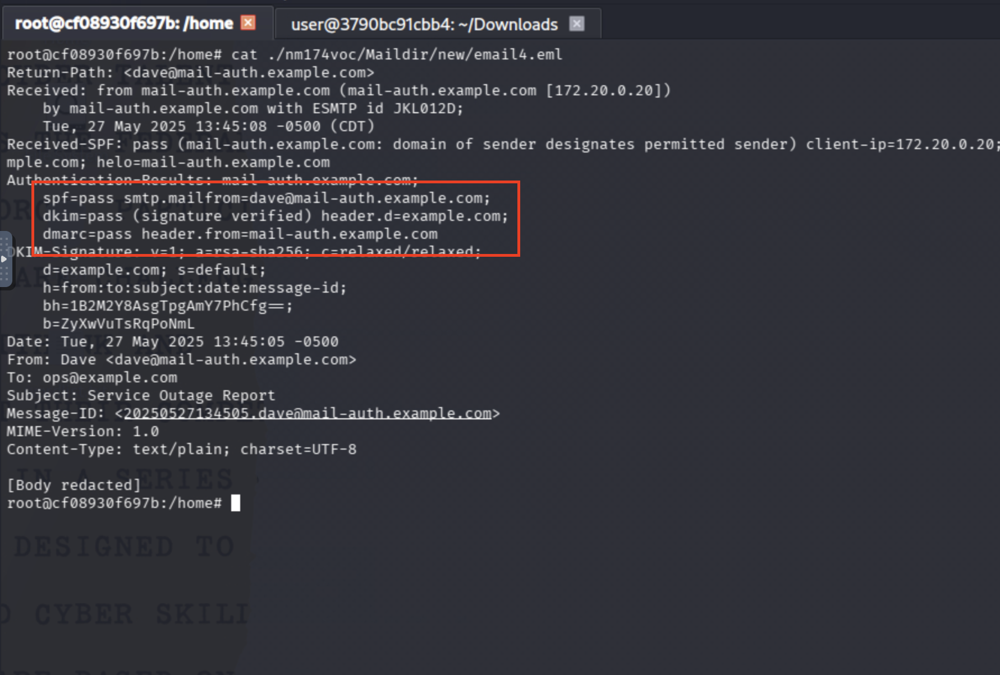
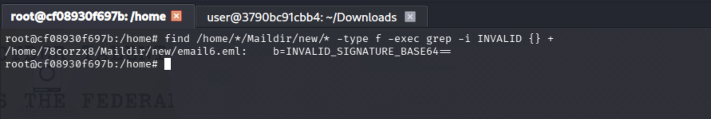
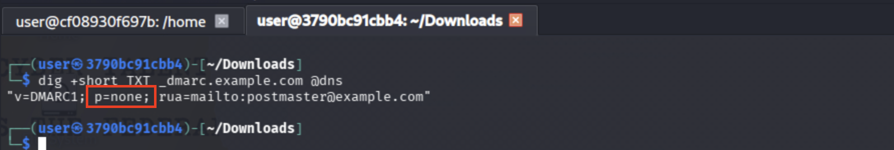
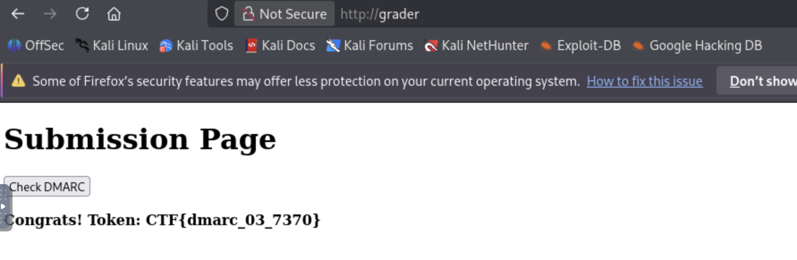
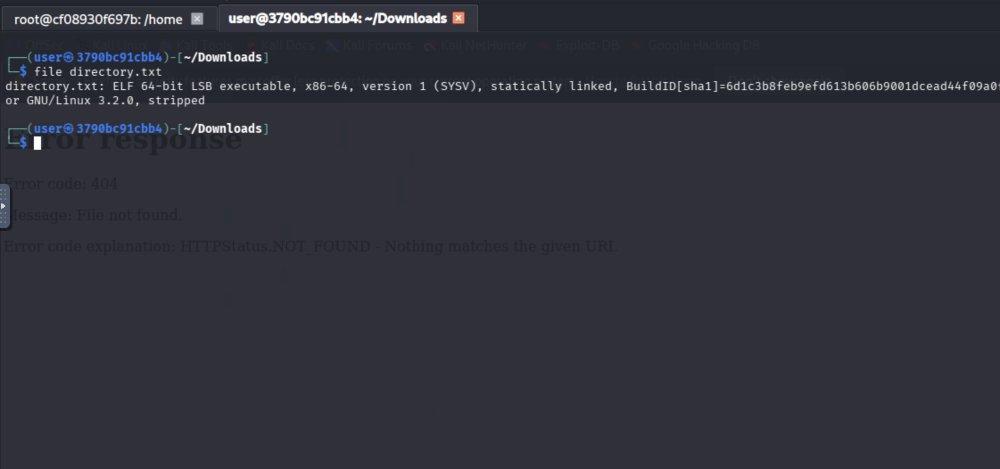
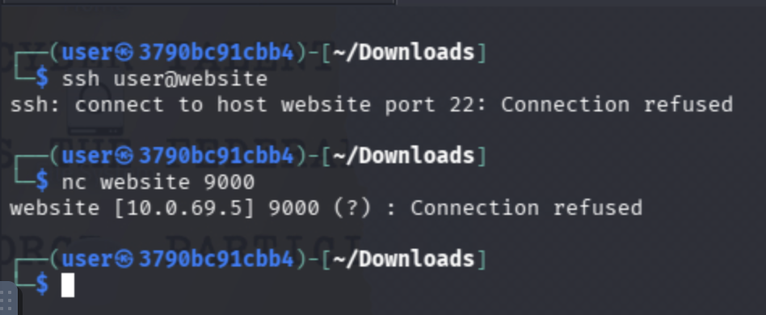
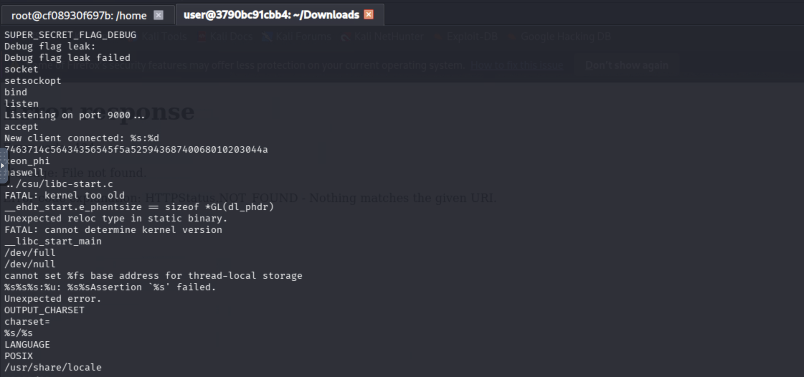
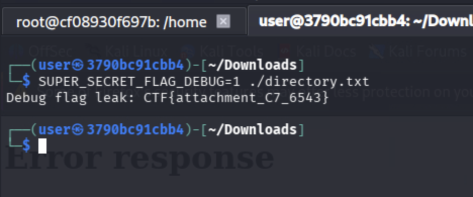

# Email Deception

*Solution Guide*

## Overview

In this challenge, you have to investigate emails and identify email software versions, set DMARC record,  and investigate suspicious emails

## Question 1

*What is the version of Postfix running on the email server?*


1. SSH into the email server:

    ```bash
    ssh user@mail_auth
    ```

1. Check the installed version of postfix:

    ```bash
    apt list postfix
    ```

    That will reveal postfix version is `3.6.4-1ubuntu1.3`

    

### Answer
Copy the postfix version `3.6.4-1ubuntu1.3` and submit that as your answer. 

## Question 2

*Identify any emails that did not come from an authenticated source.*

1. While still logged in to the email server, first escalate privileges to root: 

    ```bash
    sudo su
    ```

1. Next, identify the email users by running:

     ```bash
    ls /home/
     ```

     This will reveal the users on the machine that postfix uses for email addresses.

     Investigating one of the user folders, you will find `Maildir` and mailbox directories.

1. Reading one of the emails in the `Maildir/new` directory, you will notice that the SPF and DKIM values are present:

    

1. To check all of the emails to see which one is not authenticated, you can run:

    ```bash
    sudo su
    find /home/*/Maildir/new/* -type f -exec grep -i INVALID {} +
    ```

    This will show that `email6.eml` is the email with an invalid DKIM signature, indicating that it did not come from an authenticated source.

    

### Answer 
Submit the file name `email6.eml` as your answer to this question.

## Question 3

*Set the DMARC record to reject unauthenticated emails*


1. We can check the current DMARC record by running the following command _from your kali workstation_:

    *Be sure to use `@dns` to query the locally-running dns server!*
    
    ```bash
    dig +short TXT _dmarc.example.com @dns
    ```

    This will reveal that the DMARC policy is set to `none`:

    

1. To change it to `reject`, we need to edit the zone file located in `/etc/bind/zones` on the `dns` machine. First, SSH into the machine:

    ```bash
    ssh user@dns
    ```

    Then, using your text editor of choice, edit the file `/etc/bind/zones/db.example.com` and change the `none` value to `reject`. It should look like this:

    ```conf

    ; dns/zones/db.example.com
    $TTL 3600
    @   IN SOA  ns1.example.com. admin.example.com. (
            2025050501 ; serial YYYYMMDDNN
            3600       ; refresh
            1800       ; retry
            604800     ; expire
            86400 )    ; minimum

    @               IN NS     ns1.example.com.
    ns1             IN A      172.20.0.10
    mail-auth       IN A      172.20.0.20
    forwarder       IN A      172.20.0.40

    ; MX records: priority 10→auth, 20→rogue
    @               IN MX 10  mail-auth.example.com.


    ; SPF: only mail-auth is allowed
    @               IN TXT "v=spf1 mx -all"

    ; DKIM public key, included from the generated file:
    default._domainkey IN TXT    "v=DKIM1; k=rsa; p=MIGfMA0GCSqGSIb3DQEBAQUAA4GNADCBiQKBgQDLyhja5GiifGeYpmtp1bWxBS4AiMM7tk2qdbgxR6w3IFqEqHPlxUvqjxakC9uyzj3gv4XtYfmEOpO0bwtgBohYzmIA7APjzC9UlVexR3Jc13KQrL"

    ; DMARC: initially none, competitor will change to reject
    _dmarc          IN TXT "v=DMARC1; p=reject; rua=mailto:postmaster@example.com"
    ```

1. Then restart the DNS service:

    ```bash
    sudo service named stop
    sudo service named start
    # service named restart kills named but does not bring it back up
    ```

1. Navigate to `http://grader/` to validate your configuration and retrieve the token.



### Answer
Submit the token from the grader page as your answer.

## Question 4
*Find any suspicious attachments or links in any emails and gather any information you can from them.*

1. Back on our `mail_auth` machine, we can look for additional information within the email content. You will notice there is a link within `email3.eml` that points to `http://website/directory.txt`:

    

1. Navigating to this URL from your machine, you will immediately download this file. If you open it in a text editor, you will see that it has a lot of data that is not readable via text editor, indicating that it may be a binary file.  We can either notice the "ELF" header, or verify using `file directory.txt` to see what kind of file it is.

    

1. Make this file executable then run it to see what it does. You will see that it opens a listener on port 9000.

    ```bash
    chmod +x directory.txt
    ./directory.txt
    ```

1. In another terminal, connect to this and open a socket using `netcat`:

    ```bash
    nc 127.0.0.1 9000
    ```

    This will give you a bind shell, but this is running locally.  We can attempt to remotely connect to the website machine, but we are unsuccessful and it appears the listener is not open on that machine. 

    

1. Since we have the binary locally, let's inspect it using `strings` and deduce further information:

    ```bash
    strings -n 8 ./directory.txt | less
    ```

    Looking through this, you will notice the following:

    - `Listening on port 9000...`
    - `New client connected: %s:%d`
    - `Debug flag leak:`
    - `Debug flag leak failed`
    - An environment variable named `SUPER_SECRET_FLAG_DEBUG`
    - A long hex-looking string that is unique to your challenge.
    
    These are clues of what to do next. 

    

1. To see debug information, we can set that environment variable to 1 and run the binary:

    ```bash
    SUPER_SECRET_FLAG_DEBUG=1 ./directory.txt
    ```

    This will return the flag value.

    

### Answer
Submit the flag value output from the binary as your answer.

---

This is the end of the challenge.