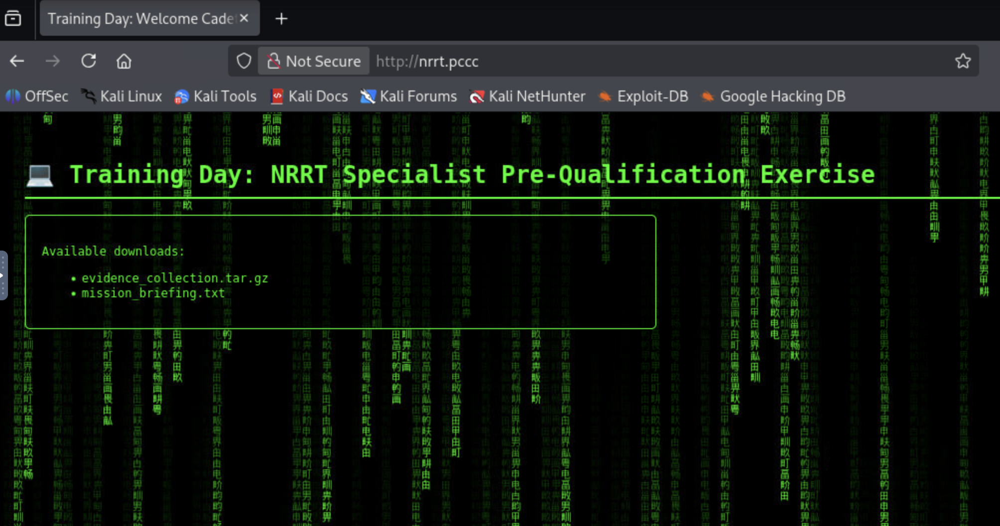
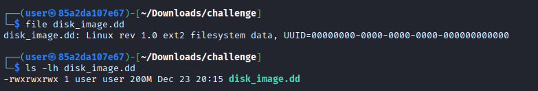
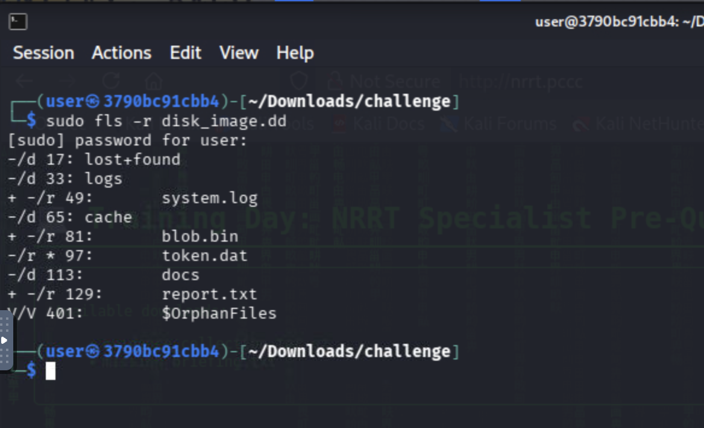
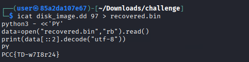
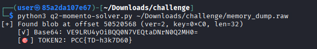
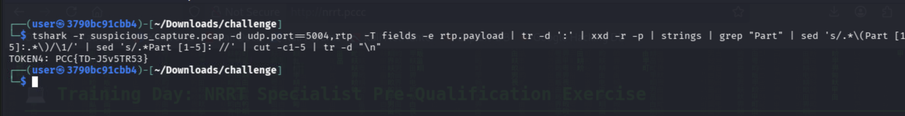

# Training Day

This solution guide provides challengers with a walkthrough of their first day on the Nautical Rapid Response Team (NRRT).

## Prerequisites & Preparation

From your workstation, navigate to `http://nrrt.pccc` and download `evidence_collection.tar.gz` from this page:



Next, uncompress it with the following command:

```bash
tar -xvf evidence_collection.tar.gz
```

This will create a `challenge` directory in your current folder. Go to it to begin inspection:

```bash
cd challenge
```

In the current directory, you should now see:

```bash
ls
```

You should see this output:

```bash
┌──(user㉿85a2da107e67)-[~/Downloads/challenge]
└─$ ls
disk_image.dd  memory_dump.raw  mission_briefing.txt  suspicious_capture.pcap  syslog.log
```

⚠️ From here onward, all analysis will happen on these extracted files in this folder.

# Overview
The objective of this challenge is to complete four exercises provided by this special unit's command in order to qualify to become an analyst on the team. 

# Question 1

***Token 1 - Recover a deleted token artifact from an image derived from a recent breach and decode the UTF-8 encoding***

1) After uncompressing the archive (completed during the Preparation Phase), you discover one of the files called `disk_image.dd` which is about 200 MB in size and formatted as `ext4` in-place with no partition tables.

NOTE: You will soon find that "token.dat" was recently deleted.

💡 When a file is deleted from ext4, the directory entry is removed, but the data remains on disk blocks until overwritten. We must recover that deleted file.

2) Next, run the following command to ensure that the file is indeed 200 MB and to determine the type of disk image that is presented:

```bash
ls -lh disk_image.dd
file disk_image.dd
```

The results of the last two instructions can be found here:



NOTE: `strings` will not work here as a shortcut (tool):

```bash
┌──(user㉿85a2da107e67)-[~/Downloads/challenge]
└─$ strings disk_image.dd 
lost+found
logsA
cache
token.dat
docs
system.log
info: boot ok
warn: low entropy
blob.bin
3{ge
R3qc
N`Rs
2D]e
A<LOTV
#(z~
uME4
H<P0
gK|R
>uy     <
R{F>p
!TAix
YO0"W`U
vX$o
rT*~[   Xtw
TO2s
26V0
XoyM
I+E`
`6=D
P)9|g
Kg<DZ
)WL;
I']=
Z)LV
PJCGC
report.txt
Quarterly report draft
```

3) We can use tools such as SleuthKit to list all files (including deleted) recursively. Let's use `fls` to examine the disk:

```bash
sudo fls -r disk_image.dd
```

For all intents and purposes, the -r flag means `recursive`. There are several decoy files however, we are only interested in `token.dat`. 
NOTE: the "-rd" flag combination can reduce your view to only deleted and recoverable items.

5) This should yield the desired result:



We find that token.dat was recently deleted which indicated by the `-/r` flag next to token.dat; note the inode number (e.g. 97 in this case).

6) We can now extract the deleted inode using a tool called `icat`. We are going to create a a separate and stable artifact with the information from `inode 97` and then decode it with UTF-8 decoding (as is described in the question):

```bash
icat disk_image.dd 97 > recovered.bin
python3 - <<'PY'
data=open("recovered.bin","rb").read()
print(data[::2].decode("utf-8"))
PY
```

Here's the result:



## Answer

The answer to Question 1 is the value of presented by the script.

# Question 2
Token 2: Discover the XOR key (0xA1-0xFF), decrypt the dump, then decode the resulting base64 string.

1) We are presented with `memory_dump.raw` in our evidence directory however, based on the question's description, it appears it is heavily encrypted and needs decrypting and decoding to get our desired result (TOKEN2).

The following script will get us there:

```python
#!/usr/bin/env python3
import base64
import binascii
import sys
from dataclasses import dataclass
from pathlib import Path
from typing import List, Optional, Tuple


MARKER = b"LCM2"
VERSION_EXPECTED = 2

# Reasonable safety limits
MAX_LEN = 4096          # payload bytes
MAX_SCAN_HITS = 1000    # avoid pathological cases


@dataclass
class Hit:
    offset: int
    version: int
    key: int
    length: int
    xordata: bytes

    def decode_with_key(self, key: int) -> Tuple[Optional[str], Optional[bytes]]:
        decoded = bytes(b ^ key for b in self.xordata)
        try:
            # Base64 strings should be ASCII; strip whitespace just in case.
            b64_str = decoded.decode("ascii", errors="strict").strip()
        except UnicodeDecodeError:
            return None, None

        # Strict base64 validation to reduce false positives
        try:
            raw = base64.b64decode(b64_str, validate=True)
        except Exception:
            return b64_str, None

        return b64_str, raw


def find_all(data: bytes, needle: bytes) -> List[int]:
    offsets = []
    start = 0
    while True:
        idx = data.find(needle, start)
        if idx == -1:
            break
        offsets.append(idx)
        start = idx + 1
        if len(offsets) >= MAX_SCAN_HITS:
            break
    return offsets


def parse_hit(data: bytes, off: int) -> Optional[Hit]:
    """
    Format:
      MARKER(4) | VER(1) | KEY(1) | LEN(2 LE) | XOR_DATA(LEN)
    """
    hdr_len = 4 + 1 + 1 + 2
    if off + hdr_len > len(data):
        return None

    if data[off:off+4] != MARKER:
        return None

    ver = data[off+4]
    key = data[off+5]
    length = int.from_bytes(data[off+6:off+8], "little")

    if length <= 0 or length > MAX_LEN:
        return None
    if off + hdr_len + length > len(data):
        return None

    xordata = data[off+8:off+8+length]
    return Hit(offset=off, version=ver, key=key, length=length, xordata=xordata)


def looks_like_token(raw: bytes) -> bool:
    # We expect something like b"TOKEN2: ..."
    return raw.startswith(b"TOKEN2: ")


def main() -> int:
    if len(sys.argv) != 2:
        print(f"Usage: {sys.argv[0]} /path/to/memory_dump.raw", file=sys.stderr)
        return 2

    path = Path(sys.argv[1])
    data = path.read_bytes()

    offsets = find_all(data, MARKER)
    if not offsets:
        print("[-] Marker LCM2 not found.")
        return 1

    hits: List[Hit] = []
    for off in offsets:
        hit = parse_hit(data, off)
        if hit:
            hits.append(hit)

    if not hits:
        print("[-] Marker found but no valid blobs parsed (length/version bounds).")
        return 1

    found_any = False

    for hit in hits:
        print(f"[+] Found blob at offset {hit.offset} (ver={hit.version}, key=0x{hit.key:02X}, len={hit.length})")

        # If version is unexpected, still try (could be decoy)
        if hit.version != VERSION_EXPECTED:
            print(f"    [!] Unexpected version {hit.version} (expected {VERSION_EXPECTED}); will still attempt decode.")

        # First try using embedded key if in range
        decoded_b64, raw = hit.decode_with_key(hit.key)
        if raw and looks_like_token(raw):
            print(f"    [✓] Base64: {decoded_b64}")
            print(f"    [🎯] {raw.decode('utf-8', errors='replace')}")
            found_any = True
            continue

        # If embedded key failed or produced non-token, brute force 0xA1..0xFF
        print("    [*] Embedded key did not yield TOKEN2; brute-forcing keys 0xA1..0xFF...")
        for key in range(0xA1, 0x100):
            decoded_b64, raw = hit.decode_with_key(key)
            if raw and looks_like_token(raw):
                print(f"    [✓] Key: 0x{key:02X}")
                print(f"    [✓] Base64: {decoded_b64}")
                print(f"    [🎯] {raw.decode('utf-8', errors='replace')}")
                found_any = True
                break
        else:
            # Give a tiny hint for debugging
            if decoded_b64:
                preview = decoded_b64[:80].replace("\n", "")
                print(f"    [-] No TOKEN2 found. Last b64-ish preview: {preview!r}")
            else:
                print("    [-] No TOKEN2 found; data not decodable as ASCII base64 under tested keys.")

    if not found_any:
        print("[-] No valid TOKEN2 recovered from any blob.")
        return 1

    return 0


if __name__ == "__main__":
    raise SystemExit(main())
```

2) For a complete explanation on how this script operates (and why), please click the button below:

# Solver Script Explanation

<details>
<summary>💡 Explanation of how the solver script works</summary>

## Overview
The memory dump contains a hidden binary blob that stores **TOKEN2** in an obfuscated form.
The solver script automatically locates this blob, decodes it, and extracts the token.

## 1. Locating the hidden blob
The script scans the entire memory dump for a fixed **marker string**:

```text
LCM2
```

This marker is intentionally short and non-obvious, but it provides a reliable anchor point so the solver does not have to guess offsets or rely on fragile heuristics.

## 2. Parsing the blob structure
Once the marker is found, the script interprets the following bytes using a fixed structure:

```text
[ MARKER | VERSION | XOR_KEY | LENGTH | XOR_DATA ]
```

- **MARKER (4 bytes)** – Identifies the start of the blob (`LCM2`)
- **VERSION (1 byte)** – Allows future format changes
- **XOR_KEY (1 byte)** – A randomized key between `0xA1` and `0xFF`
- **LENGTH (2 bytes, little-endian)** – Length of the encoded payload
- **XOR_DATA (N bytes)** – XOR-encoded base64 string

## 3. XOR decoding
Each byte of the payload is XOR’d with the key to recover an ASCII string:

```python
decoded = byte ^ key
```

This produces a **Base64-encoded string**, not the token directly.
XOR obfuscation prevents the token from appearing in plaintext or via `strings`.

## 4. Base64 decoding
The decoded string is validated and Base64-decoded.
If successful, the result is expected to start with:

```text
TOKEN2:
```

This confirms the correct key and payload.

## 5. Brute-forcing (fallback path)
If the embedded key is missing or incorrect, the script automatically brute-forces all keys from:

```text
0xA1 → 0xFF
```

This is only **95 possible keys**, making brute-force fast and fair.
Each candidate is tested until valid Base64 decoding produces a `TOKEN2:` prefix.

## Result
When a valid blob is decoded, the script prints:
- The XOR key used
- The recovered Base64 string
- The final decrypted **TOKEN2 value**
</details>

3) After execution, the token is revealed:



## Answer

The answer for TOKEN2 is the value presented by the script's execution.

# Question 3

***Token 3 - Inspect the suspicious system log capture to determine a hidden payload being passed in an encrypted protocol command***

A text file named syslog.log containing several lines, 


1) The simplest way to solve this is to run the following command:

```bash
grep -i "PCC" syslog.log
```

This reveals the exact line that the token we seek is on:

Command:

```bash
┌──(user㉿85a2da107e67)-[~/Downloads/challenge]
└─$ cat syslog.log | grep PCC
May  8 10:26:02 host sshd[5681]: (root) CMD (sshpass -p PCCC{TD-I1w8v45} -i id_rsa -o StrictHostKeyChecking=no "ssh root@unknown.com")
```

## Answer

The answer to this question is the value associated with the PCC format (e.g. PCCC{TD-I1w0v45} in our case) 

## Question 4
***Token 4 -  Inspect a suspicious packet capture to determine a fragmented hidden payload being passed in a voice protocol***

### Background
The packet capture (suspicious_capture.pcap) contains 5,000 RTP packets. The token has been split into five separate packets which are labelled accordingly (Part X: VALUE). When combined (all parts), the fourth token is discovered.


### Tshark Pathway

We can use `tshark` to quickly solve this challenge:

1) Running tshark without any commands allows us to see the capture in total:

Command:

```bash
tshark -r suspicious_capture.pcap
```

Output:

```bash

┌──(user㉿85a2da107e67)-[~/Downloads/challenge]
└─$ tshark -r suspicious_capture.pcap 
    1   0.000000 192.168.1.100 → 192.168.1.200 UDP 174 27316 → 5004 Len=132
    2   0.000276 192.168.1.100 → 192.168.1.200 UDP 179 62437 → 5004 Len=137
    3   0.000515 192.168.1.100 → 192.168.1.200 UDP 117 53333 → 5004 Len=75
    4   0.000775 192.168.1.100 → 192.168.1.200 UDP 119 51204 → 5004 Len=77
    5   0.001056 192.168.1.100 → 192.168.1.200 UDP 153 41844 → 5004 Len=111
    6   0.001285 192.168.1.100 → 192.168.1.200 UDP 223 16788 → 5004 Len=181
    7   0.001526 192.168.1.100 → 192.168.1.200 UDP 177 33286 → 5004 Len=135
    8   0.001754 192.168.1.100 → 192.168.1.200 UDP 104 2893 → 5004 Len=62
    9   0.002081 192.168.1.100 → 192.168.1.200 UDP 253 33433 → 5004 Len=211
   10   0.002309 192.168.1.100 → 192.168.1.200 UDP 140 35376 → 5004 Len=98
   11   0.002532 192.168.1.100 → 192.168.1.200 UDP 114 8411 → 5004 Len=72
   12   0.002759 192.168.1.100 → 192.168.1.200 UDP 141 37827 → 5004 Len=99
   13   0.003014 192.168.1.100 → 192.168.1.200 UDP 238 51250 → 5004 Len=196
   14   0.003241 192.168.1.100 → 192.168.1.200 UDP 226 62605 → 5004 Len=184
   15   0.003477 192.168.1.100 → 192.168.1.200 UDP 237 11516 → 5004 Len=195
   16   0.003701 192.168.1.100 → 192.168.1.200 UDP 170 38284 → 5004 Len=128
   17   0.003998 192.168.1.100 → 192.168.1.200 UDP 146 62498 → 5004 Len=104
   18   0.004251 192.168.1.100 → 192.168.1.200 UDP 171 47253 → 5004 Len=129
   19   0.004475 192.168.1.100 → 192.168.1.200 UDP 158 41140 → 5004 Len=116
   20   0.004698 192.168.1.100 → 192.168.1.200 UDP 229 43585 → 5004 Len=187
```

2) We notice that the question asks about `voice protocols` and the destination port for all transactions appears to be `udp/5004`. This is indicative of the `RTP` or Real Time Protocol for voice communications.

```text
Sample packet:    14   0.003241 192.168.1.100 → 192.168.1.200 UDP 226 62605 → 5004 Len=184
```

3) With this in mind, let's tailor our filter to decode the packets based on this protocol:

Command:

```bash
tshark -r suspicious_capture.pcap -d udp.port==5004,rtp
```

Output:

```bash
┌──(user㉿85a2da107e67)-[~/Downloads/challenge]
└─$ tshark -r suspicious_capture.pcap -d udp.port==5004,rtp
    1   0.000000 192.168.1.100 → 192.168.1.200 RTP 174 PT=DynamicRTP-Type-96, SSRC=0x0, Seq=0, Time=0
    2   0.000276 192.168.1.100 → 192.168.1.200 RTP 179 PT=DynamicRTP-Type-96, SSRC=0x0, Seq=1, Time=1337
    3   0.000515 192.168.1.100 → 192.168.1.200 RTP 117 PT=DynamicRTP-Type-96, SSRC=0x0, Seq=2, Time=2559
    4   0.000775 192.168.1.100 → 192.168.1.200 RTP 119 PT=DynamicRTP-Type-96, SSRC=0x0, Seq=3, Time=3885
    5   0.001056 192.168.1.100 → 192.168.1.200 RTP 153 PT=DynamicRTP-Type-96, SSRC=0x0, Seq=4, Time=4998
    6   0.001285 192.168.1.100 → 192.168.1.200 RTP 223 PT=DynamicRTP-Type-96, SSRC=0x0, Seq=5, Time=6005
    7   0.001526 192.168.1.100 → 192.168.1.200 RTP 177 PT=DynamicRTP-Type-96, SSRC=0x0, Seq=6, Time=7383
    8   0.001754 192.168.1.100 → 192.168.1.200 RTP 104 PT=DynamicRTP-Type-96, SSRC=0x0, Seq=7, Time=8801
    9   0.002081 192.168.1.100 → 192.168.1.200 RTP 253 PT=DynamicRTP-Type-96, SSRC=0x0, Seq=8, Time=10215
   10   0.002309 192.168.1.100 → 192.168.1.200 RTP 140 PT=DynamicRTP-Type-96, SSRC=0x0, Seq=9, Time=11553
   11   0.002532 192.168.1.100 → 192.168.1.200 RTP 114 PT=DynamicRTP-Type-96, SSRC=0x0, Seq=10, Time=13029
   12   0.002759 192.168.1.100 → 192.168.1.200 RTP 141 PT=DynamicRTP-Type-96, SSRC=0x0, Seq=11, Time=13991
   13   0.003014 192.168.1.100 → 192.168.1.200 RTP 238 PT=DynamicRTP-Type-96, SSRC=0x0, Seq=12, Time=14938
   14   0.003241 192.168.1.100 → 192.168.1.200 RTP 226 PT=DynamicRTP-Type-96, SSRC=0x0, Seq=13, Time=16263
   15   0.003477 192.168.1.100 → 192.168.1.200 RTP 237 PT=DynamicRTP-Type-96, SSRC=0x0, Seq=14, Time=17080
   16   0.003701 192.168.1.100 → 192.168.1.200 RTP 170 PT=DynamicRTP-Type-96, SSRC=0x0, Seq=15, Time=18280
   17   0.003998 192.168.1.100 → 192.168.1.200 RTP 146 PT=DynamicRTP-Type-96, SSRC=0x0, Seq=16, Time=19509
   18   0.004251 192.168.1.100 → 192.168.1.200 RTP 171 PT=DynamicRTP-Type-96, SSRC=0x0, Seq=17, Time=20622
   19   0.004475 192.168.1.100 → 192.168.1.200 RTP 158 PT=DynamicRTP-Type-96, SSRC=0x0, Seq=18, Time=22041
   20   0.004698 192.168.1.100 → 192.168.1.200 RTP 229 PT=DynamicRTP-Type-96, SSRC=0x0, Seq=19, Time=22849
   21   0.004989 192.168.1.100 → 192.168.1.200 RTP 112 PT=DynamicRTP-Type-96, SSRC=0x0, Seq=20, Time=24361
   22   0.005209 192.168.1.100 → 192.168.1.200 RTP 202 PT=DynamicRTP-Type-96, SSRC=0x0, Seq=21, Time=25435
```

4) There are several things we know about this particular task:
* We know that "Part" is part of the ASCII to be returned
* We know that RTP is the protocol involved
* We have a stable set of decoded packets based on our filter

As a result of all of this, we can create a tshark command that encompasses all of this:

Command:

```bash
tshark -r suspicious_capture.pcap -d udp.port==5004,rtp  -T fields -e rtp.payload | tr -d ':' | xxd -r -p | strings | grep "Part" | sed 's/.*\(Part [1-5]:.*\)/\1/'
```

Here are some notes:
* The `td` is used to parse the delimiter after the word Part
* xxd renders the hex
* strings pulls out the ASCII
* grep filters the output for the `specific` "Part:" string we're looking for line by line
* sed is being used to clear any pesky metadata we may get prepended to our output


5) After executing the command, the output should be as follows:

```bash
┌──(user㉿85a2da107e67)-[~/Downloads/challenge]
└─$ tshark -r suspicious_capture.pcap -d udp.port==5004,rtp -T fields -e rtp.payload | tr -d ':' | xxd -r -p | strings | grep -i "Part"
Part 1: TOKEN
        Part 2: 4: PC
F>Part 3: C{TD-
Part 4: U2x9
@Part 5: a21}`
```

6) Arranging the lines will provide us the token we need:

```text
Part 1: TOKEN
Part 2: 4: PC
Part 3: C{TD-
Part 4: U2x9
Part 5: a21}
```

Alternatively, this could be cleaned up even more now that we know what we're looking for: 

```bash
tshark -r suspicious_capture.pcap -d udp.port==5004,rtp  -T fields -e rtp.payload | tr -d ':' | xxd -r -p | strings | grep "Part" | sed 's/.*\(Part [1-5]:.*\)/\1/' | sed 's/.*Part [1-5]: //' | cut -c1-5 | tr -d "\n"
```



## Answer

Given the format described in the main description, our token is PCCC{VALUE}. In this case, it's:

```text
PCCC{TD-U2x9a21}
```

**This completes the Solution Guide for this challenge.**