# Arcadian

This solution guide provides challengers with a walkthrough of a new digital exhibit at the Palace of Versailles (FR).

## Prerequisites & Preparation
This challenge only requires you to download a binary from a web page `http://exhibit.pccc` and use your preferred suite of reverse engineering tools to complete all objectives.

# Overview
* Find the fragmented token 
* Complete the Dynamic Pointer Maze through automation or through reverse engineering
* Capture the memory of the binary (in a timely manner) 
* Examine an application error's misconfigured logic
* Decrypt ciphertext using an XOR-shift algorithm

# Question 1
Token 1: Repair the fragmented string in stage 1 

First, make the downloaded binary executable `chmod +x arcadian`

Upon first interacting with the arcadian binary, you find the following output:

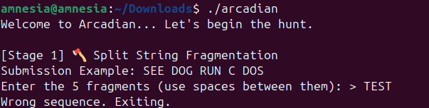

The goal is to enter the correct sequence of a fragmented token into the application in exchange for TOKEN1.

As challengers, do not know what this phrase is, they must begin to reverse engineer the Rust binary to figure out what this string might be.

The tool radare2 is great at determining function names on the fly and has a bit of automation built in that is moderately user friendly.

1) First run the following command:

```bash
r2 -AA ./arcadian
```

The fact that we are able to use `flags` means there must be a label for them within the code base. Let's try to reverse this stage (1).

This will yield the following output:  

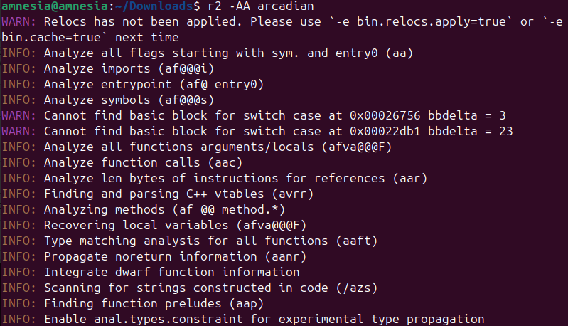

We now see that radare2 has mapped out all of the function it has vision of within the binary.

2) Next, let's use the `afl` command to look for strings containing the word `stage1`. The result can be found below:

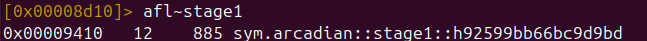

Depending on the system you're running this on, the name of the function may be different. In our case, it's `sym::arcadian::stage1::<MEMORY ADDRESS>`. Keep this for later.

3) Next, let's use the `pdf` command to disassemble the function and get under the hood:

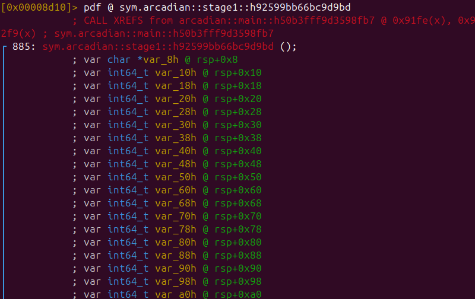

4) Scrolling further down, we see the following string: 

```text
3N1PC7RUSTICT0K
```

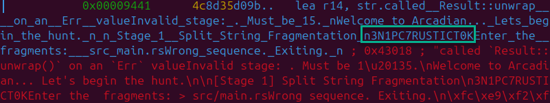

The application is using this string to compare against user input. What you are presented with is all of the runtime data affiliated with this function (both success and fail messages).

💡 Here's a broader more in-depth technical explanation of what's going on here:

* The screenshot above, just a few lines down from the identified string in pdf command, shows how the token is loaded.
* Thee first instruction `lea rax, [ADDR]   ;TOKSUBM...` loads a pointer to TOK into RAX. 
* The next line, mov qword [var_88h], rax saves that pointer. 
mov qword [var_a0h], 3 then saves 3, which represents the length of the string. 
* It then repeats that with all the remaining chunks. All in all, it splits the string into several char[3] arrays. 
* The real order can then be seen by reading those in order: T0K 3N1 PC7 RUSTIC.

NOTE: Technically, that only shows the order the strings are LOADED in, not checked in. In general, we'd have to go down further and determine which sections of our input are matched against var_88, var_98, var_a8, var_b0, and var_c8 in order to TRULY confirm it, but in this case, the order loaded matches the order checked.


5) As the application is asking for `five separate values`, it is safe to say we must `split this string into five parts` - their order is yet to be determined.

In the end, we find the value desired is actually `T0K 3N1 PC7 RUS TIC`.

7) Once entered, you will be presented with your first token.

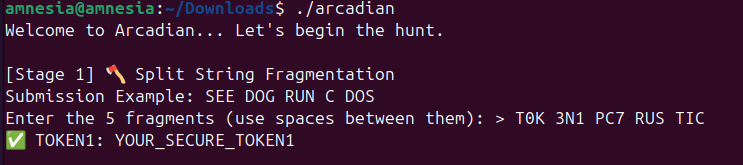

### Answer

The value of the token is the `answer` to this question.

# Question 2
Token 2: Discovered after completing the DPM (Maze)

1) First, run the following command (just like in the first stage):

```bash
r2 -AA ./arcadian
```

Labels will be created for any existing functions.

2) Next, we'll run the `afl` command to search for `stage2`:

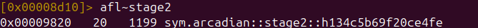

3) Now that we've found the address of `stage2`, let's use `pdf` again to disassemble it:

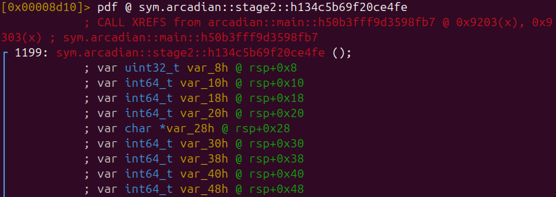


4) Scrolling down, we'll eventually find a code cave where tons of variables are being set. There seems to be exactly `six` values being set. 

Most low level programming languages typically set values before comparing them for validity or for transfer into other forms such as strings:

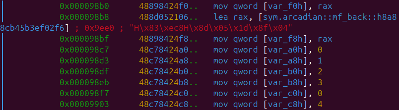

We can take a leap of faith and assume this could translate to representations of the functions that were disclosed to us before entering r2:

|Motion|Letter|ID Number|
|-----|-----|-----|
|Left|L|1|
|Right|R|2|
|Up|U|3|
|Down|D|4|
|Diagonal|X|5|
|Backwards|B|6|

We should try this combination; using both the table and functions presented the answer to this maze should be:

```text
L R U D L X
```

Worst case scenario, we can use this to build a list assigning each value to each function and creating combinations through automation for submission into the program.

5) Lucky for us, when entered, the results are exactly what we wanted:

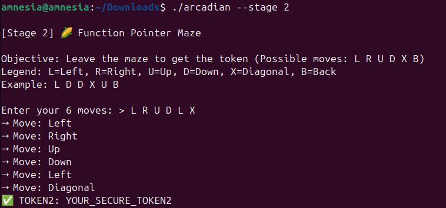

### Answer

The value of the token is the `answer` to this question.

# Question 3

Token 3: Use SIGTRAP to retrieve this token from memory during it's decryption routine.

The normal functionality of this application is to dump it's core upon execution:

```bash
./arcadian --stage=3

[Stage 3] 🔄 Self-Modifying Memory
Decrypting TOKEN3 in 5 seconds…
Trace/breakpoint trap (core dumped)
```

1) To catch the token in time, run the following command in another terminal within 5 seconds of starting the binary's stage 3:

```bash
Terminal 1:
./arcadian --stage=3

```

and within 5 seconds

```bash
Terminal 2:
sudo gdb -p $(pgrep arcadian) #sudo needed for ptrace
```

Here's a small movie below demonstrating the technique:

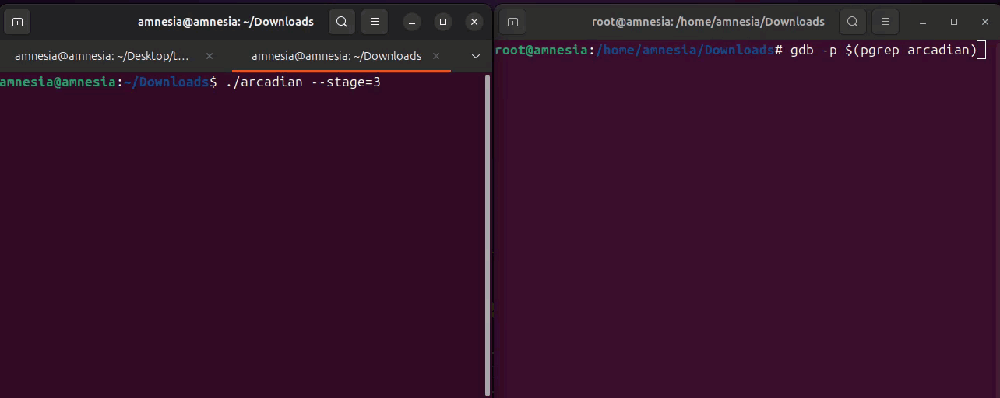


2) Next, we must trap the time before the program stops to get the token. We'll run the following commands in `terminal 2` which will assume control of the binary after the `pgrep` command:

```bash
(gdb) handle SIGTRAP stop
SIGTRAP is used by the debugger.
Are you sure you want to change it? (y or n) y
Signal        Stop	Print	Pass to program	Description
SIGTRAP       Yes	Yes	No		Trace/breakpoint trap

(gdb) continue

-- Random Memory Data --

(gdb) continue // This is the second time to execute the program again after we hit the breakpoint just before exiting this routine
```

3) Control will now be returned to you in `terminal 1` and you will see the following:

```bash
[Stage 3] 🔄 Self-Modifying Memory
Decrypting TOKEN3 in 5 seconds…
Decryption complete!
Type `dump` to reveal TOKEN3:
> 
```

4) Typing `dump` and hitting Enter will reveal the token:

```bash
Type `dump` to reveal TOKEN3:
> dump
✅ TOKEN3: YOUR_SECURE_TOKEN3
```

### Answer

The value of the token is the `answer` to this question.

# Question 4
Token 4: Find the STAGE4_UNLOCK symbol, determine it's offset, and patch it with a '\x00' to produce this token.

1) Activate stage 4 and the prompt will expose you what appears to be normal activity:

```bash
sudo ./arcadian --stage 4

[Stage 4] 🛡️ Anti-RE Protections
✅ Service OK. No issues detected.
```

To be successful in this operation, we'll need four values:
* Virtual address of STAGE4_UNLOCK
* File Offset
* In-segment Delta


2) To find the cited STAGE4_UNLOCK symbol's `virtual address`, run the following command:

```bash
user@85a2da107e67:~/Downloads$ readelf -s arcadian | grep STAGE4_LOCK
   910: 0000000000056008     1 OBJECT  GLOBAL DEFAULT   27 STAGE4_LOCK
```

This will present you with its `virtual address` in the binary. Keep this close (`0x56008`).

3) Next, we must determine what the current location of .data is as strings will be stored there (including the ciphertext for our token):

```bash
user@85a2da107e67:~/Downloads$ readelf -l arcadian | grep -A2 "LOAD"
  LOAD           0x0000000000000000 0x0000000000000000 0x0000000000000000
                 0x0000000000005e68 0x0000000000005e68  R      0x1000
  LOAD           0x0000000000006000 0x0000000000006000 0x0000000000006000
                 0x000000000003c8f9 0x000000000003c8f9  R E    0x1000
  LOAD           0x0000000000043000 0x0000000000043000 0x0000000000043000
                 0x000000000000ea34 0x000000000000ea34  R      0x1000
  LOAD           0x0000000000051b80 0x0000000000052b80 0x0000000000052b80
                 0x00000000000034b8 0x0000000000003618  RW     0x1000
  DYNAMIC        0x0000000000054618 0x0000000000055618 0x0000000000055618
```

Let's focus on the RW load area:

```text
LOAD           0x0000000000051b80 0x0000000000052b80 0x0000000000052b80
                 0x00000000000034b8 0x0000000000003618  RW     0x1000
```

`0x51b80` is our file offset or `p_offset` here. Keep this close as well.

4) We must now calculate the `in-segment` delta and then the file offset to ensure we get the `right byte`:

```text

delta = sym_vma − p_vaddr
      = 0x56008 − 0x52b80
      = 0x3488


file_offset = p_offset + delta
            = 0x51b80 + 0x3488
            = 0x55008
```


Running `hexdump` takes this a step further. The -C flag gives us ASCII output and -v keeps things aligned for viewing:

```bash
hexdump -Cv arcadian -s 0x55008 -n 1
00055008  01                                                |.|
00055009
```

We can see that the byte we're looking for is located at `0x55008`.

5) Make a copy of `arcadian`:

```bash
cp arcadian arcadian.bak
```

Once we patch a file, there's no going back. 

6) We have now validated the `0x55008` offset and need to patch it (previously 0x01) with \0x00:

```bash
printf '\x00' | dd of=arcadian bs=1 seek=$((0x55008)) conv=notrunc

1+0 records in
1+0 records out
1 byte copied, 0.000207503 s, 4.8 kB/s
```

7) Since STAGE4_UNLOCK is not equal to 0 (code logic wise) or `not in the intended state`, the function falls to what would be it's "else" state which delivers the token:

```bash
LOCKED version (pre-patch)

/arcadian --stage=4

[Stage 4] 🛡️ Anti-RE Protections
✅ Service OK. No issues detected.

UNLOCKED version (after patch)

./arcadian --stage=4

[Stage 4] 🛡️ Anti-RE Protections
✅ Service OK. No issues detected.
🥷 Bypass detected! Revealing TOKEN4…
Press ENTER to continue: 
✅ TOKEN4: YOUR_SECURE_TOKEN4

```

### Answer

The value of the token is the `answer` to this question.

# Question 5
Token 5: Decrypt the ciphertext from stage 5 using an XOR-shift algorithm


💡An XOR-SHIFT can be used to generate a sequence of numbers by repeatedly applying the bitwise XOR operation and bit shifting to a state variable.

In this challenge, the `shift` will be performed by incrementing the key by one byte per byte of data. 

E.g. Byte 1: 0x0A, Byte 2: 0x0B etc.


1) When querying stage 5, challengers are presented with an XOR-SHIFT puzzle.  First, run stage 5 and review the output: `./arcadian --stage=5`

Several key elements are provided to us:
* Ciphertext
* A key

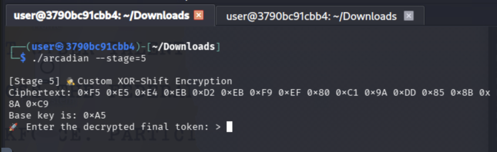

2) We can couple these elements into a script using the programming language `python`. 

```python3
#!/usr/bin/env python3
# replace the cipher and key with your specific output from running ./arcadian --stage=5

cipher = [0xFC, 0xE9, 0xF2, 0xFA, 0xF6, 0xF9, 0xEE, 0xEF, 0xF8, 0xFC, 0xEA, 0xEF, 0xE5, 0xFD, 0xF8, 0xF1, 0xFB, 0x83]
key = 0xA5
plain = ''.join(chr(b ^ (key + i)) for i,b in enumerate(cipher))
print("TOKEN5 =", plain)
```

3) Effectively, the script will iterate through each byte slowly shifting the key position by 1 (e.g. 0xA5, 0xA6, etc) until the token is decrypted.

The output is:

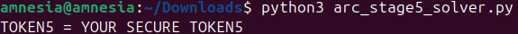

### Answer

The value of the token is the `answer` to this question.

**This completes the Solution Guide for this challenge.**